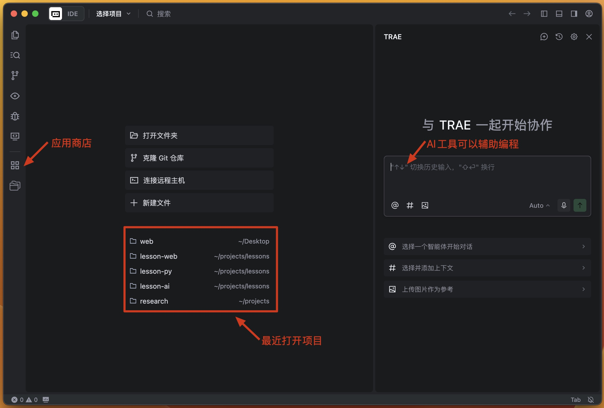
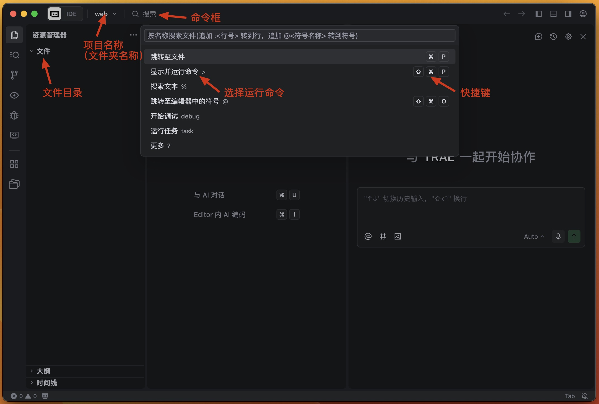
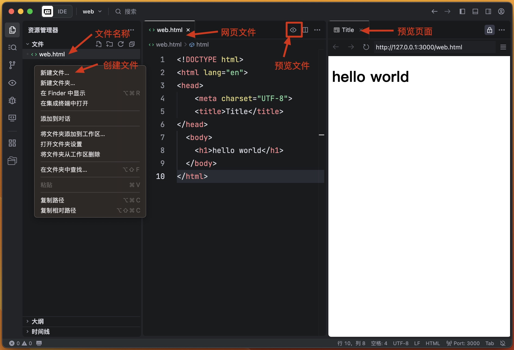
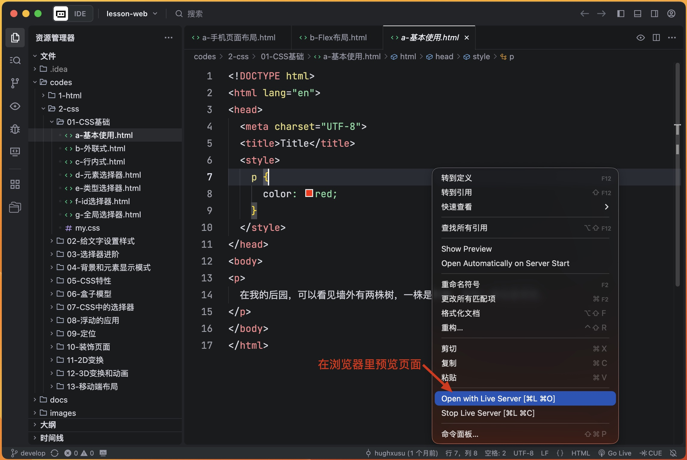
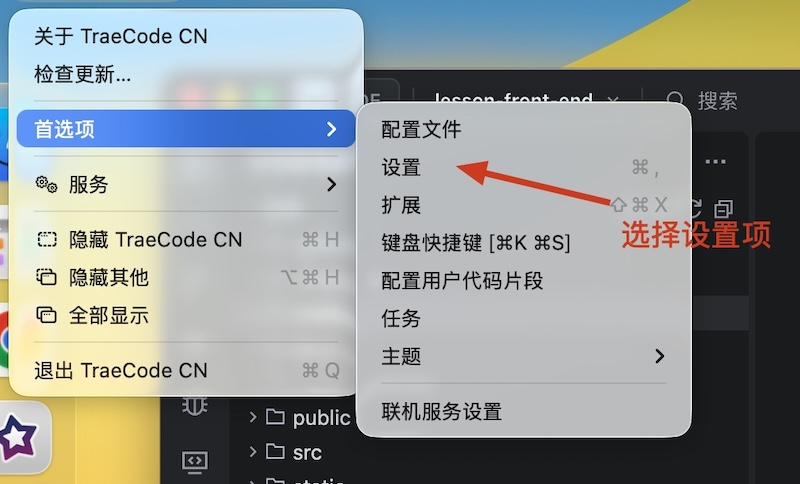
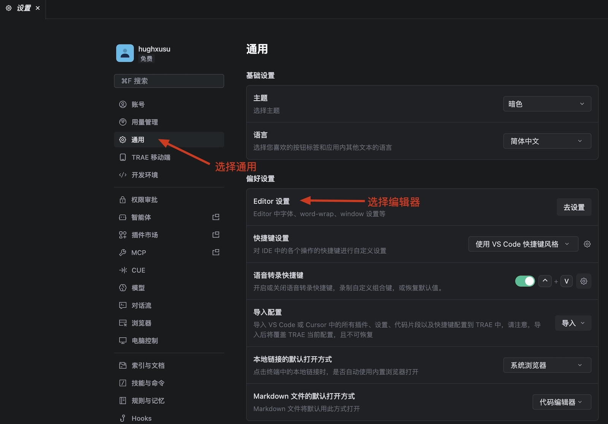
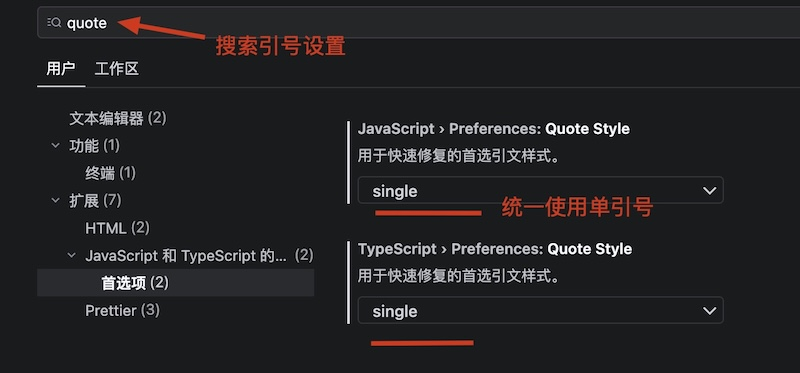
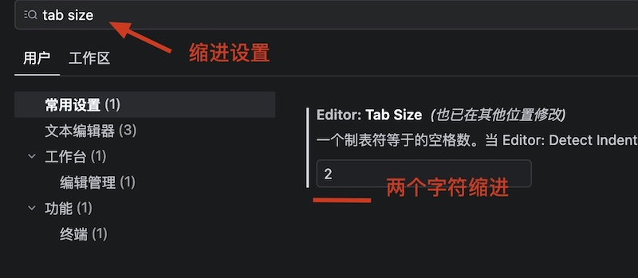
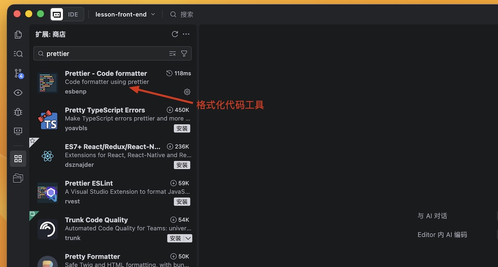
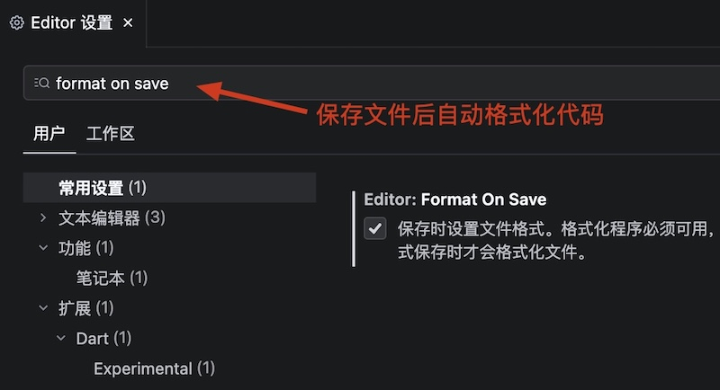

# 搭建前端开发环境

## 开发工具

1. [Chrome浏览器](https://www.google.cn/intl/zh-CN/chrome/?)，设置为默认浏览器。
2. [TRAE](https://www.trae.com.cn/)是一款非常优秀的前端集成开发环境。

## 开发工具的安装

### TRAE

**集成开发环境**（IDE，Integrated Development Environment）——集成了开发软件需要的所有工具，一般包括：

* 图形用户界面
* 代码编辑器（支持代码补全/自动缩进）
* 编译器/解释器
* 调试器（断点/单步执行）

Trae IDE与AI深度集成，提供智能问答、代码自动补全以及基于Agent的AI自动编程能力。使用Trae开发项目时，你可以与AI灵活协作，提升开发效率。[官方使用教程](https://docs.trae.com.cn/ide/what-is-trae?_lang=zh)

在电脑上新建一个文件夹，使用TRAE打开

如果需要预览网页需要安装插件：Live Server或Live Preview

在Chrome中预览网页

## 配置代码格式

在设置项中设置代码格式

选择文本编辑器配置代码常见格式

设置代码中的引号均为单引号

设置代码中的缩进格式为2个字符

* `detectIndentation`设置为`false`。

安装前端代码格式工具

* Prettier插件，主要帮助前端语言进行代码格式化，支持语言包括：JavaScript、TypeScript、HTML和CSS等。

设置文件保存后自动格式化代码

* 当文件保存是会自动调用Prettier对代码进行格式化。
