# CSS特性

对同一元素添加不同属性，影响属性生效的特性包括：继承性、层叠性和优先级。

## 继承性

一些设置在父元素上的 CSS 属性是可以被子元素继承的，有些则不能。

文本控制属性都是继承属性：

* 字体属性：`color`、`font-style`、`font-weight`、`font-size`、`font-family`
* 段落属性：`text-indent`、`text-align`、`line-height`

```html
<style>
  div {
    color: red;
    font-size: 30px;
    text-align: center;
  }
</style>
<div>
  在我的后园， 可以看见墙外有两株树，
  <p>一株是枣树，还有一株也是枣树。</p>
</div>
```

常见应用场景，设置统一样式：

* 直接给body标签设置统一的`font-size`，统一不同浏览器默认文字大小。
* 可以直接给`ul`设置`list-style`属性为 none，去除列表默认的小圆点样式。

```html
<style>
  ul {
    list-style: none;
  }
</style>
<ul>
  <li>豆浆</li>
  <li>油条</li>
</ul>
```

如果元素有浏览器默认样式，优先显示浏览器的默认样式：

* a标签的文字颜色浏览器有默认样式。

* h系列标签的`font-size`浏览器有默认样式。

```html
<style>
  div {
    color: red;
    font-size: 12px;
  }

</style>
<div>
  <a href="#">在我的后园， 可以看见墙外有两株树，</a>
  <h1>一株是枣树，还有一株也是枣树。</h1>
</div>
```

## 层叠性

1. 给同一个标签设置不同的样式，样式会层叠叠加，共同作用在标签上。
2. 给同一个标签设置相同的样式，样式会层叠覆盖，最终写在最后的样式会生效。
3. 当样式冲突时，只有当选择器优先级相同时，才能通过层叠性判断结果。

```html
<style>
  div {
    color: red;
    color: green;
  }
  
</style>
<div class="box">在我的后园，可以看见墙外有两株树，一株是枣树，还有一株也是枣树。</div>
```

## 优先级

不同选择器具有不同的优先级，优先级高的选择器样式会覆盖优先级低选择器样式。

优先级公式：继承 < 通配符选择器 < 标签选择器 < 类选择器 < id选择器 < 行内样式 < `!important`

* `!important`写在属性值的后面，分号的前面。
* `!important`不能提升继承的优先级，只要是继承优先级最低。

```html
<style>
  #box {
    color: orange;
  }

  .box {
    color: blue;
  }

  div {
    color: green !important;
  }

  body {
    color: red;
  }
</style>
<div class="box" id="box" style="color: pink;">测试优先级</div>
```

> [!attention]
>
> 实际开发中慎用`!important`。

### 权重叠加计算

如果多个复合选择器选中元素，需要通过权重叠加计算方法，判断最终哪个选择器优先级最高，该选择器的样式会生效。

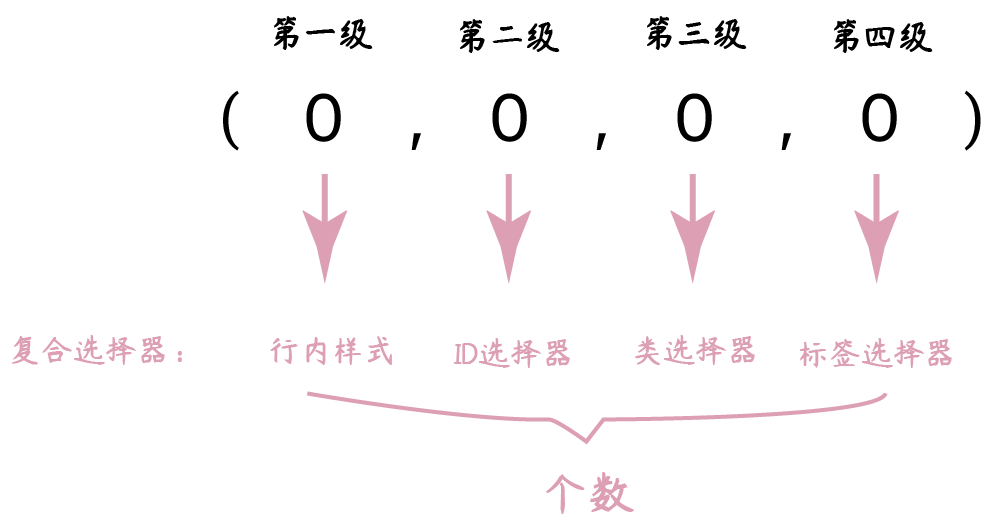

比较规则：

1. 比较上一级数字，数值大者优先。
2. 如果相同再比较下一级。
3. 如果权重完全相同，根据层叠性判断。
4. `!important`如果不是继承，则权重最高。

```html
<style>
  /* (行内, id, 类, 标签) */

  /* (0, 1, 0, 1) */
  div #one {
    color: orange;
  }

  /* (0, 0, 2, 0) */
  .father .son {
    color: skyblue;
  }

  /* 0, 0, 1, 1 */
  .father p {
    color: purple;
  }

  /* 0, 0, 0, 2 */
  div p {
    color: pink;
  } 
</style>

<div class="father">
  <p class="son" id="one">我是一个标签</p>
</div>
```

## 检查样式错误的步骤

1. 使用Chrome浏览器选中检查的元素。
2. 检查选择器是否生效（是否有效选择对应的元素）。
3. 检查样式是否生效（没生效会有删除线）。

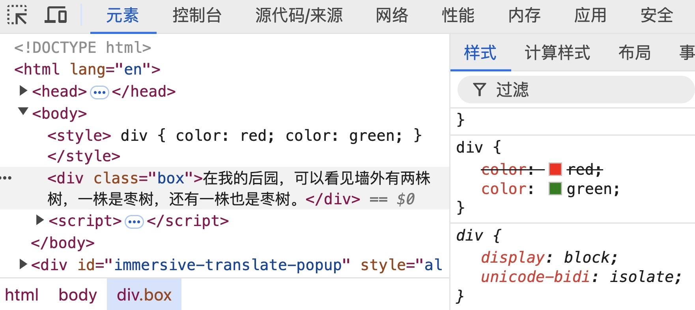

4. 检查是否样式报错（样式报错有警告**⚠️**）。

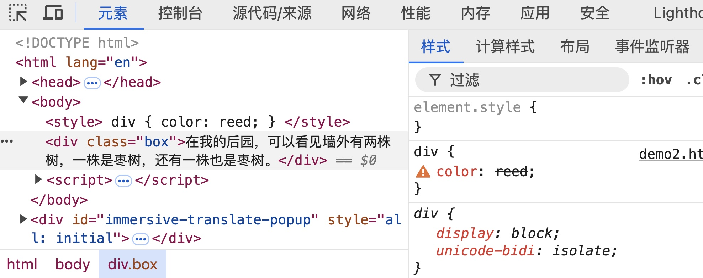


## 原型测量与切图

[Figma](https://www.figma.com/)是一个基于浏览器、主打云端协作的UI/UX设计工具。它最大的特点是，让设计师、产品经理、开发人员能在同一个线上文件里实时协作，共同完成产品开发。

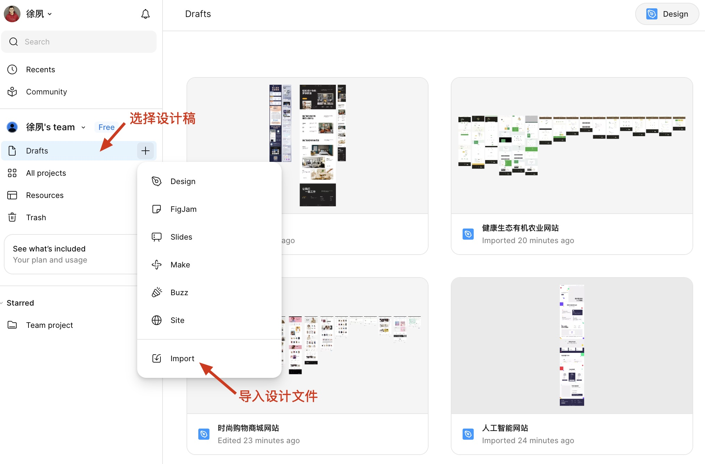

查看设计稿中的元素

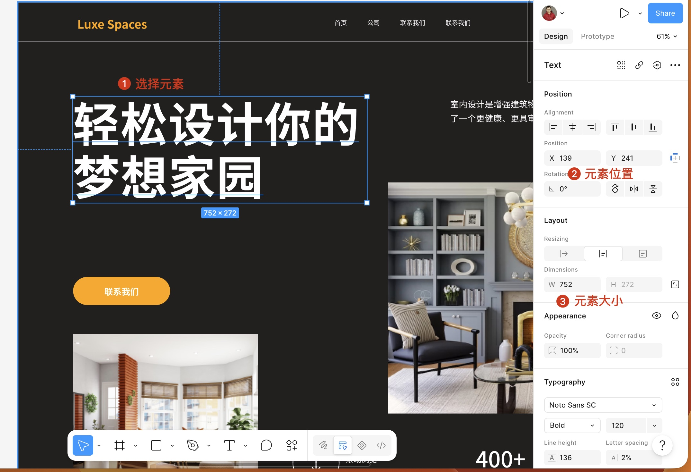

* 测量两个元素之间的距离：
  * Windows：按住`Alt`键。
  * Mac：按住`⌥ Option`键。

### MCP工具

Figma AI Bridge MCP是一个桥接工具，使用它让Trae读取设计稿中的元素，自动完成网页编程工作。

1. 创建MCP工具

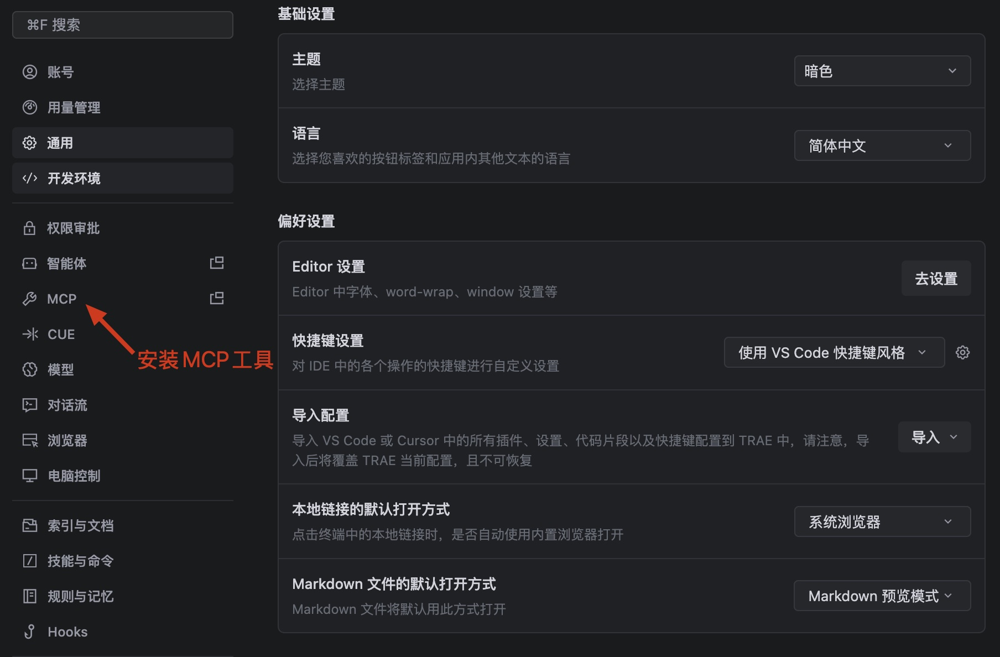

2. 添加MCP插件

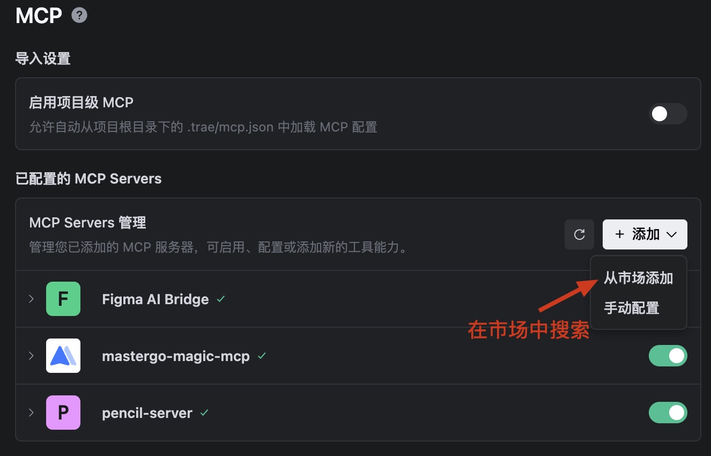

3. 搜索Figma插件

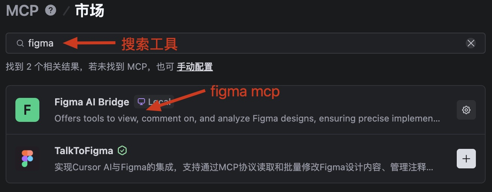

4. 添加Figma的Token

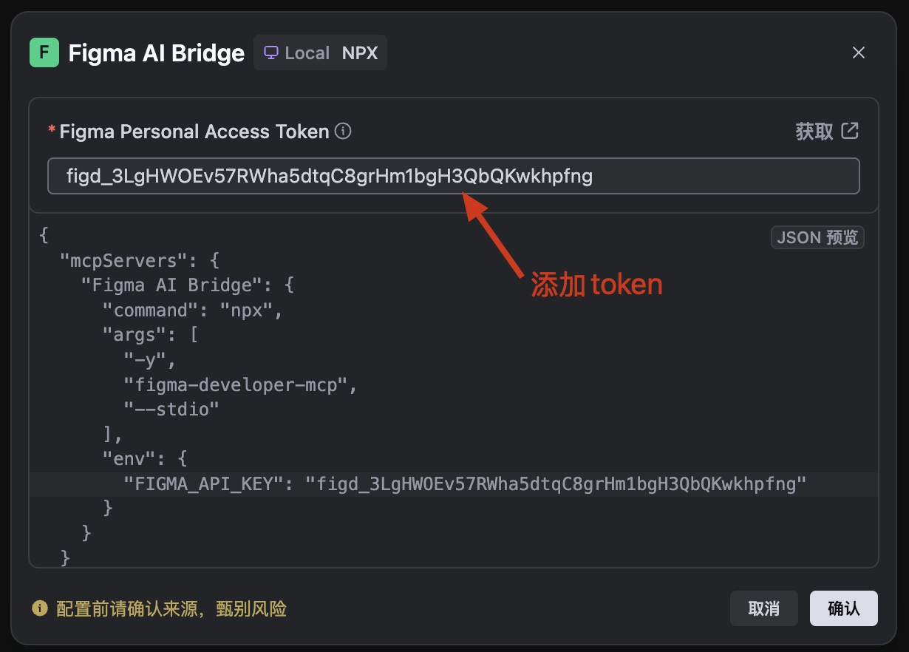

5. Figma配置项

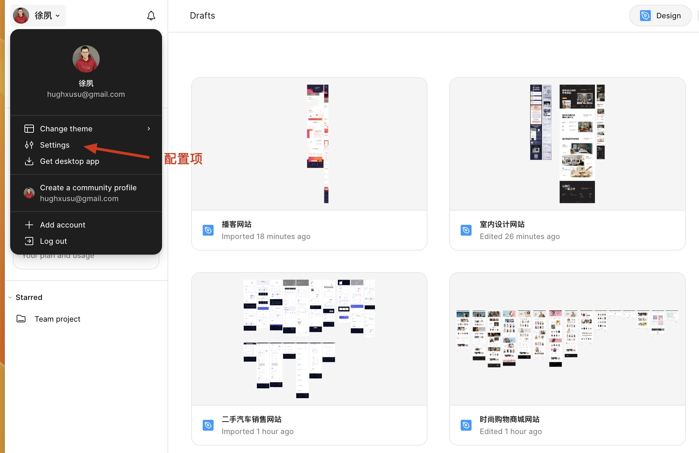

6. 生成新Token

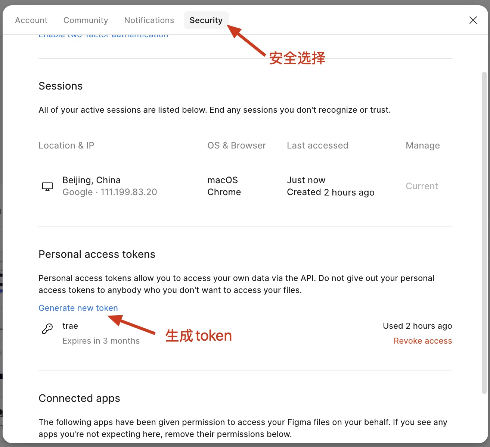

7. 生成一个新Token

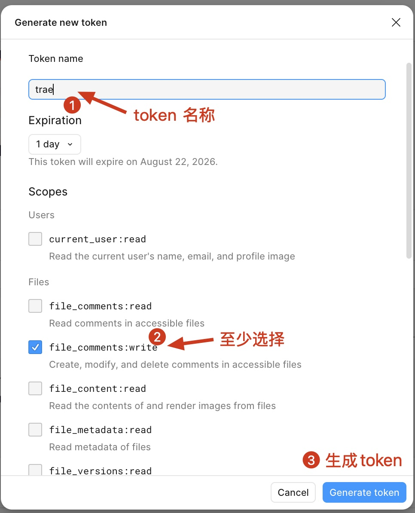

8. 添加新智能体

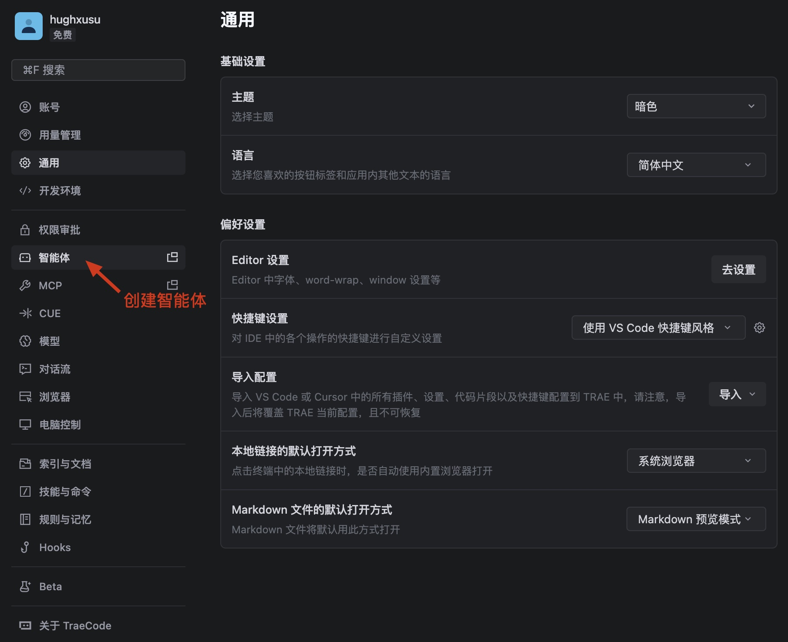

9. 创建新智能体，并配置Figma的MCP

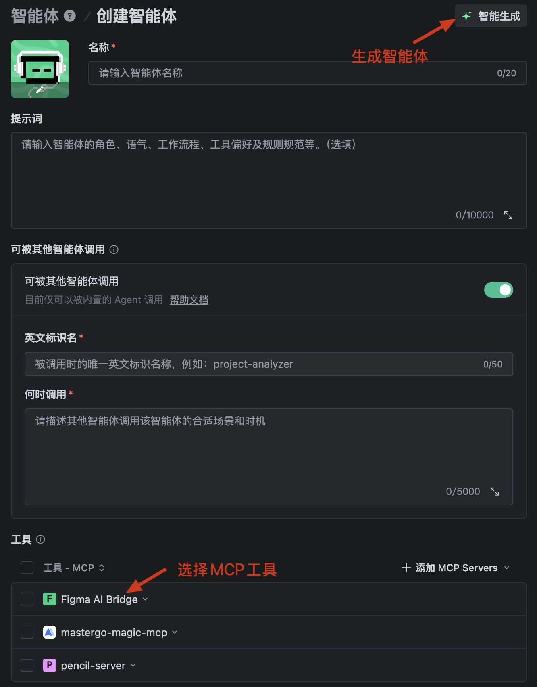

10. 使用新建的智能体

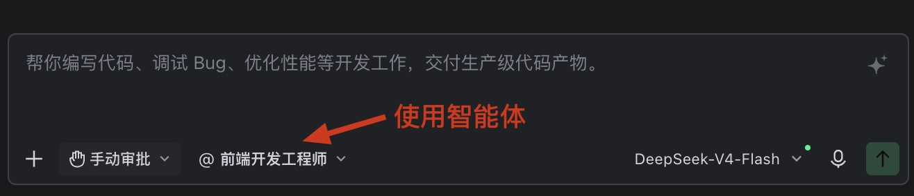

## 练习

1. 使用MCP工具完成snow网站登陆页。

[素材下载](https://github.com/hughxusu/lesson-front-end/tree/develop/src/figma)

