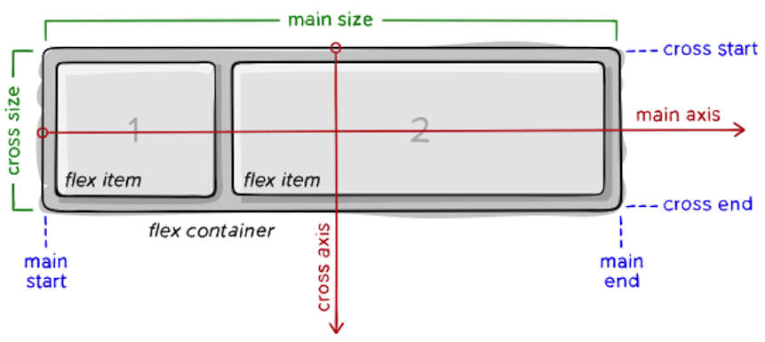
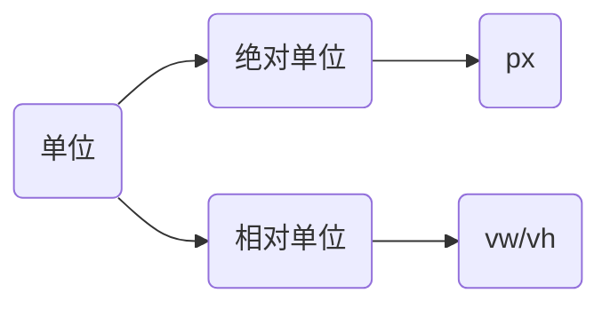

# 弹性布局

## Flex 布局

Flex布局被称为弹性布局，是一种用于在容器中排列子元素的一维布局模型。

* 设置方式：在父元素添加`display: flex`。
* Flex布局是浏览器，专门针对布局的显示模式，被浏览器提倡。

```html
<style>
  * {
    margin: 0;
    padding: 0;
  }

  .bar {
    display: flex;
    width: 100%;
    box-sizing: border-box;
    border: 1px solid #000;
  }

  .bar div {
    width: 100px;
    height: 100px;
    background-color: pink;
  }

  .page {
    width: 100%;
    height: 200px;
    background-color: skyblue;
  }
</style>
<div class="bar">
  <div>1</div>
  <div>2</div>
  <div>3</div>
</div>
<div class="page">
</div>
```

> [!warning]
>
> Flex布局可以避免浮动布局中脱离文档流现象发生。

只有高版本的浏览器，可以兼容Flex布局，在[can i use](https://caniuse.com/)中可以查询，哪些浏览器版本支持Flex布局。

### Flex布局模型构成



* 设置了`flex`显示模式的元素，称为弹性容器（flex container）。
* 弹性容器中的元素，称为弹性项（flex item）。
* 水平方向默认是主轴（main axis）。
* 垂直方法默认是交叉轴（cross axis）。

弹性项的排列方式，沿主轴方向进行排列。

### 主轴对齐方式

`justify-content`属性可以调解主轴的对齐方式，通过调节主轴或侧轴的对齐方式，可以设置盒子之间的距离。

| 属性值          | 作用                                               |
| --------------- | -------------------------------------------------- |
| `flex-start`    | 默认值，起点开始依次排列                           |
| `flex-end`      | 终点开始依次排列                                   |
| `center`        | 沿主轴居中排列                                     |
| `space-around`  | 弹性盒子沿主轴均匀排列，空白间距均分在弹性盒子两侧 |
| `space-between` | 弹性盒子沿主轴均匀排列，空白间距均分在相邻盒子之间 |
| `space-evenly`  | 弹性盒子沿主轴均匀排列，弹性盒子与容器之间间距相等 |

主轴对齐方式，需要在弹性容器中设置。

```css
justify-content: space-between;
```

### 交叉轴对齐方式

`align-items` 可以调解交叉轴的对齐方式

| 属性值       | 作用                                       |
| ------------ | ------------------------------------------ |
| `flex-start` | 默认值，起点开始依次排列                   |
| `flex-end`   | 终点开始依次排列                           |
| `center`     | 沿侧轴居中排列                             |
| `stretch`    | 默认值，弹性盒子沿着主轴线被拉伸至铺满容器 |

交叉轴对齐方式，也需要在弹性容器中设置。

```css
.bar {
  width: 100%;
  height: 240px;
  box-sizing: border-box;
  border: 1px solid #000;
  display: flex;
  align-items: center;
}
```

`align-self`可以修改单个弹性项，交叉轴的对齐方式，该属性需要添加到弹性项中。

```css
.bar div:nth-child(2) {
  align-self: stretch;
}
```

> [!warning]
>
> 当弹性容器的交叉轴对齐方式，不是`stretch`时，高度由内容撑开。

### 伸缩比

使用`flex`属性，可以修改弹性容器的伸缩比，表示占用容器剩余尺的份数，该属性需要添加到弹性项中。

```css
.bar div:nth-child(1) {
  width: 100px;
  background-color: red;
}

.bar div:nth-child(2) {
  flex: 4;
  background-color: blue;
}

.bar div:nth-child(3) {
  flex: 1;
  background-color: green;
}
```

### 主轴方向

主轴默认是水平方向，交叉轴默认是垂直方向，可以通过`flex-direction`改变主轴方向。

| 属性值           | 作用           |
| ---------------- | -------------- |
| `row`            | 水平（默认值） |
| `column`         | 垂直           |
| `row-reverse`    | 从右向左       |
| `column-reverse` | 从下向上       |

改变主轴方向，需要在弹性容器中设置。

```html
<style>
  .box {
    display: flex;
    flex-direction: column;
    align-items: center;
    justify-content: space-evenly;
    width: 80px;
    height: 80px;
    border: 1px solid #ccc;
  }

  .box img {
    width: 32px;
    height: 32px;
  }
</style>
<div class="box">
  
  <span>媒体</span>
</div>
```

### 弹性盒子换行

使用`flex-wrap: wrap;`属性，可以实现弹性盒子多行排列效果，需要在弹性容器中设置。

```html
<style>
  * {
    margin: 0;
    padding: 0;
  }

  .box {
    display: flex;
    flex-wrap: wrap;
    height: 500px;
    border: 1px solid #000;
  }

  .box div {
    width: 100px;
    height: 100px;
    background-color: pink;
  }
</style>
<div class="box">
  <div>1</div>
  <div>2</div>
  <div>3</div>
  <div>4</div>
  <div>5</div>
  <div>6</div>
  <div>7</div>
  <div>8</div>
</div>
```

使用`align-content`属性可以调整行的对齐方式，取值与`justify-content`相同，需要在弹性容器中设置。

```css
align-content: space-between;
```

> [!important]
>
> 弹性布局与浮动的区别：
>
> 1. 浮动属性，直接添加在需要浮动的元素上。
> 2. 弹性布局，需要构建父子结构的元素关系。
> 3. 弹性布局属性，大多数添加在弹性容器（父元素）上，只有少部分添加在弹性项（子元素上）。

## 视口



视口表示浏览器中显示文档的区域，css可以设置视口相对单位：

1. 1 `vw` = 1 / 100 视口宽度
2. 1 `vh` = 1 / 100 视口高度

可以使实现不同宽度的设备中，网页元素尺寸等比缩放效果。

```html
<style>
  * {
    margin: 0;
    padding: 0;
  }

  .box {
    margin: auto;
    width: 300px;
    height: 300px;
    border: 1px solid black;
  }

  .sub {
    width: 10vw;
    height: 10vh;
    background-color: skyblue;
  }
</style>

<div class="box">
  <div class="sub"></div>
</div>
```

`vw`尺寸的换算
$$
VW = \frac{PX}{设计稿单位视口宽度} \\
VH = \frac{PX}{设计稿单位视口高度}
$$
* [px转换为视口工具](https://cssunitconverter.vercel.app/)

```html
<style>
  * {
    margin: 0;
    padding: 0;
  }

  .box {
    width: 21.33vw; /* 80px */
    height: 8.996vh; /* 60px */
    background-color: pink;
  }
</style>
<div class="box">
</div>
```

> [!caution]
>
> 在开发中一般不会混用vw和vh，以避免因为屏幕比例问题而导致的形变。
>
> ```css
> height: 16.00vw;
> ```

## 响应布局

能够根据设备宽度的变化，设置差异化样式（如：[小红书](https://www.xiaohongshu.com/explore)），实现响应布局的方法是，使用媒体查询属性。

媒体查询（Media Queries）是 CSS3 中引入的一项技术，允许网页开发者根据设备的特性（如屏幕尺寸、分辨率、设备类型等）来应用不同的CSS样式规则。

```css
@media (媒体特性) {
  选择器 {
    样式
  }
}
```

媒体查询通常使用`max-width`和`min-width`控制。

```css
@media (max-width: 768px) {
  body {
    background-color: pink;
  }
}

@media (min-width: 1200px) {
  body {
    background-color: skyblue;
  }
}
```

媒体查询中要注意样式的层叠性。

* 使用`min-width`从小到大写。
* 使用`max-width`从大到小写。

```css
@media (min-width: 768px) {
  body {
    background-color: pink;
  }
}
@media (min-width: 992px) {
  body {
    background-color: green;
  }
}
@media (min-width: 1200px) {
  body {
    background-color: skyblue;
  }
}
```

媒体查询的完整写法

```css
@media 关键词 媒体类型 and (媒体特性) {
  选择器 {
    样式
  }
}
```

媒体特性主要用来描述媒体类型的具体特征

| 特性名称       | 属性                      | 值                              |
| -------------- | ------------------------- | ------------------------------- |
| 视口的宽和高   | `width`、`height`         | 数值                            |
| 视口最大宽或高 | `max-width`、`max-height` | 数值                            |
| 视口最小宽或高 | `min-width`、`min-height` | 数值                            |
| 屏幕方向       | `orientation`             | `portrait`竖屏；`landscape`横屏 |

### 媒体查询引入

使用外连接设置不同类型的媒体查询

```html
<link rel="stylesheet" media="逻辑符 媒体类型 and (媒体特性)" href="xx.css">
```

实践中只使用媒体特性即可。上面的样式可以拆解为多个样式表。

```html
<link rel="stylesheet" href="./small.css" media="(min-width: 992px)">
<link rel="stylesheet" href="./big.css" media="(min-width: 1200px)">
```

## 练习

1. 使用Flex布局完成snow页面中的Choose Account Type卡片。
