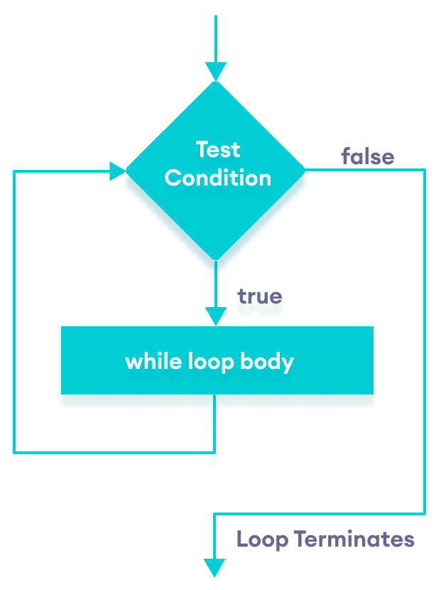
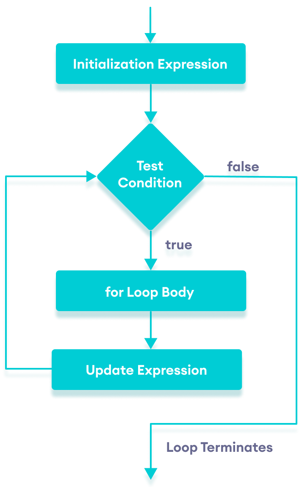

# 循环控制

循环就是让指定的代码块不断的运行，直到指定的条件不再满足为止。JavaScript支持循环操作的关键是`while`和`for`。

## `while` 循环

循环三要素

1. 变量起始值。
2. 终止条件（没有终止条件，循环会一直执行，造成死循环）。
3. 变化量（用自增或者自减）。

```js
// 1. 变量起始值
let i = 0
// 2. 终止条件
while (i < 3) {
    document.write(`<h1>第${i}循环</h1>`)
    // 3. 变化量
    i++
}
document.write(`<h1>循环结束值${i}</h1>`)
```



### 跳过循环

`break`和`continue`是专门在循环中使用的关键字：

- `break`满足一定条件时退出循环，不再执行后续重复的代码。
- `continue`跳过后续代码，进入下一次循环。


```js
let techs = ['html', 'css', 'js', 'vue', 'react', 'angular']
let i = 0
while (i < techs.length) {
    if (techs[i].length > 4) {
        break
    }

    if (techs[i].length < 3) {
        i++
        continue
    }

    document.write(`<h1>${techs[i]}</h1>`)
    i++
}
```

> [!warning]
>
> `break`和`continue`只针对当前所在循环有效。

### 循环的应用

1. 利用循环进行统计计算。

```js
let i = 1
let sum = 0
while (i <= 100) {
    if (i % 2 === 0) {
        sum = sum + i
    }
    i++
}
document.write(`<h1>${sum}</h1>`)
```

2. 程序执行控制

```js
while (true) {
    let str = prompt(`
        请输入操作命令:
    `)

    if (str === 'exit') {
        break
    }

    alert(`执行命令：${str}`)
}
```

## `for` 循环

`for`循环把声明起始值、循环条件、变化值写到一起，使程序一目了然。

```js
for (let i = 0; i < 5; i++) {
    document.write(`<h1>第${i}循环</h1>`)
}
// document.write(`<h1>循环结束值${i}</h1>`)
```



> [!caution]
>
> 在`for`循环的起始条件中，定义变量`i`，循环结束时无法获得。

`for`循环和`while`循环的区别

* 如果明确了循环的次数时，使用`for`循环。
* 不明确循环次数的时，使用`while`循环。
* `for`循环常用数组的变量。

```js
let sites = ['Google', 'Wiki', 'Weibo', 'Runoob', 'Baidu']
for (let i = 0; i < sites.length; i++) {
    document.write(`<h1>${sites[i]}</h1>`)
}
```

程序中的计数原则：

* 自然计数法，从1开始计数。
* 程序计数法从0开始计数。在编写程序时，应该尽量养成习，循环计数从0开始。

### 跳出`for`循环

`break`和`continue`在`for`循环中的作用与`while`循环一直。

```js
let techs = ['html', 'css', 'js', 'vue', 'react', 'angular']
for (let i = 0; i < techs.length; i++) {
    if (techs[i].length > 4) {
        break
    }

    if (techs[i].length < 3) {
        continue
    }

    document.write(`<h1>${techs[i]}</h1>`)
}
```

### 循环嵌套

循环中体中包含循环。

```js
for (let i = 0; i < 3; i++) {
    for (let j = 0; j < 5; j++) {
        document.write(`<h1 style="display: inline;">⭐️</h1>`)
    }
    document.write(`<br/>`)
}
```

* 外层循环控制行数，内层循环控制列数。

## 综合案例

1. 打印九九乘法表。

