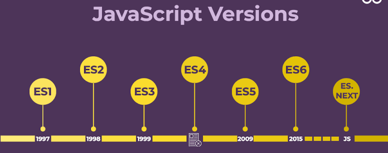

# 闭包与箭头函数



| 时代/阶段     | 代表特性                           | 主要解决的问题                     |
| ------------- | ---------------------------------- | ---------------------------------- |
| ES5 (2009)    | 标准的JavaScript语法               | 标准化 JavaScript，规范语法细节    |
| ES6 (2015)    | `let/const`、`Class`、箭头函数、等 | 赋予构建大型工程和模块化应用的能力 |
| ES2016~ES2020 | `async/await`等                    | 异步体验与安全链式操作的极致优化   |
| ES2021~至今   | 不可变数组方法、顶层 `await`、等   | 面向对象严谨度与数据不可变性增强   |

## 闭包

闭包的使用：

1. 定义外部函数。
2. 定义内部函数（函数嵌套）。
3. 外部函数返回了内部函数。

```js
function multiplierFactory(factor) {
	function multiplier(number) {
		return number * factor
	}

	return multiplier
}

let double = multiplierFactory(2)
console.log(double);
console.log(double(5));
let triple = multiplierFactory(3)
console.log(triple(5));
```

闭包使用中可以直接返回匿名函数

```js
function multiplierFactory(factor) {
	return function(number) {
		return number * factor
	}

}

let double = multiplierFactory(2)
console.log(double(6));
```

> [!important]
>
> 闭包的本质是一个函数与其相关的引用环境组合的一个整体。

闭包的特点：

1. 闭包可以保存外部函数的变量，不会随着外部函数调用完而销毁。
2. 由于闭包引用了外部函数的变量，则外部函数的变量没有及时释放，消耗更多内存。

> [!caution]
>
> 引用闭包的变量不销毁，闭包相关的变量不会释放。

闭包中，外部函数的变量，可以被修改

```js
function makeCounter(init=0) {
    let count = init
    return function () {
        count++
        return count
    }
}
let counter = makeCounter()
console.log(counter());
console.log(counter());
console.log(counter());
```

## 预解析

### 函数预解析

JavaScript会把带有名字的函数，提升到当前作用域最前面。

```js
sayHello();

function sayHello() {
    console.log('hello world');
}
```

* 函数`sayHello`会被提升到，作用域最前面。

> [!warning]
>
> 匿名函数和变量函数，不会预解析。

```js
let hello = function () {
    console.log('hello world');
}
```

### 变量的预解析

JavaScript会把变量声明，提升到当前作用域的最前面，只声明不赋值。

1. 变量为定义

```js
console.log(hello);
```

2. 变量未赋值

```js
console.log(hello);
let hello = 'hello world'
```

> [!caution]
>
> 无论是变量和函数都应该先定义，后使用。

## 剩余参数

使用`...`符合可以在函数中打包参数。

```js
function getSum (...a) {
    let sum = 0;
    for (let i = 0; i < a.length; i++) { 
        sum = sum + a[i]
    }
    

}
getSum(1, 2, 3, 4, 5, 6);
```

固定参数和剩余参数可以混合使用

```js
function getValues(a, b, ...c) {
    let sum = a + b;
    for (let i = 0; i < c.length; i++) { 
        sum = sum * c[i]
    }
    return sum
}

console.log(getValues(1, 2, 3, 4));
```

## 箭头函数

箭头函数是一种声明函数的简洁语法。箭头函数只能用于函数表达式和回调函数。

* 定义函数表达

```js
let trapezoidArea = (top, bottom, height) => {
    return (top + bottom) * height / 2;
}

let result = trapezoidArea(2, 3, 4);
console.log(result);
```

* 回调函数

```html
<body>
	<button>Click me</button>
</body>
<script type="text/javascript">
let btn = document.querySelector('button')
btn.addEventListener('click', () => {
	alert('五陵年少金市东，银鞍白马度春风。')
})
</script>
```

* 如果参数只有一个，可以省略小括号。

```js
let circleArea = r => {
    return Math.PI * r * r;   
}

let result = circleArea(3);
console.log(result);
```

* 如果函数体只有一行代码，那么可以省略大括号。省略大括号，直接返回表达式。

```js
let circleArea = r => Math.PI * r * r; 
let result = circleArea(3);
console.log(result);
```

> [!warning]
>
> 箭头函数与匿名函数的`this`指向的内容有所不同。

* 一般函数的`this`指针指向调用者

```html
<body>
	<button>匿名函数</button>
</body>
<script type="text/javascript">
let btn = document.querySelector('button')
btn.addEventListener('click', function() {
	console.log(this);
})
</script>
```

* 箭头函数的`this`指针指向上级作用域的`this`

```html
<body>
	<button>箭头函数</button>
</body>
<script type="text/javascript">
let btn = document.querySelector('button')
btn.addEventListener('click', () => {
	console.log(this);
})
</script>
```

* 使用匿名函数定义对象的方法

```js
let product = {
	price: 299,
    getImage: function () {
      console.log(`product.this`);
      console.log(this);
      window.setTimeout(function () {
        console.log(`window.this`);
        console.log(this);
      }, 1000);
    },
}
product.getImage()
```

* 使用箭头函数定义对象的方法

```js
let product = {
	price: 299,
    getImage: () => {
      console.log(`product.this`);
      console.log(this);
      window.setTimeout(() => {
        console.log(`window.this`);
        console.log(this);
      }, 1000);
    },
}
product.getImage()
```

> [!important]
>
> 箭头函数中没有`arguments`，只能使用`...`动态获取实参

```js
let getMax = (...args) => {
	let max = args[0];
	for (let i = 1; i < args.length; i++) {
		if (args[i] > max) {
			max = args[i];
		}
	}
	return max;
}
```

> [!warning]
>
> 监听函数中使用箭头函数，如果希望获得调用对象，需要借助监听事件。

```html
<body>
	<button>Click me</button>
</body>
<script type="text/javascript">
let btn = document.querySelector('button')
btn.addEventListener('click', (e) => {
	console.log(e.target);
})
</script>
```

> [!caution]
>
> 如果函数中明确的要使用的调用对象的`this`，则不能使用箭头函数。

## 解构赋值

解构赋值就是将数组或对象中的数据，拆分到变量中。

### 数组解构

1. 可以使用一一对应的方式对数组进行解构。

```js
let [a, b, c, d] = ['red', 'green', 'blue', 'yellow'];
console.log(a);
console.log(b);
```

2. 变量数量大于数组长度，多余变量值为`undefined`

```js
let [a, b, c, d, f, g] = ['red', 'green', 'blue', 'yellow'];
console.log(a);
console.log(f);
console.log(g);
```

3. 变量数量小于数组长度，多余元素不会被赋值

```js
let [a, b] = ['red', 'green', 'blue', 'yellow'];
console.log(a);
console.log(b);
```

4. 可以选择部分元素结构

```js
let [, a, , b] = ['red', 'green', 'blue', 'yellow'];
console.log(a);
console.log(b);
```

5. `...`可以将部分元素进行打包

```js
let [a, b, ...c] = ['red', 'green', 'blue', 'yellow'];
console.log(a);
console.log(b);
console.log(c);
```

> [!caution]
>
> `...`打包部分，必须放在解构赋值最后。

6. `...`展开运算符

```js
let colorsOne = ['red', 'green'];
let colorsTwo = ['blue', 'yellow'];
let colors = [...colorsOne, ...colorsTwo];
console.log(colors);
```

> [!warning]
>
> `...`运算符，既可以用于打包，也可以用于拆解。

### 对象结构

把属性名当做变量名，可以实现对象解构。

```js
let product = {
    name: '无线蓝牙耳机',
    price: 299,
    brand: '小米'
}
let {name, price} = product;
console.log(name);
console.log(price);
```

* 对解构属性进行重命名

```js
let product = {
    name: '无线蓝牙耳机',
    price: 299,
    brand: '小米'
}
let {name: productName} = product;
console.log(productName);
```

* 嵌套对象的解构

```js
let product = {
    name: '无线蓝牙耳机',
    price: 299,
    brand: '小米'
}

let order = {
    product: product,
    num: 2,
    discount: 0.9, 
}

let {product: { name }} = order;
console.log(name);
```

解构赋值的应用

```js
let product = {
    name: '无线蓝牙耳机',
    price: 299,
    brand: '小米'
}

function showProduct({ name, price, brand }) {
    document.write(`<h1>品牌：${brand} <br> 产品名称：${name} <br> 价格：${price} </h1>`);
}

showProduct(product);
```

## 练习

1. 写一个函数返回动态参数的最大值和最小值。
