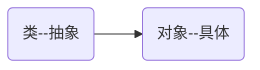

# 面向对象

面向对象编程是一种抽象化的编程思想。将一系列业务逻辑抽象称为一个模型，这个模型具备通用的特征和行为。同时，可以根据这个模型创建对象，对象用于存储数据或承载算法逻辑等。



类和对象的示例


## 创建对象

> [!tip]
>
> 思考一个常见的应用，任务清单。每一条任务应该包括：
>
> 1. 任务的状态
> 2. 任务的描述
> 3. 显示当前任务信息  

使用字面量创建一个对象

```js
let item = {
    desc: '学习es6',
    isDone: false,
    show: function () {
        status = this.isDone ? '✅' : '⭕️';
        return status + ' ' + this.desc;
    }
}
console.log(item.show());
```

### 构造函数

构造函数是专门用于创建对象的函数，构造函数结合`new`关键值，可以创建对象。

1. 内置构造函数`Object`。

```js
let item = new Object();
console.log(typeof item);
item.desc = '学习es6';
item.isDone = false;
item.show = function () {
    status = this.isDone ? '✅' : '⭕️';
    return status + ' ' + this.desc;
}
console.log(item.show());
```

* `new`对象直接初始化

```js
let item = new Object({
    desc: '学习es6',
    isDone: false,
    show: function () {
        status = this.isDone ? '✅' : '⭕️';
        return status + ' ' + this.desc;
    }
});
console.log(item.show());
```

2. 自定义构造函数
   * 自定义构造函数时，构造函数采样大驼峰命名法。
   * 构造函数里面`this`指向当前实例对象。

```js
function Item(desc, isDone) {
    this.desc = desc;
    this.isDone = isDone;
    this.show = function() {
        status = this.isDone ? '✅' : '⭕️';
        return status + ' ' + this.desc;
    }
}

let item1 = new Item('学习es6', false);
console.log(item1.show());

let item2 = new Item('学习vue', true);
console.log(item2.show());
```

> [!important]
>
> 构造函数相当于一个模版，可以用于创建多个实例对象。
