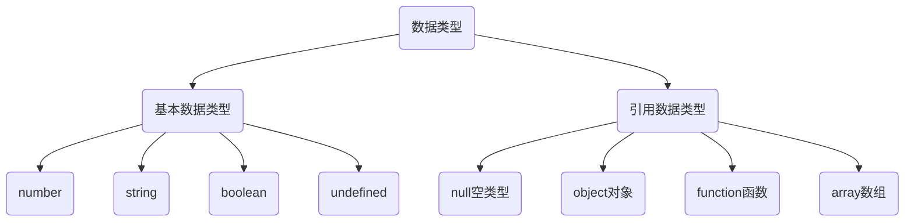
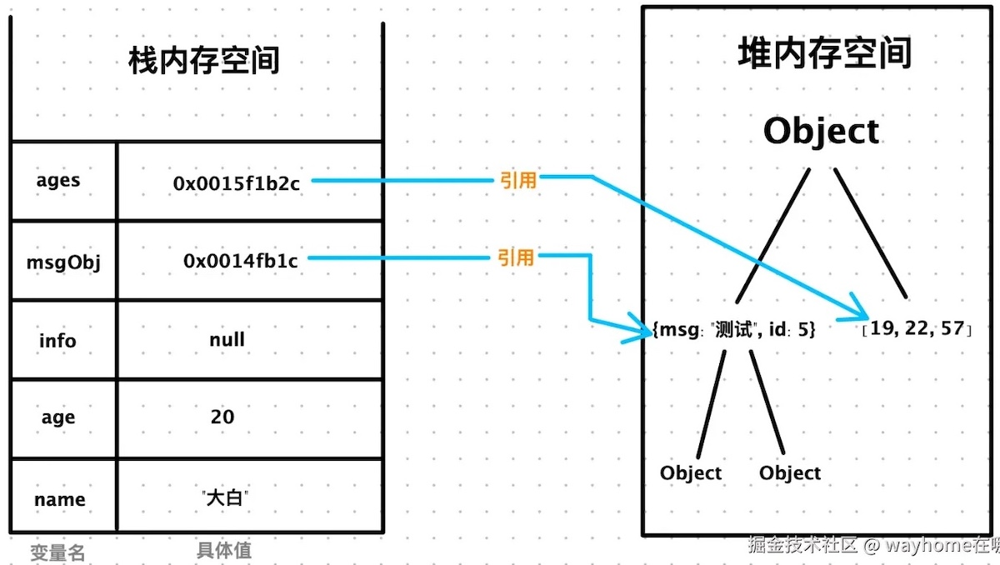

# 面向对象

面向对象编程是一种抽象化的编程思想。将一系列业务逻辑抽象称为一个模型，这个模型具备通用的特征和行为。同时，可以根据这个模型创建对象，对象用于存储数据或承载算法逻辑等。


类和对象的示例


## 创建对象

> [!tip]
>
> 思考一个常见的应用，任务清单。每一条任务应该包括：
>
> 1. 任务的状态
> 2. 任务的描述
> 3. 显示当前任务信息  

使用字面量创建一个对象

```js
let item = {
    desc: '学习es6',
    isDone: false,
    getElement: function () {
        let div = document.createElement('div');
        let checkbox = document.createElement('input');
        checkbox.type = 'checkbox';
        checkbox.checked = this.isDone;
        div.appendChild(checkbox);
        div.appendChild(document.createTextNode(this.desc));
        return div;
    }
}
document.body.appendChild(item.getElement());
```

### 构造函数

构造函数是专门用于创建对象的函数，构造函数结合`new`关键值，可以创建对象。

1. 内置构造函数`Object`。

```js
let item = new Object();
console.log(typeof item);
item.desc = '学习es6';
item.isDone = false;
item.getElement = function () {
	...
}
document.body.appendChild(item.getElement());
```

* `new`对象直接初始化

```js
let item = new Object({
    desc: '学习es6',
    isDone: false,
    getElement: function () {
			...
    }
});
document.body.appendChild(item.getElement());
```

2. 自定义构造函数
   * 自定义构造函数时，构造函数采样大驼峰命名法。
   * 构造函数里面`this`指向当前实例对象。

```js
function Item(desc, isDone) {
    this.desc = desc;
    this.isDone = isDone;
    this.getElement = function() {
			...
    }
}

let item1 = new Item('学习es6', false);
document.body.appendChild(item1.getElement());

let item2 = new Item('学习vue', true);
document.body.appendChild(item2.getElement());
```

> [!important]
>
> 构造函数相当于一个模版，可以用于创建多个实例对象。

### 对象的判断

`instanceof`用于检测实例对象对应的构造函数

```js
let item = new Item('学习es6', false);
console.log(item instanceof Item);
```

实例对象的`constructor`属性指向了构造函数

```js
let item = new Item('学习es6', false);
console.log(item.constructor);
```

### 静态成员

在JavaScript中函数本质上也是对象，可以为函数动态添加属性或方法，构造函数的属性和方法被称为静态成员。

> [!important]
>
> 一般公共特征的属性或方法，设置为静态成员。

```js
Item.total = 0
Item.addOne = function() {
    this.total++
}

document.body.appendChild(item.show());
console.log(Item.total);
Item.addOne()
console.log(Item.total);
```

* 静态成员方法中的`this`指向构造函数本。
* 静态成员只能由构造函数访问。

### `Object`的静态方法

* `Object.keys`静态方法，用于获取对象中所有属性。
* `Object.values``静态方法，用于获取对象中所有属性值。

```js
let item = new Item('学习es6', false);

let keys = Object.keys(item);
console.log(keys);
let values = Object.values(item);
console.log(values);

```

## 引用数据类型



* 简单数据类型（值类型/基本数据类型）：变量中存储的数据是值本身。
* 引用数据类型（复杂数据类型）：变量中存储的仅仅是地址（引用）。
* [JavaScript的内置对象](https://developer.mozilla.org/zh-CN/docs/Web/JavaScript/Reference/Global_Objects)。

### 堆和栈

1. 栈：由操作系统自动分配释放存放函数的参数值、局部变量的值等。简单数据类型存放到栈里面。
2. 堆：由程序员分配释放，若程序员不释放，由垃圾回收机制回收。引用数据类型存放到堆里面。



引用类型变量（栈空间）里存放的是地址，真正的对象实例存放在堆空间中。

```js
let a = 10
let b = a
b = 20
document.write(`<h1>a: ${a}</h1>`)
document.write(`<h1>b: ${b}</h1>`)

let obj1 = {name: 'John', age: 20}
let obj2 = obj1
document.write(`<h1>obj1: ${obj1.age}</h1>`)
obj2.age = 30
document.write(`<h1>obj1: ${obj1.age}</h1>`)
document.write(`<h1>obj2: ${obj2.age}</h1>`)
```

### 包装类型

一切皆对象：JavaScript是面向对象的编程语言，所有的数据要么是对象本身，要么可以在使用时“表现得像对象”。

> [!tip]
>
> 思考如下代码：
>
> ```js
> let str = 'hello world';
> console.log(str.length);
> ```
>
> `str`是基本数据类型，为什么会有属性`length`?

包装类型：在JavaScript中的字符串、数值、布尔具有对象的使用特征，是底层程序使用对象类型将这些数据类型，包装起来。

```js
let str1 = 'hello world';
console.log(typeof str1);
let str2 = new String('hello world');
console.log(typeof str2);
```

基本数据类型的包装

```js
let str = new String('hello world');
console.log(typeof str);

let num = new Number(100.12345);
console.log(typeof num);

let bool = new Boolean(true);
console.log(typeof bool);
```

包装类型有多种方法可以使用：[String](https://developer.mozilla.org/zh-CN/docs/Web/JavaScript/Reference/Global_Objects/String)、[Number](https://developer.mozilla.org/zh-CN/docs/Web/JavaScript/Reference/Global_Objects/Number)、[Boolean](https://developer.mozilla.org/zh-CN/docs/Web/JavaScript/Reference/Global_Objects/Boolean)

```js
let str = new String('hello world');
console.log(str.toUpperCase());

let num = new Number(100.12345);
console.log(num.toFixed(2));

let bool = new Boolean(true);
console.log(bool.valueOf());
console.log(bool.toString());
```

* 无论是引用类型，还是包装型，都包含两个公共的方法`toString`和`valueOf`：
  * `valueOf`获取原始值。
  * `toString`将对象表示为字符串。

调用基本数据类型属性的流程：

1. 自动封箱：当尝试访问`str.length`时，后台会自动创建一个临时的`String`对象 `new String('hello world')`。
2. 调用方法：在这个临时的包装对象上调用`.length`属性。
3. 自动销毁：方法调用结束后，这个临时的包装对象立刻被销毁。

> [!caution]
>
> `null`和`undefined`两种数据类型没有包装类，无法使用任何属性和方法。

## 练习

1. 定义一个类用于表示二维坐标系中的任意一个点。
2. 定义一个类使用上面的点，表示二维坐标系中的任意一个三角形。
3. 实现一个算法，判断二维平面中的任意一个点是否在三角形内，借助前面定义的两个类来实现。
