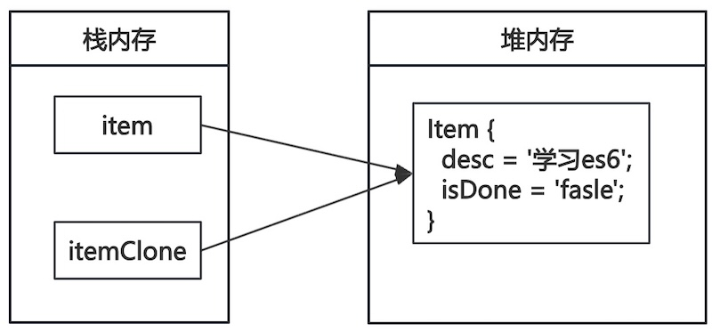

# 内置对象进阶

## 数组的进阶

创建数组对象

```js
// 字面量创建数组对象
let colorsOne = ['red', 'green', 'blue'];
console.log(colorsOne);

// 构造函数创建数组对象
let colorsTwo = new Array('red', 'green', 'blue');
console.log(colorsTwo);
```

使用循环变量数组

```js
let colors = ['red', 'green', 'blue', 'yellow', 'orange'];
for (let i = 0; i < colors.length; i++) {
    console.log(colors[i]);
}
```

使用`forEach`方法变量数组

```js
let colors = ['red', 'green', 'blue', 'yellow', 'orange'];
colors.forEach((item, index, arr) => {
    console.log(item);
    console.log(index);
    console.log(arr);
});
```

* `item`元素项；`index`索引；`arr`数组对象本身。

`for...of`循环，遍历可迭代对象，包括：`Array`、`Map`、`Set`、`String`等。

```js
let colors = ['green', 'bluegreen', 'blue', 'yellow', 'orange'];
for(let item of colors){
    console.log(item);
}
```

数组的其它遍历方法

* `filter`过滤数组中相关的元素。
* `find`查找满足条件的首值，并返回。
* `findIndex`查找满足条件的首值索引，并返回。

```js
let numbers = [10, 20, 30, 30, 50, 80, 90];

let shortNumbers = numbers.filter(item => item < 50);
console.log(shortNumbers);

let first = numbers.find(item => item > 50);
console.log(first);

let firstIndex = numbers.findIndex(item => item > 50);
console.log(firstIndex);
```

[数组对象相关的方法](https://developer.mozilla.org/zh-CN/docs/Web/JavaScript/Reference/Global_Objects/Array)

## 正则表达式

[正则表达式](https://www.runoob.com/regexp/regexp-tutorial.html)是用一套特定的字符组合成一个“规则字符串”，用来在海量文字中快速找到、替换或验证符合特定特征的内容。正则表达式的特点：

- 语法很令人头疼，可读性差。
- 通用行很强，能够适用于很多编程语言。

前端开发中正则表达式有广泛的应用：

* 验证表单：用户名规则验证、密码规则验证、手机号规则验证，等。
* 页面中特定词汇的过滤或替换。

定义正则表达式对象

```js
// 字面量定义正则表达式
let regOne = /hello/;
console.log(regOne);
console.log(typeof regOne);

// 构造函数定义正则表达式
let regTwo = new RegExp('hello');
console.log(regTwo);
```

使用正则表达式进行检测

```js
let str = 'Is is the cost of of gasoline going up up'
let regOne = /is/
console.log(regOne.test(str));
let regTwo = /up/
console.log(regTwo.exec(str));
```

* `test`检查字符串中是否存在模式串，存在返回`true`，不存在返回`false`。
* `exec`检查字符串中模式串的位置，返回首元素位置数组。

正则表达式中的字符

* 普通字符即字符的字面量。
* 元字符：正则表达式中被赋予了特殊语法含义的符号，元字符包括

边界符：`^`匹配行首文本；

```js
let str = 'Is is the cost of of gasoline going up up'
let regOne = /is/
console.log(regOne.test(str));
let regTwo = /^is/
console.log(regTwo.test(str));
```

量词：`+`重复一次或多次

```js
let str = '天天向上'
let reg = /天+/
console.log(reg.exec(str));
```

特殊字符：`\d`表示0~9

```js
let str = 'a 123 b 456 c 789 d'
let reg = /\d+/
console.log(reg.exec(str));
```

[元字符对照表](https://developer.mozilla.org/zh-CN/docs/Web/JavaScript/Guide/Regular_expressions#%E7%BC%96%E5%86%99%E4%B8%80%E4%B8%AA%E6%AD%A3%E5%88%99%E8%A1%A8%E8%BE%BE%E5%BC%8F%E7%9A%84%E6%A8%A1%E5%BC%8F)

修饰符：

* `g`匹配所有满足正则表达式的结果。

```js
let str = 'a 123 b 456 c 789 d'
let reg = /\d+/g
let result = str.matchAll(reg)
result.forEach(item => {
    console.log(item);
});
```

* `i`正则匹配时字母不区分大小写。

```js
let str = 'Is is the cost of of gasoline going up up'
let reg = /is/gi
let result = str.matchAll(reg)
result.forEach(item => {
    console.log(item);
});
```

[正则对象的相关方法](https://developer.mozilla.org/zh-CN/docs/Web/JavaScript/Reference/Global_Objects/RegExp)

## 数据拷贝

直接对变量进行赋值，数据指向相同的内存，修改一个变量导致副本同样被修改

```js
function Item(desc, isDone) {
    this.desc = desc;
    this.isDone = isDone;
}

let item = new Item('学习es6', false);
let itemClone = item;

itemClone.desc = '学习vue';
console.log(itemClone);
console.log(item);
```



### 浅拷贝

只拷贝对象第一层的数据，使用`Object.assign`可以实现浅拷贝。

```js
function Item(desc, isDone) {
    this.desc = desc;
    this.isDone = isDone;
}

let item = new Item('学习es6', false);
let itemClone = Object.assign(new Item(), item);

itemClone.desc = '学习vue';
console.log(itemClone);
console.log(item);
```

`...`展开运算符也可以用浅拷贝。

```js
let one = [1, 2, 3];
let two = [...one];
two.push(4);
console.log(one);
console.log(two);
```

### 深拷贝

当数据有对象嵌套时，第二层数据无法拷贝。

```js
let product = {
    'name': '无线蓝牙耳机',
    "price": 299,
    brand: '小米'
}

let order = {
    product: product,
    num: 2,
    discount: 0.9, 
}

console.log(order);

let orderClone = Object.assign({}, order);
orderClone.num = 10;
console.log(orderClone);

orderClone.product.name = '有线耳机';
console.log(orderClone);
console.log(order);
```

实现深拷贝的方法

1. 手动实现递归函数。
2. `structuredClone`，2022年后添加的API。

```js
let product = {
    'name': '无线蓝牙耳机',
    "price": 299,
    brand: '小米'
}

let order = {
    product: product,
    num: 2,
    discount: 0.9, 
}

let orderClone = structuredClone(order);
orderClone.num = 10;

orderClone.product.name = '有线耳机';
console.log(orderClone);
console.log(order);
```

> [!caution]
>
> 不能拷贝函数`Function`和DOM节点，尝试拷贝会抛出异常。 

## 练习

1. 设计一个手机号和密码登陆的页面，用正则表达式验证输入是否合理。
1. 使用JavaScript实现一个递归的深拷贝函数。


