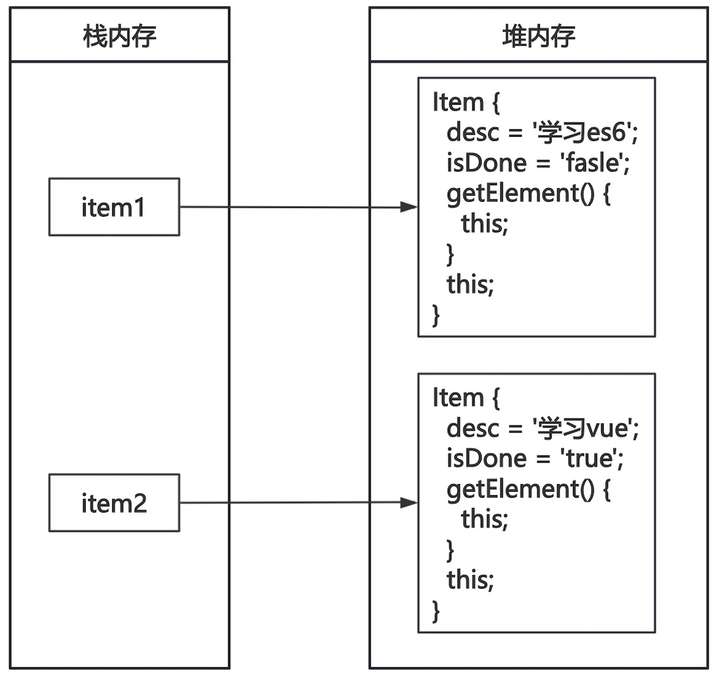
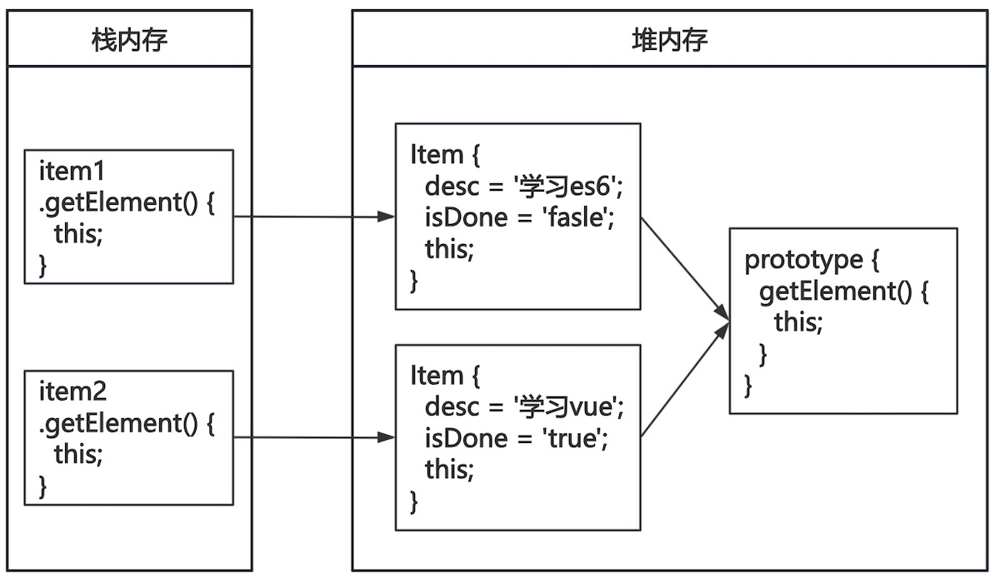

# 原型

定义任务类的构造函数，创建两个任务对象，代码如下

```js
function Item(desc, isDone) {
    this.desc = desc;
    this.isDone = isDone;
    this.getElement = function() {
			...
    }
}

let item1 = new Item('学习es6', false);
document.body.appendChild(item1.getElement());

let item2 = new Item('学习vue', true);
document.body.appendChild(item2.getElement());
```

> [!tip]
>
> 思考上面代码的内存是如何分配的？



* 上面的创建的两个对象，中`getElement`方法被复制了两份。

## 原型对象

每一个构造函数都有一个`prototype`属性，这个属性指向了一个对象，`prototype`指向的对象称为原型对象。

1. 当访问对象的属性或方法时，优先在实例对象中查找。
2. 如果实例对象中不存在，然后再去原型对象查找。
3. 如果原型对象不存在报错或返回`undefined`。
4. 原型对象中的属性和方法，被所有实例共享。

> [!important]
>
> 实际开发中，会将封装的方法添加到原型对象上。

给原型对象添加方法

```js
function Item(desc, isDone) {
    this.desc = desc;
    this.isDone = isDone;
}

Item.prototype.getElement = function() {
    let div = document.createElement('div');
    let checkbox = document.createElement('input');
    checkbox.type = 'checkbox';
    checkbox.checked = this.isDone;
    div.appendChild(checkbox);
    div.appendChild(document.createTextNode(this.desc));
    return div;
}

let item1 = new Item('学习es6', false);
document.body.appendChild(item1.getElement());

let item2 = new Item('学习vue', true);
document.body.appendChild(item2.getElement());
```



如果对象上的方法和原型对象上的方法重名，优先使用对象方法。

```js
function Item(desc, isDone) {
    this.desc = desc;
    this.isDone = isDone;

    this.getElement = function() {
        let status = this.isDone ? '✅' : '❌';
        let div = document.createElement('div');
        div.appendChild(document.createTextNode(status + ' ' + this.desc));
        return div;
    }
}

Item.prototype.getElement = function() {
    let div = document.createElement('div');
    let checkbox = document.createElement('input');
    checkbox.type = 'checkbox';
    checkbox.checked = this.isDone;
    div.appendChild(checkbox);
    div.appendChild(document.createTextNode(this.desc));
    return div;
}

let item = new Item('学习es6', false);
document.body.appendChild(item.getElement());
```

通过原型对象可以给已有对象添加方法

```js
Array.prototype.sumEvenIndex = function() {
    let sum = 0;
    this.forEach((item, index) => {
        if (index % 2 === 0) {
            sum += item;
        }
    })
    return sum;
}

let one = [1, 2, 3, 4, 5, 6];
console.log(one.sumEvenIndex());

let two = [11, 22, 33, 44, 55, 66];
console.log(two.sumEvenIndex());
```

* 给数组添加了一个通用的方法。

### 构造函数与隐式原型

每一个原型对象都有一个`constructor`属性，用于指回构造函数本身。

```js
function Item(desc, isDone) {
    this.desc = desc;
    this.isDone = isDone;
}

console.log(Item.prototype.constructor);
```

每个实例对象上都有一个`__proto__`它指向了构造函数的原型对象。

```js
function Item(desc, isDone) {
    this.desc = desc;
    this.isDone = isDone;
}

let item = new Item('学习es6', false);
console.log(item.__proto__);
console.log(Item.prototype);
console.log(item.__proto__ === Item.prototype);
```

## `this`的指向

### `function`的`this`

1. 普通函数的`this`指针指向`window`。

```js
function hello() {
    console.log(this);
}

hello();
```

2. 构造函数的`this`指针指向实例对象。

```js
function Item(desc, isDone) {
    this.desc = desc;
    this.isDone = isDone;
    console.log(this);
}

let item = new Item('学习es6', false);
```

3. 方法的`this`指针指向实例对象。

```js
function Item(desc, isDone) {
    this.desc = desc;
    this.isDone = isDone;
}

Item.prototype.getElement = function() {
    console.log(this);
}

let item = new Item('学习es6', false);
item.getElement();
```

4. 事件处理函数的`this`指针指向事件源

```html
<body>
    <button id="btn">点击我</button>
</body>
<script>
let btn = document.querySelector('#btn');
btn.addEventListener('click', function() {
    console.log(this);
})
```

5. 定时器的`this`指针指向`window`

```js
window.setInterval(function() {
    console.log(this);
}, 1000);
```

> [!important]
>
> 一般情况下，普通`function`的`this`采用运行时绑定：
>
> 1. 作为对象的方法调用时，`this`指向调用该方法的对象；
> 2. 作为构造函数`new`调用时，`this`指向新创建的实例对象；
> 3. 作为独立函数直接调用时，`this`默认指向全局对象（如 `window`）。

### 严格模式

严格模式：旨在让JavaScript在更严格的语法和运行时条件下执行，消除不安全隐患并提升性能。

1. 严格模式下，普通函数中的`this`指向`undefined`。

```js
'use strict';
function hello() {
    console.log(this);
}

hello();
```

* `'use strict';`使用严格模式必须写作代码最开始。

2. 禁止删除变量或函数，如下代码是错误的：

```js
'use strict';
let a = 1;
delete a;
```

[严格模式更多语法细节](https://developer.mozilla.org/zh-CN/docs/Web/JavaScript/Reference/Strict_mode)

### 箭头函数

箭头函数中的`this`没有自己的绑定机制，箭头函数的`this`指针，指向上级作用域的`this`。

```html
<body>
	<button>箭头函数</button>
</body>
<script type="text/javascript">
let btn = document.querySelector('button')
btn.addEventListener('click', () => {
	console.log(this);
})
</script>
```

使用箭头函数作为方法

```js
let product = {
	price: 299,
    getImage: () => {
		console.log(`product.this`);
		console.log(this);
		window.setTimeout(() => {
			console.log(`window.this`);
			console.log(this);
		}, 1000);
    },
}
product.getImage()
```

> [!caution]
>
> 1. 箭头函数不能用作构造函数，不推荐用作对象的方法。
> 2. `this`需要指向调用对象时，不能用箭头函数。

## 改变`this`指向

 JavaScript中有3个方法可以动态指定，普通函数中`this`的指向。

### `call`方法

`call`方法，能够在调用函数的同时，指定`this`的值：

* 使用`call`方法调用函数时，第1个参数为`this`指定的值。
* `call`方法的其余参数做为函数的参数。

```js
function sumEvenOrOdd(isEven=true) {
    let sum = 0;
    this.forEach((item, index) => {
        if (isEven === true) {
			if (index % 2 === 0) {
				sum += item;
			}
		} else {
			if (index % 2 !== 0) {
				sum += item;
			}
        }
    })
    return sum;
}

let one = [1, 2, 3, 4, 5, 6];
console.log(sumEvenOrOdd.call(one));

let two = [11, 22, 33, 44, 55, 66];
console.log(sumEvenOrOdd.call(two, false));
```

### `apply`方法

`apply`方法能够在调用函数的同时指定`this`的值：

* 使用`apply`方法调用函数时，第1个参数为`this`指定的值。
* `apply`方法第2个参数为数组，数组的单元值依次自动传入函数做为函数的参数。

```js
function sumEvenOrOdd(isEven=true) {
    let sum = 0;
    this.forEach((item, index) => {
        if (isEven === true) {
			if (index % 2 === 0) {
				sum += item;
			}
		} else {
			if (index % 2 !== 0) {
				sum += item;
			}
        }
    })
    return sum;
}

let one = [1, 2, 3, 4, 5, 6];
console.log(sumEvenOrOdd.apply(one, [true]));

let two = [11, 22, 33, 44, 55, 66];
console.log(sumEvenOrOdd.apply(two, [false]));
```

### `bind`方法

`bind`方法并不会调用函数，而是创建一个指定了`this`值的新函数。

```html
<body>
	<button>发送验证码</button>
</body>
<script type="text/javascript">
let btn = document.querySelector('button');
btn.addEventListener('click', function() {
    this.disabled = true;
    function reset() {
      this.disabled = false;
    }

    let resetFn = reset.bind(this);
    setTimeout(resetFn, 2000);
});
</script>
```

* `reset.bind(this);`函数返回值绑定了指定的`this`。
* `.bind(this, arg1, arg2, ...)`其余参数做为函数的参数。

直接输入`bind`返回值

```js
let btn = document.querySelector('button');
btn.addEventListener('click', function() {
    this.disabled = true;
    function reset() {
      this.disabled = false;
    }

    setTimeout(reset.bind(this), 2000);
});
```

简化写法

```js
let btn = document.querySelector('button');
btn.addEventListener('click', function() {
    this.disabled = true;
    setTimeout(function () {
      this.disabled = false;
    }.bind(this), 2000);
});
```

> [!caution]
>
> 上面的方法对箭头函数无效。

## 练习

1. 给数组添加两个方法求最大值和最小值。


