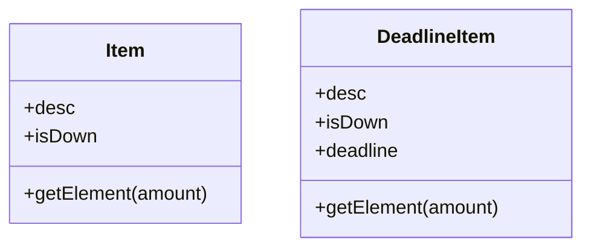
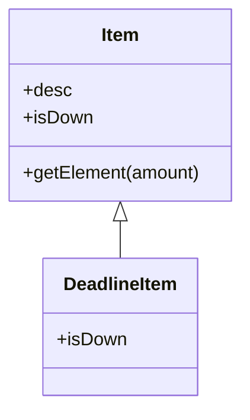

# 继承

> [!tip]
>
> 对于任务清单来说，有的任务是一般任务，有的任务是有截止时间的任务。

两种任务的对比


```mermaid
classDiagram
    class Item
    Item : +desc
    Item : +isDown
    Item : +getElement(amount)
   
    class DeadlineItem
    DeadlineItem : +desc
    DeadlineItem : +isDown
    DeadlineItem : +deadline
    DeadlineItem : +getElement(amount)
```

> [!tip]
>
> 上面两种任务中有重复的属性和方法，如何已有的代码简化新类的定义？

```js

```



```mermaid
classDiagram
    class Item
    Item : +desc
    Item : +isDown
    Item : +getElement(amount)
   
    class DeadlineItem
    DeadlineItem : +isDown
    
    Item <|-- DeadlineItem
```

