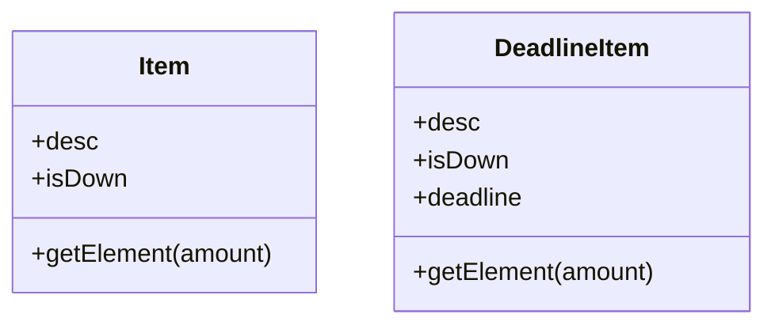
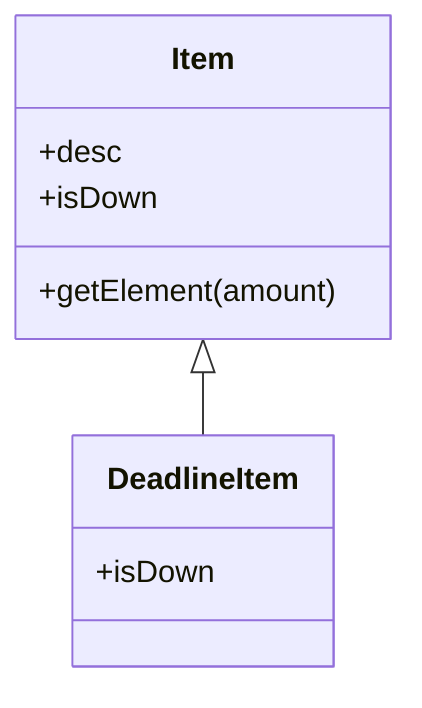
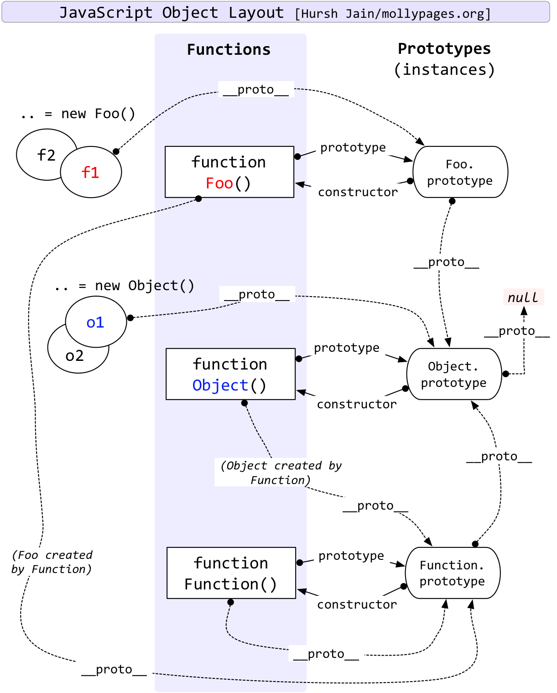

# 继承

> [!tip]
>
> 对于任务清单来说，有的任务是一般任务，有的任务是有截止时间的任务。两种任务中有重复的属性和方法，如何已有的代码简化新类的定义？

两种任务的对比



继承是面向对象编程中的一个基本特性，它允许一个类（子类）基于另一个类（父类）来构建，从而获得父类的属性和方法，并可以添加新的功能或修改现有功能。父类也被称为基类或超类。

## 继承的实现

1. 定义基类的构造函数

```js
function Item(desc, isDone) {
    this.desc = desc;
    this.isDone = isDone;
}

Item.prototype.getElement = function() {
    let div = document.createElement('div');
    let checkbox = document.createElement('input');
    checkbox.type = 'checkbox';
    checkbox.checked = this.isDone;
    div.appendChild(checkbox);
    div.appendChild(document.createTextNode(this.desc));
    return div;
}
```

2. 创建子类的构造函数，并继承基类

```js
function DeadlineItem(desc, isDone, deadline) {
    Item.call(this, desc, isDone);
    this.deadline = deadline;
}
```

* `Item.call(this, desc, isDone)`只调用了`Item`的构造函数，将`Item`的属性绑定到`DeadlineItem`上。

3. `DeadlineItem.prototype`的原型对象指向`Item`对象

```js
DeadlineItem.prototype = new Item();
console.log(DeadlineItem.prototype.constructor);
```

* 设置了`Item`原型对象可以，根据原型对象搜索父类方法。

4. 设置原型的构造函数

```js
DeadlineItem.prototype.constructor = DeadlineItem;
console.log(DeadlineItem.prototype.constructor);
```

* 使得`__proto__`指向`DeadlineItem`。

5. 创建子类并调用相关方法

```js
item = new DeadlineItem('学习es6', false, '2023-01-01');
document.body.appendChild(item.getElement());
```

继承结构的类关系图



### 方法重写

子类和父类具有同名属性和方法，默认使用子类的同名属性和方法。

```js
DeadlineItem.prototype.getElement = function () {
    let div = Item.prototype.getElement.call(this);
    div.appendChild(document.createTextNode(' 截止日期：' + this.deadline));
    return div;
}
```

* `Item.prototype.getElement.call()`借助父类方法，创建对象。

子类和父类方法同名时优先调用子类方法

```js
item = new DeadlineItem('学习es6', false, '2023-01-01');
document.body.appendChild(item.getElement());
```

> [!caution]
>
> 上面调用父类方法时，需要使用`Item.prototype.getElement.call()`显示调用方法，不能使用`this.getElement()`，会找到子类这个新方法自身，导致无限递归。

### 顶级对象

JavaScript中所有的对象都继承值`Object()`对象

```js
item = new DeadlineItem('学习es6', false, '2023-01-01');
console.log(item.__proto__);
console.log(item.__proto__.__proto__);
console.log(item.__proto__.__proto__.__proto__);
console.log(item.__proto__.__proto__.__proto__.__proto__);
```

## 原型链

在JavaScript中，面向对象编程的实现是以构造函数和原型对象为核心。因此掌握构造函数和原型对象的语法，是灵活运用面向对象的基础。整个原型链的结果图如下



对象搜索方法的路径：

1. 首先搜索对象自身的方法。
2. 如果自身没有，搜索原型对象的方法。
3. 如果没有，在搜索原型对象的原型对象上的方法。
4. 以此类推进行搜索。
5. 直到`Objec.prototype`，如果一直没有函数，则程序报错。

## 异常处理

程序执行过程期间发生错误，导致程序无法继续执行，称为异常。JavaScript中使用`throw`关键字抛出异常

* `throw`与`Error`相结合使用，创建`Error`对象时可以传入错误提示信息。
* 抛出异常后，程序会终止执行。

```js
function addTwoArr(arr1, arr2) {
    if (!Array.isArray(arr1) || !Array.isArray(arr2)) {
        throw new Error('参数必须是数组');
    }

    if (arr1.length !== arr2.length) {
        throw new Error('数组长度必须相同');
    }

    let res = [];
    for (let i = 0; i < arr1.length; i++) {
        res.push(arr1[i] + arr2[i]);
    }
    return res;
}

let arr1 = [1, 2, 3];
let arr2 = [4, 5, 6, 7];
console.log(addTwoArr(arr1, arr2));
```

使用`try...catch`捕获异常

* 将可能发生错误的代码写在`try`代码段中
* 如果`try`代码段中出现错误后，会执行`catch`代码段，并截获到错误信息。
* 捕获异常后代码不会终止执行。

```js
let arr1 = [1, 2, 3];
let arr2 = [4, 5, 6, 7];

try {
    console.log(addTwoArr(arr1, arr2));
} catch (error) {
    console.log(error.message);
}
```

## 练习

1. 实现一个叫做Dog的类和一个叫做Animal的类：
   * Dog类继承自Animal类
   * 在Animal中实现一个show_species的类方法，打印出当前父类或者子类的species属性，像这样： It's dog!
   * 在 Dog类中实现一个barking的方法，打印出类似这样的句子"Brown Pug is barking!"，其中Brown是这条狗的颜色，Pug 是狗的品种。
   * 可以在Animal的构造函数中看到颜色和品种是如何被初始化的。
