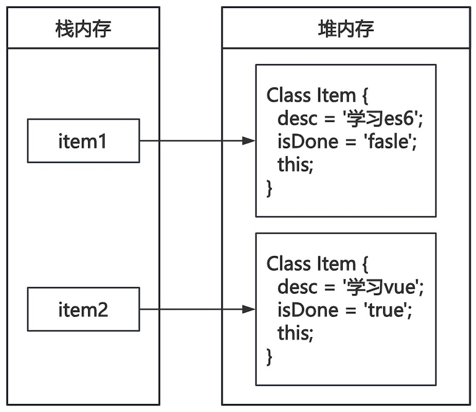

# `class`关键字

JavaScript在ECMAScript 6规范中，增加了类相关的语法，可以使用`class`关键值创建类。

## 类的定义

使用`class`关键字定义类。

```js
class Item {
    desc;
    isDone;
}

let item = new Item();
item.desc = '学习es6';
item.isDone = false;
console.log(item);
```

* `class Item`定义了类，可以封装属性和方法。
* `desc`和`isDone`是封装的属性，定义属性时，不需要用`let`定义。
* 使用`new`关键值可以创建对象。
* 对于`item`属性赋值，创建对象后进行赋值。

### 构造函数

定义类时，内部有一个特定的方法`constructor` ，该方法会在类被实例化时自动被调用，常被用于处理一些初始化的操作。一般在该方法中对数据进行初始化。

```js
class Item {
    constructor(desc, isDone=false) {
        this.desc = desc;
        this.isDone = isDone;
    }
}

let item = new Item('学习es6');
console.log(item);
```

* 在`constructor`中使用属性需要使用`this`指针。
* `class`中的 `this`指针指向对象自身。



### 对象方法

在类中可以添加对象方法，添加对象方法时，不需要使用`function`关键值。

```js
class Item {
    constructor(desc, isDone=false) {
        this.desc = desc;
        this.isDone = isDone;
    }

    getElement() {
        let div = document.createElement('div');
        let checkbox = document.createElement('input');
        checkbox.type = 'checkbox';
        checkbox.checked = this.isDone;
        div.appendChild(checkbox);
        div.appendChild(document.createTextNode(this.desc));
        return div;
    }
}

let item = new Item('学习es6');
document.body.appendChild(item.getElement());
```

### 静态属性与方法

使用`static`关键值可以给类添加静态属性和方法，静态属性和方法绑定在整个类上。

```js
class Item {
    static count = 0;

    static addCount() {
        this.count++;
    }
		...
}

let item = new Item('学习es6');
Item.addCount();
console.log(Item.count);
```

* 调用静态属性和方法，需要通过类名调用`Item`。

## 类的继承

使用`extends`关键字可以实现`class`的继承

```js
class Item {
    constructor(desc, isDone=false) {
        this.desc = desc;
        this.isDone = isDone;
    }

    getElement() {
        let div = document.createElement('div');
        let checkbox = document.createElement('input');
        checkbox.type = 'checkbox';
        checkbox.checked = this.isDone;
        div.appendChild(checkbox);
        div.appendChild(document.createTextNode(this.desc));
        return div;
    }
}

class DeadlineItem extends Item {
    constructor(desc, deadline, isDone=false) {
        super(desc, isDone);
        this.deadline = deadline;
    }
}

let deadlineItem = new DeadlineItem('学习es6', '2023-01-01');
document.body.appendChild(deadlineItem.getElement());
```

* `extends Item`表示继承的父类。
* `super`关键字可以调用父类的方法，直接调用`super()`函数调用父类的构造方法。

### 方法重写

子类和父类具有同名属性和方法，默认使用子类的同名属性和方法。

```js
class Item {
  ...
}

class DeadlineItem extends Item {
  ...
    getElement() {
        let div = super.getElement();
        div.appendChild(document.createTextNode(' 截止日期：' + this.deadline));
        return div;
    }
}

let deadlineItem = new DeadlineItem('学习es6', '2023-01-01');
document.body.appendChild(deadlineItem.getElement());

let item = new Item('学习vue');
document.body.appendChild(item.getElement());
```

* `DeadlineItem`的`getElement`进行了重写，子类对象`deadlineItem`优先调用该方法。
* 子类的`getElement`方法中可以调用父类相同的方法简化代码，借助`super`关键字调用父类方法。

## 类的本质

ES6语法中类的本质是函数，使用`class`关键字定义类只要是一种语法糖。

```js
class Item {
    constructor(desc, isDone=false) {
        this.desc = desc;
        this.isDone = isDone;
    }
}

console.log(`Item 类型是：${typeof Item}`);
console.log(`Item 类的原型是：`);
console.log(Item.prototype);

let item = new Item('学习vue');
console.log(`item 类型是：${typeof item}`);
console.log(`item 实例的原型是：`);
console.log(item.__proto__);

console.log(`item 实例的原型是否是 Item 类的原型：`);
console.log(item.__proto__ === Item.prototype);
```

> [!important]
>
> JavaScript语言中每个子类只能继承一个父类，不能进行多继承。

## 迭代器与生成器

迭代器（Iterator）主要供`for ... of`进行遍历：

* 原生具备iterator接口的数据：Array、set、map、String，等
* 使用解构赋值以及三点运算符时，会默认调用iterator接口。

```javascript
// 变量数组
let arr = [1, 2, 3, 4, 5];
for (let item of arr) {
    console.log(item);
}

// 浅拷贝
let arr = [1, 2, 3, 4, 5];
let arrClone = [...arr];
console.log(arrClone);
```

生成器（Generator）函数是一个状态机，内部封装了不同状态的数据

* generator函数返回的是一个对象。
* 调用next方法函数内部逻辑开始执行

```js
function * generator() {
    console.log('开始生成');
    yield 'hello';
    console.log('生成 1');
    yield 'world';
}

```

* 定义生成器时，`function`与函数名之间有一个`*`。
* 内部用`yield`关键字来返回值。

调用生成器函数，返回一个生成器对象

```js
let gen = generator();
console.log(gen);
console.log(`gen 是一个 ${typeof gen}`);
console.log(gen.next());
console.log(gen.next());

console.log('生成器结束');
console.log(gen.next());
```

* 调用`next`方法函数内部逻辑开始执行。
* 遇到`yield`表达式停止。
* 再次调用`next`函数继续执行。
* 当生成器停止时返回，对象`{value: undefined, done: true}`。

可以是`for ... of`变量生成器中所有值

```js
let gen = generator();
for (let item of gen) {
    console.log(item);
}
```

> [!warning]
>
> 特殊的遍历语法
>
> * `for ... in ...`用于遍历对象的键值对。
> * `for ... of ...`用于遍历迭代器对象。

```js
let product = {
    'name': '无线蓝牙耳机',
    "price": 299,
    brand: '小米'
}

for (let key in product) {
    console.log(`${key}: ${product[key]}`);
}
```

### 生成器的应用

迭代器的特点

1. 状态保持：获取值之后不会结束，可以继续执行，直到迭代完成。
2. 惰性求值：只在需要时计算值，不预先计算所有结果。
3. 一次性遍历：遍历后无法重置，需要重新创建。

```js
function * fibonacci(num) {
    let a = 0;
    let b = 1;
    while (num-- > 0) {
        yield a;
        [a, b] = [b, a + b];
    }
}

let fib = fibonacci(10);
for (let i of fib) {
    console.log(i);
}
```


