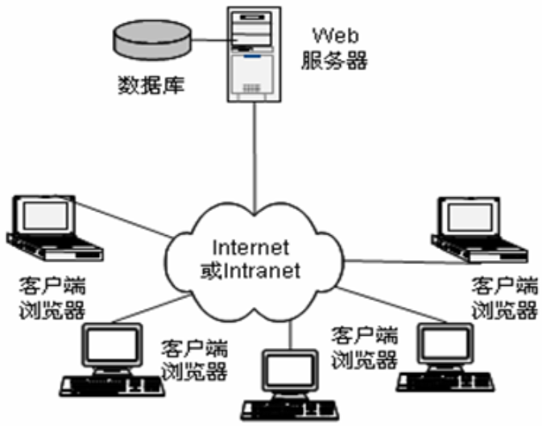
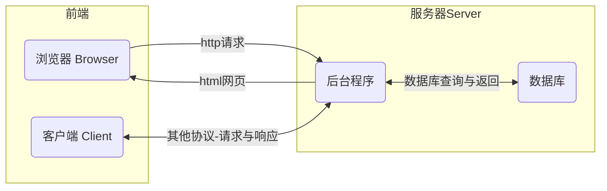
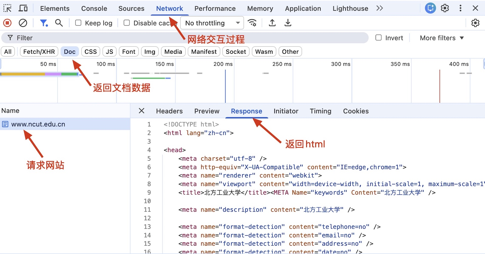
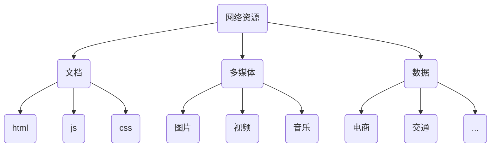
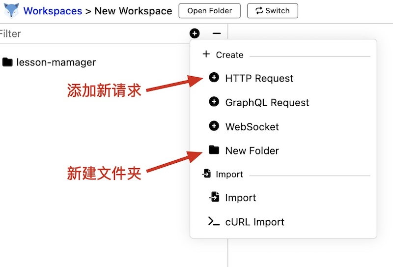
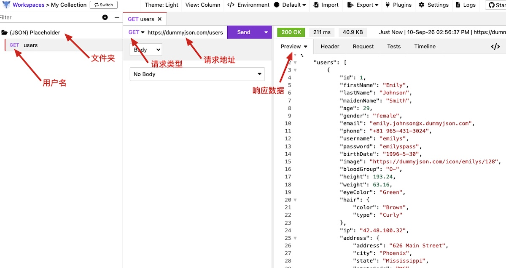

# 网络请求的基本知识

现在所有的软件和服务都要依托于互联网，上网的目的：聊天、追剧、打游戏、使用AI工具……

> [!important]
>
> 上网的本质目的是获取和消费资源。

互联网服务框架：BS（Browser/Server）与CS（Client/Server）

* 服务器：上网过程中，负责存放和对外提供资源的电脑。
* 浏览器/客户端：上网过程中，负责获取和消费资源的电脑。
* WEB服务器和数据库服务器本质上就是高配置的电脑，可以同时处理数百个程序。

## 网络请求的过程

访问网页的打开过程：

* 浏览器
  1. 打开浏览器。
  2. 输入网站地址。
  3. 确定后，向服务器发起资源请求。
* 服务器
  1. 服务器接收资源请求。
  2. 根据请求内容查找相关资源。
  3. 将资源整合成网页，返回给浏览器。

访问网站：https://www.ncut.edu.cn/，

### URL地址

URL（全称是UniformResourceLocator）中文叫统一资源定位符，用于标识互联网上每个资源的唯一存放位置。浏览器只有通过URL地址，才能正确定位资源的存放位置，从而成功访问到对应的资源。

URL地址一般由三部组成：

1. 客户端与服务器之间的通信协议
2. 服务器域名
3. 资源在服务器上文件路径

### 网络资源

在网页直接传递的所有信息都可以视为网络资源。

## 请求接口

前后端开发中常说的接口是指Web API，它是服务器暴露出来的一个URL地址，允许客户端通过特定网络协议（如 HTTP/HTTPS）发送请求并获取数据。

最常见的两种请求方式分别为`get`和`post`请求：

* `get`请求，通常用于从服务器获取资源。
* `post`请求，通常用于向服务器提交数据。

### 接口测试工具

接口测试工具可以用于验证，服务器是否可以被正常访问。这里推荐使用[Restfox](https://github.com/flawiddsouza/Restfox)工具进行接口测试。

其它知名的接口测试工具，如：[Postman](https://www.postman.com/)。

### 使用Restfox

[DummyJSON](https://dummyjson.com/)是一个免费的接口测试网站，可以用于接口测试。

测试一个`get`请求

