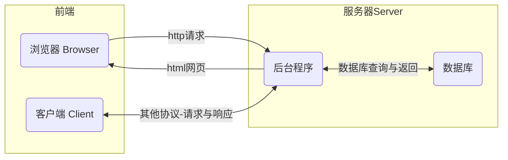
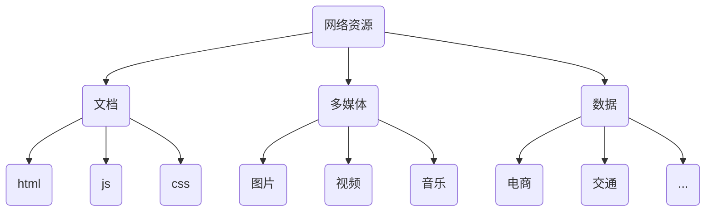
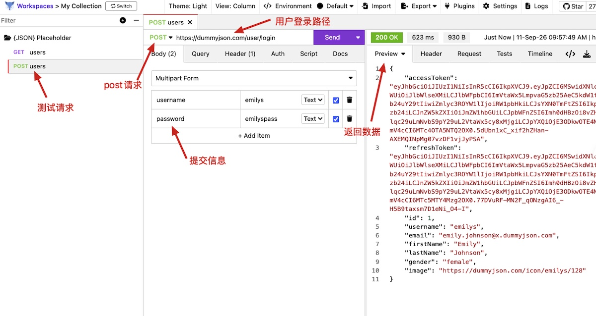
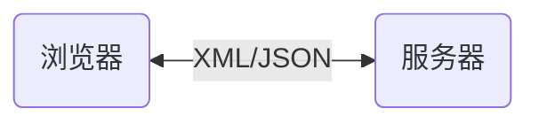
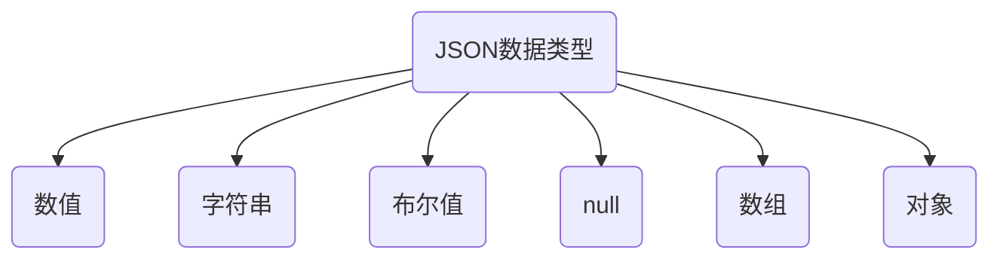

# 网络请求的基本知识

现在所有的软件和服务都要依托于互联网，上网的目的：聊天、追剧、打游戏、使用AI工具……

> [!important]
>
> 上网的本质目的是获取和消费资源。

互联网服务框架：BS（Browser/Server）与CS（Client/Server）


* 服务器：上网过程中，负责存放和对外提供资源的电脑。
* 浏览器/客户端：上网过程中，负责获取和消费资源的电脑。
* WEB服务器和数据库服务器本质上就是高配置的电脑，可以同时处理数百个程序。

## 网络请求的过程



访问网页的打开过程：

* 浏览器
  1. 打开浏览器。
  2. 输入网站地址。
  3. 确定后，向服务器发起资源请求。
* 服务器
  1. 服务器接收资源请求。
  2. 根据请求内容查找相关资源。
  3. 将资源整合成网页，返回给浏览器。

访问网站：https://www.ncut.edu.cn/，


### URL地址

URL（全称是UniformResourceLocator）中文叫统一资源定位符，用于标识互联网上每个资源的唯一存放位置。浏览器只有通过URL地址，才能正确定位资源的存放位置，从而成功访问到对应的资源。

URL地址一般由三部组成：

1. 客户端与服务器之间的通信协议
2. 服务器域名
3. 资源在服务器上文件路径


### 网络资源

在网页直接传递的所有信息都可以视为网络资源。



> [!warning]
>
> 广义的数据有时会指代网络资源。

## 请求接口

前后端开发中常说的接口是指Web API，它是服务器暴露出来的一个URL地址，允许客户端通过特定网络协议（如 HTTP/HTTPS）发送请求并获取数据。

最常见的两种请求方式分别为`get`和`post`请求：

* `get`请求，通常用于从服务器获取资源。
* `post`请求，通常用于向服务器提交数据。

### 接口测试工具

接口测试工具可以用于验证，服务器是否可以被正常访问。这里推荐使用[Restfox](https://github.com/flawiddsouza/Restfox)工具进行接口测试。


其它知名的接口测试工具，如：[Postman](https://www.postman.com/)。

### 使用Restfox

免费的接口API，可以用于接口测试。

| 名称                                                        | 介绍                                                   |
| ----------------------------------------------------------- | ------------------------------------------------------ |
| [{JSON} Placeholder](https://jsonplaceholder.typicode.com/) | 简单的API练习接口                                      |
| [ReqRes](https://reqres.in/)                                | 简单接口测试                                           |
| [DummyJSON](https://dummyjson.com/)                         | 全套假数据接口，接近真实电商和后台系统的业务数据结构。 |
| [Fake Store API](http://fakestoreapi.com/)                  | 专为真实购物网站设计的模拟API                          |
| [Open Trivia Database](https://opentdb.com/)                | 随机问答题库                                           |
| [一言](https://developer.hitokoto.cn/)                      | 随机名言诗词                                           |
| [Platzi Fake Store API](https://fakeapi.platzi.com/)        | 电商模拟接口                                           |
| [RandomUser](https://randomuser.me/)                        | 专业生成假用户信息的API                                |
| [REST Countries](https://restcountries.com/)                | 包含全球所有国家和地区的详细地理信息                   |
| [Frankfurter](https://frankfurter.dev/)                     | 汇率转换API                                            |
| [Open-Meteo](https://open-meteo.com/)                       | 完全免费开源的气象API                                  |
| [PokeAPI](https://pokeapi.co/)                              | 收录了全套宝可梦的属性、技能、图片等信息               |
| [Dog API](https://dog.ceo/dog-api/)                         | 返回随机狗图片的URL                                    |
| [Cat Facts](https://catfact.ninja/#/)                       | 随机返回一条关于猫咪的冷知识                           |

测试一个`get`请求

* 请求路径`https://dummyjson.com/users`


* 请求返回的数据就是JSON格式。

测试一个`post`请求

* 请求路径：https://dummyjson.com/user/login
* 提交数据
  * username：emilys
  * password：emilyspass



### 接口文档

说明接口调用方式和返回数据格式的文档，文档包括：

* 请求URL。
* 调用方式`post`或`get`等。
* 参数格式。
* 响应格式。

[Cat Fact API](https://catfact.ninja/#/MCP) Swagger接口文档。

## 数据交换格式

数据交换格式，是指浏览器与服务器传递数据的格式，这里的数据主要是指，电商、天气等文本信息。前度常见的数据交互格式是XML和JSON。



### XML

XML（EXtensible Markup Language）可扩展标记语言，与HTML类似也是一种标记语言。

* HTML是专门用来描述网页的，是网页内容的载体。
* XML是用来传输和存储数据，是数据的载体，可以自由定义标签，只要发送的端和解析端标准统一即可。

XML数据实例

```xml
<user>
  <username>tom</username>
  <password>123456</password>
</user>
```

XML的缺点：

* XML格式臃肿，与数据无关的字符较多，传输效率低。
* 在Javascript中解析XML比较麻烦。

### JSON

JSON（JavaScript Object Notation）JavaScript 对象表示法。JSON就是使用文本表示表示Javascript对象和数组。因此，JSON的本质是字符串。

JSON的特点：

* JSON是一种轻量级的文本数据交换格式，在作用上类似于XML。
* 体积比XML更小、更快，且更易解析。
* JSON专门用于存储和传输数据。

JSON数据示例

```json
{
  "username": "tom",
  "password": "123456"
}
```

JSON数据包含两种结构

* 对象结构：对象结构用`{}`表示内容，包含键值对（`key`-`value`），键值对应逗号分割。`key`使用双引号字符串表示，`value`是数据。
* 数组结构：数组结构用`[]`表示内容，包含多个数据，用逗号分割。

JSON数据类型



JSON数据结构

```json
{
    "users": [
        {
            "id": 1,
          	"email": "emily.johnson@x.dummyjson.com",
            "username": "emilys",
            "address": {
                "address": "626 Main Street",
                "coordinates": {
                    "lat": -77.16213,
                    "lng": -92.084824
                },
            },
          	isAdmin: true
        },
        {
            "id": 2,
            "email": "michael.williams@x.dummyjson.com",
            "username": "michaelw",
            "address": {
                "address": "385 Fifth Street",
                "coordinates": {
                    "lat": 22.815468,
                    "lng": 115.608581
                },
            },
           isAdmin: false
        },
    ],
    "total": 2,
}
```

* 属性名必须使用双引号。
* 字符串类型的值必须使用双引号。
* JSON中不允许使用单引号表示任何信息。
* JSON中不能写注释。
* JSON的最外层只能是对象或数组。
* JSON中没有`undefined`数据类型，只要`null`类型。

> [!warning]
>
> JSON的本质就是文本字符串。

JavaScript中`JSON`对象，用于数据转换

* 把js对象转换为字符串的过程，叫做序列化，使用`JSON.stringify()`函数。

```js
let users = [
    {
        id: 1,
        username: 'emilys',
        email: 'emily.johnson@x.dummyjson.com',
        isAdmin: false
    },
    {
        id: 2,
        username: 'james',
        email: 'james.smith@x.dummyjson.com',
        isAdmin: true
    },
]
let str = JSON.stringify(users);
console.log(typeof str);
let div = document.createElement('div');
div.innerHTML = str;
document.body.appendChild(div);
```

* 把字符串转换为js对象的过程，叫做反序列化，使用`JSON.parse()`函数。

```js
let users = '[{"id":1,"username":"emilys","email":"emily.johnson@x.dummyjson.com","isAdmin":false},{"id":2,"username":"james","email":"james.smith@x.dummyjson.com","isAdmin":true}]'
let usersObj = JSON.parse(users);
console.log(usersObj);
console.log(typeof usersObj);
```

## 练习

1. 使用`JSON`对象写一个对象浅拷贝的函数。
