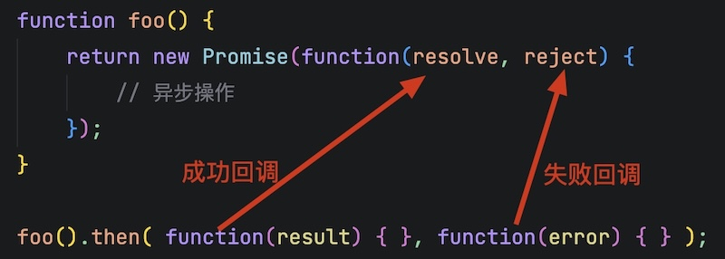

# Axios

[Axios](https://axios.rest/zh/)是专注于网络数据请求的库，与原生的`XMLHttpRequest`对象相比，Axios调用更简单。

## CDN

内容分发网络（Content Delivery Network）简称CDN，它的核心作用是将网站的静态资源，缓存到分布在世界各地的服务器节点上，让用户能够就近获取所需内容，从而大幅提高网站的加载速度和稳定性。

前端开发中，常用的静态资源类型：

* 开源的css样式。
* 开源的JavaScript库文件。
* 开源的字体、图标文件。

有专门的CDN服务器，保存这些资源，供全球开发者免费调用。

国内常用的前端CDN服务器是[BootCDN](https://www.bootcdn.cn/)。

### 引入Axios库

在BootCDN中搜索Axios库


在HTML页面中引入JavaScript标签

```html
<head>
    <meta charset="UTF-8">
    <meta name="viewport" content="width=device-width, initial-scale=1.0">
    <title>Document</title>
    <script src="https://cdn.bootcdn.net/ajax/libs/axios/1.18.1/axios.min.js"></script>
</head>
```

* `<script>`会保证执行网页是去BootCDN上加载`axios`包，可以在JavaScript程序中直接使用`axios`对象。

## 使用Axios库

### 发送`get`请求

1. `axios.get`发送一般的`get`请求。

```js
let btn = document.querySelector('#btn');
let result = document.querySelector('#result');
btn.addEventListener('click', function() {
    axios.get('https://dummyjson.com/users').then(function(response) {
        console.log(response);
        console.log(response.data);
    })
})
```

* `axios.get`第一个参数为请求URL。
* `axios`请求之后返回一个对象，对象中的`then`方法表示成功的回调。
* [`response`](https://axios.rest/pages/advanced/response-schema.html)对象包含全部的响应信息。
* `response.data`包含响应的数据，数据会自动转换为JavaScript对象。

2. 带参数的`get`请求

```js
let btn = document.querySelector('#btn');
let query = {
    key: 'username',
    value: 'emilys'
}
btn.addEventListener('click', function() {
    axios.get(
        'https://dummyjson.com/users/filter', 
        { params: query }
    ).then(function(response) {
        console.log(response.data);
    })
})
```

* `axios.get`第二个参数是一个对象，其中键`params`表示`get`请求参数。
* `axios`请求参数可以直接传入对象。

### 发送`post`请求

使用`axios.post`可以发送`post`请求

```js
let btn = document.querySelector('#btn');
let user = {
    username: 'emilys',
    password: 'emilyspass'
}
btn.addEventListener('click', function() {
    axios.post(
       'https://dummyjson.com/user/login', 
        user
    ).then(function(response) {
        console.log(response.data);
    })
})
```

* `axios.post`第二个参数是请求体，可以传递一般对象，也可以传入`FormData`对象。

### 通用方法

可以使用`axios`对象发起请求，`axios`参数是一个完整的对象。

```js
 axios({
     method: '请求类型',
     url: '请求的URL地址',
     data: { /* POST数据 */ },
     params: { /* GET参数 */ }
 }) .then(callback)
```

1. 发送`get`请求，`get`请求参数用`params`表示。

```js
axios({
    method: 'GET',
    url: 'https://dummyjson.com/users/filter',
    params: query
}).then(function(response) {
    console.log(response.data);
})
```

2. 发送`post`请求，`post`请求参数用`data`表示。

```js
axios({
    method: 'POST',
    url: 'https://dummyjson.com/user/login',
    data: user
}).then(function(response) {
    console.log(response.data);
})
```

## `Promise`对象

> [!tip]
>
> 按顺序执行延时代码，示例代码如下：

```html
<body>
    <div><span>第一步操作</span>: <span id="first"></span></div>
    <div><span>第二步操作</span>: <span id="second"></span></div>
    <div><span>第三步操作</span>: <span id="third"></span></div>
    <button id="btn">开始操作</button>
</body>
<script>
let first = document.querySelector('#first');
let second = document.querySelector('#second');
let third = document.querySelector('#third');
let btn = document.querySelector('#btn');

btn.addEventListener('click', function() {
    first.innerHTML = '第一步操作完成';
    setTimeout(function() {
        second.innerHTML = '第二步操作完成';
        setTimeout(function() {
            third.innerHTML = '第三步操作完成';
        }, 1000);
    }, 1000);
}, 1000);
</script>
```

多层回调函数的相互嵌套，就形成了回调地狱，回调地狱导致的问题：

* 代码耦合性太强，难以维护。
* 大量代码相互嵌套，代码的可读性变差。

为了解决回调地狱的问题，ES6中新增了Promise的概念：

1. `Promise`是一个构造函数，可以创建一对象。
2. `Promise.prototype`上包含一个`.then()`方法，用来指定成功和失败的回调函数。
   1. `.then(ok => { }, error => { })`可以指定两个回调函数，第一个事成功回调，第二个是失败回调。
   2. 调用`.then()`方法时，成功的回调函数是必选的，失败的回调函数是可选的。
3. `Promise.prototype`上包含一个`.catch`方法，用来捕获异常。
4. `Promise.prototype`上包含一个`.finnally`方法，是否有异常该方法都可以执行。
5. `then`、`catch`、`finnally`与异常处理的`try`、`catch`、`finnally`类似。

> [!important]
>
> `then`方法中包含的错误，可以由`.catch`，但是`.catch`方法处理的异常，`then`可能不包括。

### `Promise`的使用

Axios库返回的对象就是`Promise`，下面连续发送3个请求。

```js
axios.get('https://dummyjson.com/products/1').then(function(response) {
    first.innerHTML = response.data.title;
})
axios.get('https://dummyjson.com/products/2').then(function(response) {
    second.innerHTML = response.data.title;
})
axios.get('https://dummyjson.com/products/3').then(function(response) {
    third.innerHTML = response.data.title;
})
```

上面三个请求是异步发送，不能保证请求顺序执行，如果要请求顺序执行

```js
axios.get('https://dummyjson.com/products/1').then(function(response) {
    first.innerHTML = response.data.title;
    return axios.get('https://dummyjson.com/products/2');
}).then(function(response) {
    second.innerHTML = response.data.title;
    return axios.get('https://dummyjson.com/products/3');
}).then(function(response) {
    third.innerHTML = response.data.title;
})  
```

* 可以在`then`方法的成功回调函数中，返回下一个`Promise`对象，然后继续调用`.then`方法。
* `Promise`可以通过链式调用解决回调嵌套。

使用`.catch`可以捕获，调用中的异常

```js
axios.get('https://dummyjson.com/products/1000').then(function(response) {
    first.innerHTML = response.data.title;
    return axios.get('https://dummyjson.com/products/2');
}).then(function(response) {
    second.innerHTML = response.data.title;
    return axios.get('https://dummyjson.com/products/3');
}).then(function(response) {
    third.innerHTML = response.data.title;
}).catch(function(error) {
    console.log(error);
})
```

* `.catch`捕获异常放到最后，当第一个请求出现异常后，后序请求就会终止。

将`.catch`提前并统一异常返回值，发生异常后可以继续请求。

```js
axios.get('https://dummyjson.com/products/1000').catch(function(error) {
    return { data : { title : '加载失败' } };
}).then(function(response) {
    first.innerHTML = response.data.title;
    return axios.get('https://dummyjson.com/products/2');
}).then(function(response) {
    second.innerHTML = response.data.title;
    return axios.get('https://dummyjson.com/products/3');
}).then(function(response) {
    third.innerHTML = response.data.title;
})
```

> [!warning]
>
> 1. 在开始`.catch`中，必须按照正确的处理流程，返回兜底错误数据，否则无法继续请求。
> 2. `.catch`放到最后，`return`兜底数据也无法继续请求。

在`then`中处理异常，可以替代`.catch`方法，但是处理异常后需要同样返回`Promise`请求。

```js
axios.get('https://dummyjson.com/products/1000').then(function(response) {
    first.innerHTML = response.data.title;
    return axios.get('https://dummyjson.com/products/2');
}, function(error) {
    first.innerHTML = '加载失败';
    return axios.get('https://dummyjson.com/products/2');
}).then(function(response) {
    second.innerHTML = response.data.title;
    return axios.get('https://dummyjson.com/products/3');
}).then(function(response) {
    third.innerHTML = response.data.title;
})
```

> [!important]
>
> 使用`.catch`统一处理可能的异常是，比较好的方式。

`Promise.all()`方法：

1. 接收一个`Promise`对象数组。
2. 可以发起并行的`Promise`异步操作。
3. 所有的操作全部结束后，才会执行下一步的`.then`操作。
4. `then`中返回结果数组，`Promise`数组实例的顺序相同。

```js
let arr = [
    axios.get('https://dummyjson.com/products/1'),
    axios.get('https://dummyjson.com/products/2'),
    axios.get('https://dummyjson.com/products/3')
]

Promise.all(arr).then(function(responses) {
    first.innerHTML = responses[0].data.title;
    second.innerHTML = responses[1].data.title;
    third.innerHTML = responses[2].data.title;
})
```

> [!warning]
>
> `Promise.all`请求是并行同时发出的，如果请求有顺序要求，该方法不能保证先后执行。

`Promise.race()`方法（赛跑机制）：

1. 接收一个`Promise`对象数组。
2. 可以发起并行的`Promise`异步操作。
3. 只要任何一个异步操作完成，就立即执行下一步的`.then`操作。
4. 该方法只返回一个结果。

```js
let arr = [
    axios.get('https://dummyjson.com/products/1'),
    axios.get('https://dummyjson.com/products/2'),
    axios.get('https://dummyjson.com/products/3')
]

Promise.race(arr).then(function(responses) {
    first.innerHTML = responses.data.title;
})
```

## 封装`Promise`方法

封装`Promise`方法的核心逻辑是返回一个`Promise`对象。

```js
function foo() {
    return new Promise();
}
```

*  `new Promise()`只创建了一个形式上的异步操作。

具体的异步操作，则需要在`Promise`构造函数中，传入一个`function`函数，具体的异步操作在函数内部定义。

```js
function foo() {
    return new Promise(function() {
        // 异步操作
    });
}
```

`.then()`中指定的成功和失败的回调函数，可以在`function`的中进行接收。



封装一个异步函数

```html
<body>
    <div><span>第一步操作</span>: <span id="first"></span></div>
    <div><span>第二步操作</span>: <span id="second"></span></div>
    <div><span>第三步操作</span>: <span id="third"></span></div>
    <button id="btn">开始操作</button>
</body>
<script>
let first = document.querySelector('#first');
let second = document.querySelector('#second');
let third = document.querySelector('#third');
let btn = document.querySelector('#btn');

function foo() {
    return new Promise(function(resolve, reject) {
        setTimeout(() => {
            resolve();
        }, 1000);
    });
}

btn.addEventListener('click', function() {
    foo().then(() => {
        first.innerHTML = '第一步操作完成';
        return foo();
    }).then(() => {
        second.innerHTML = '第二步操作完成';
        return foo();
    }).then(() => {
        third.innerHTML = '第三步操作完成';
    });
});
</script>
```

## `async/await`

`async/await`是ES8（ECMAScript 2017）引入的新语法，用来简化`Promise`异步操作： 

* `async`用于修饰函数。
* `await`用于修饰`Promise`表达式。

```js
async function request() {
    let response = await axios.get('https://dummyjson.com/products/1');
    first.innerHTML = response.data.title;
    response = await axios.get('https://dummyjson.com/products/2');
    second.innerHTML = response.data.title;
    response = await axios.get('https://dummyjson.com/products/3');
    third.innerHTML = response.data.title;
}
```

* 如果在函数中使用了`await`，则`function`必须被`async`修饰。
* 使用`await`修饰的表达式，会在子线程中顺序执行。

第一个`await`之前的代码会同步执行，`await`之后的代码会异步执行

```js
async function request() {
    console.log('B');
    let response = await axios.get('https://dummyjson.com/products/1');
    first.innerHTML = response.data.title;
    response = await axios.get('https://dummyjson.com/products/2');
    second.innerHTML = response.data.title;
    response = await axios.get('https://dummyjson.com/products/3');
    third.innerHTML = response.data.title;
    console.log('D');
}

btn.addEventListener('click', function() {
    console.log('A');
    request();
    console.log('C');
})
```

`async/await`可以使用`try/catch`捕获异常

```js
async function request() {
    try {
        let response = await axios.get('https://dummyjson.com/products/1000');
        first.innerHTML = response.data.title;
    } catch (error) {
        console.log(error);
    }
    response = await axios.get('https://dummyjson.com/products/2');
    second.innerHTML = response.data.title;
    response = await axios.get('https://dummyjson.com/products/3');
    third.innerHTML = response.data.title;
}
```

## 练习

1. 使用一言的接口设计一个显示名言的应用，名言选择诗词类别。

