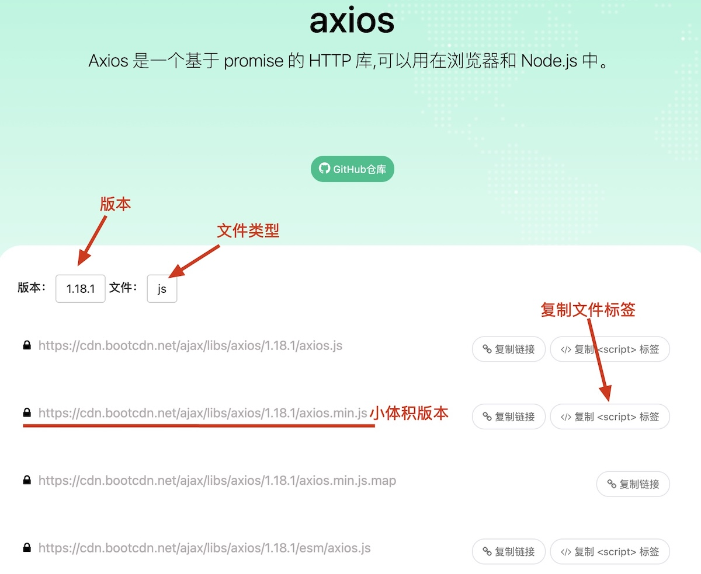

# Axios

[Axios](https://axios.rest/)是专注于网络数据请求的库，与原生的`XMLHttpRequest`对象相比，Axios调用更简单。

## CDN

内容分发网络（Content Delivery Network）简称CDN，它的核心作用是将网站的静态资源，缓存到分布在世界各地的服务器节点上，让用户能够就近获取所需内容，从而大幅提高网站的加载速度和稳定性。

前端开发中，常用的静态资源类型：

* 开源的css样式。
* 开源的JavaScript库文件。
* 开源的字体、图标文件。

有专门的CDN服务器，保存这些资源，供全球开发者免费调用。

国内常用的前端CDN服务器是[BootCDN](https://www.bootcdn.cn/)。

### 引入Axios库

在BootCDN中搜索Axios库



在HTML页面中引入JavaScript标签

```html
<head>
    <meta charset="UTF-8">
    <meta name="viewport" content="width=device-width, initial-scale=1.0">
    <title>Document</title>
    <script src="https://cdn.bootcdn.net/ajax/libs/axios/1.18.1/axios.min.js"></script>
</head>
```

* `<script>`会保证执行网页是去BootCDN上加载`axios`包，可以在JavaScript程序中直接使用`axios`对象。

## 使用Axios库

### 发送`get`请求

1. `axios.get`发送一般的`get`请求。

```js
let btn = document.querySelector('#btn');
let result = document.querySelector('#result');
btn.addEventListener('click', function() {
    axios.get('https://dummyjson.com/users').then(function(response) {
        console.log(response);
        console.log(response.data);
    })
})
```

* `axios.get`第一个参数为请求URL。
* `axios`请求之后返回一个对象，对象中的`then`方法表示成功的回调。
* [`response`](https://axios.rest/pages/advanced/response-schema.html)对象包含全部的响应信息。
* `response.data`包含响应的数据，数据会自动转换为JavaScript对象。

2. 带参数的`get`请求

```js
let btn = document.querySelector('#btn');
let query = {
    key: 'username',
    value: 'emilys'
}
btn.addEventListener('click', function() {
    axios.get(
        'https://dummyjson.com/users/filter', 
        { params: query }
    ).then(function(response) {
        console.log(response.data);
    })
})
```

* `axios.get`第二个参数是一个对象，其中键`params`表示`get`请求参数。
* `axios`请求参数可以直接传入对象。

### 发送`post`请求

使用`axios.post`可以发送`post`请求

```js
let btn = document.querySelector('#btn');
let user = {
    username: 'emilys',
    password: 'emilyspass'
}
btn.addEventListener('click', function() {
    axios.post(
       'https://dummyjson.com/user/login', 
        user
    ).then(function(response) {
        console.log(response.data);
    })
})
```

* `axios.post`第二个参数是请求体，可以传递一般对象，也可以传入`FormData`对象。

### 通用方法

可以使用`axios`对象发起请求，`axios`参数是一个完整的对象。

```js
 axios({
     method: '请求类型',
     url: '请求的URL地址',
     data: { /* POST数据 */ },
     params: { /* GET参数 */ }
 }) .then(callback)
```

1. 发送`get`请求，`get`请求参数用`params`表示。

```js
axios({
    method: 'GET',
    url: 'https://dummyjson.com/users/filter',
    params: query
}).then(function(response) {
    console.log(response.data);
})
```

2. 发送`post`请求，`post`请求参数用`data`表示。

```js
axios({
    method: 'POST',
    url: 'https://dummyjson.com/user/login',
    data: user
}).then(function(response) {
    console.log(response.data);
})
```

