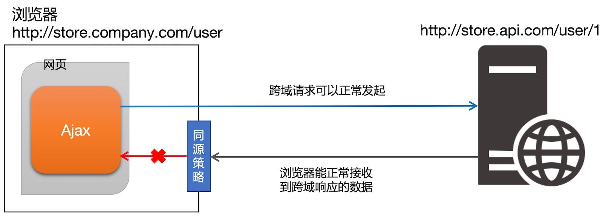
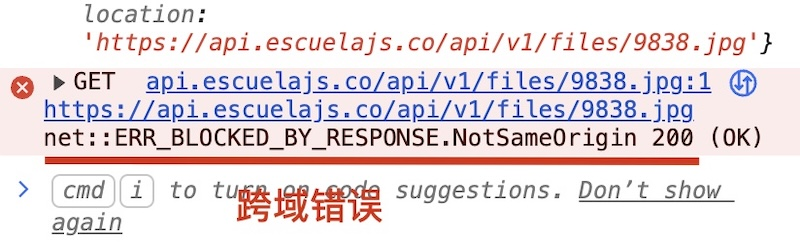
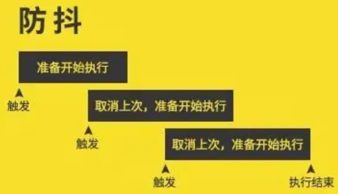
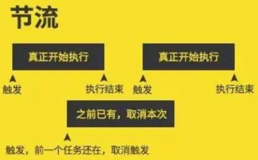

# 网络交互的注意事项

## 跨域问题

同源：如果两个页面的协议，域名和端口都相同，则两个页面具有相同的源。

[同源示例](https://developer.mozilla.org/zh-CN/docs/Web/Security/Defenses/Same-origin_policy#%E6%BA%90%E7%9A%84%E5%AE%9A%E4%B9%89)

同源策略（Same origin policy）是浏览器提供的一个安全功能。浏览器规定，A网站的JavaScript，不允许和非同源的网站C之间，进行资源的交互，包括：

* 无法读取非同源网页的Cookie、LocalStorage和IndexedDB。
* 无法接触非同源网页的DOM。
* 无法向非同源地址发送Ajax请求。

跨域：不满足同源协议则称为跨域。由于同源策略的原因，浏览器是禁止跨域的数据交互。

> [!tip]
>
> 思考如下案例：
>
> 网页地址为`http://store.company.com/user`，可以请求接口`http://store.api.com/user/1`的数据么？



> [!caution]
>
> 跨域请求回来的数据，会被浏览器拦截，无法被页面获得。

在早期的Web时代，一个网站的所有资源通常都部署在同一台服务器上，因此同源策略是对用户数据的保护。但随着技术演进，现代软件架构发生了变化，一些技术架构需要跨域来实现：

1. 前后端分离架构。
2. 微服务与分布式系统。
3. 资源CDN加速。
4. 调用第三方服务：地图服务、天气服务和支付服务等。

标准的解决跨域问题，需要在服务端在响应头中加入

```
Access-Control-Allow-Origin: http://store.company.com
```

* `Access-Control-Allow-Origin`跨源资源共享响应头（CORS），告诉浏览器哪些源有权限读取该接口返回的资源。
* 这里允许`http://store.company.com`源，读取接口数据。

```
Access-Control-Allow-Origin: *
```

* 这里允许任意源读取数据。

其它响应头配置

```
Access-Control-Allow-Credentials: true
Access-Control-Allow-Methods: GET, POST, PUT, DELETE
Access-Control-Allow-Headers: Content-Type, Authorization
```

* `Access-Control-Allow-Credentials`允许前端在跨域请求中携带身份凭证。
* `Access-Control-Allow-Methods`允许跨域的请求方法。
* `Access-Control-Allow-Headers`允许前端在跨域请求中使用`Content-Type`和`Authorization`这两个自定义请求头。

> [!important]
>
> 上面解决跨域问题的主要方式，是在服务端进行操作。前端开发能够排查，是否是跨域问题引起的错误。



前端解决跨域的方法有JSONP技术。

## 防抖

防抖策略（debounce）是当事件被触发后，延迟n秒后再执行回调，如果在这n秒内事件又被触发，则重新计时。



防抖的应用：

* 输入框实时搜索。
* 按钮提交防重复点击。
* 文本编辑器自动保存。
* 校验类输入框，如：检查用户名是否已被注册。

防抖的实现

```html
<body>
    <button id="btn">发送get请求</button>
    <hr>
    <div >username: <span id="result"></span></div>
</body>
<script defer>
    let btn = document.querySelector('#btn');
    let result = document.querySelector('#result');
    let query = {
        key: 'username',
        value: 'emilys'
    }

    function debounce(fn, delay) {
        let timer = null;
        return function() {
            if (timer) {
                clearTimeout(timer);
            }
            timer = setTimeout(function() {
                fn.apply(this, arguments);
            }, delay);
        }
    }

    btn.addEventListener('click', debounce(function() {
        axios({
            method: 'GET',
            url: 'https://dummyjson.com/users/filter',
            params: query
        }).then(function(response) {
            let user = response.data.users[0];
            result.innerHTML = JSON.stringify(user.username);
        })
    }, 500))
</script>
```

* `debounce`防抖的函数，`delay`时间内重新启动，`timer`计时器重新开始计时。

## 节流

节流策略（throttle），减少一段时间内事件的触发频率。



节流的应用：

* 页面滚动监听。
* 鼠标移动追踪与拖拽。
* 游戏与高频交互按键。
* 视频/音频播放进度监听。

节流的实现

```html
<body>
    
</body>
<script>
    let img = document.querySelector('img')

    function throttle(fn, delay) {
        let timer = null;
        return function(...args) {
            if (timer) return;
            timer = setTimeout(function() {
                fn.apply(this, args);
                timer = null;
            }, delay);
        }
    }

    document.addEventListener('mousemove', throttle(function (e) {
        // 图片中心跟随鼠标
        img.style.left = e.pageX - 48 + 'px'
        img.style.top = e.pageY - 48 + 'px'
    }, 10))
</script>
```

* `throttle`节流函数。
* `timer`节流阀：
  * 每次执行操作前，必须先判断节流阀是否为空。
    * 节流阀为空，表示可以执行操作，此时节流阀不为空。
    * 节流阀不为空，表示不能执行操作。
  * 当前操作执行完，必须将节流阀重置为空，表示可以执行下次操作。

### 防抖和节流的区别

* 防抖：如果事件被频繁触发，防抖能保证只有最后一次触发生效，前面多次的触发都会被忽略。
* 节流：如果事件被频繁触发，节流能够减少事件触发的频率，节流是有选择性地执行一部分事件。

## 练习

1. 制作一个todolist工具，使用防抖的方式，当用户输入完成后自动将任务加入列表中。
