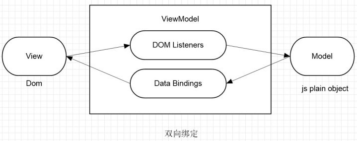

# 模版引擎

模板引擎：将数据映射并渲染到HTML上的工具。

[Alpine.js](https://alpinejs.dev/)是一个JavaScript工具库，用于直接在HTML标签中嵌入行为代码。

* 无需其他的构建工具，即插即用。
* 轻量级的响应式框架，直接作用于真实DOM。
* 双向绑定，数据与DOM同步。

Alpine.js用来代替标签选择器或jQuery库。



## Alpine使用

使用CDN引入Alpine.js包

```html
<head>
    <meta charset="UTF-8">
    <meta name="viewport" content="width=device-width, initial-scale=1.0">
    <title>Document</title> 
    <script src="https://cdn.bootcdn.net/ajax/libs/alpinejs/3.14.0/alpine.min.js" defer></script>
</head>
```

`State`（数据对象）是Alpine所有操作的核心，可以将数据提供给一段HTML，以便在页面上的任何位置使用。

```html
<body x-data="{ message: 'hello alpine' }">
    <h1 x-text="message"></h1>
</body>
```

指令：是写在HTML标签上的自定义属性，以`x-`开头，如：`x-data`和`x-text`是常用的指令。

* 告诉Alpine，如何将响应式数据绑定到DOM节点上，或如何对DOM节点的事件行为进行控制。
* 指令的值是字符串，写在引号中。

> [!important]
>
> 指令的内容本质上式伪代码，需要符合JavaScript语法或Alpine.js约定的语法格式：
>
> * 指令内容包括：变量、对象和函数。
> * Alpine解析引擎会将指令放到沙盒中运行。

### 基本指令

#### `x-data`

将一段HTML定义为组件，并为该组件提供可引用的响应式数据。

```html
<div x-data="{ count: 0 }">
    <button x-on:click="count++">Increment</button>
    <h2 x-text="count"></h2>
</div>
```

* 每个`x-data`都会创建一个局部作用域对象，它们拥有各自的作用域和独立的响应式实例。

使用元素选择的方式实现上面的功能

```html
<div >
    <button id="btn">Increment</button>
    <h2 id="count">0</h2>
</div>
</body>
<script>
let btn = document.getElementById('btn');
let count = document.getElementById('count');
btn.addEventListener('click', () => {
    count.innerHTML = Number(count.innerHTML) + 1;
})
</script>
```

1. 同级组件：互相隔离

```html
<div x-data="{ count: 0 }">
    <button x-on:click="count++">Increment</button>
    <h2 x-text="count"></h2>
</div>
<hr>
<div x-data="{ count: 0 }">
    <button x-on:click="count++">Increment</button>
    <h2 x-text="count"></h2>
</div>
```

2. 嵌套组件：类似变量的作用域。
   1. 子组件可以访问自己的数据。
   2. 子组件可以访问父组件的数据。
   3. 父组件不能访问子组件的数据。
   4. 如果键名冲突，优先使用子组件自己的数据（就近原则）。

```html
<div x-data="{ parentName: '张三', age: 40 }">
  <div x-data="{ childName: '张小三', age: 10 }">
    <p x-text="childName"></p> 
    <p x-text="parentName"></p> 
    <p x-text="age"></p> 
  </div>
</div>
```

`x-data`是JavaScript对象，可以添加属性和方法

```html
<div x-data="{ open: false, toggle() { this.open = ! this.open } }">
    <button @click="toggle()">Toggle Content</button>
    <hr>
    <div x-show="open">
        天下风云出我辈，一入江湖岁月催。
    </div>
</div>
```

#### `x-text`

将元素的文本内容设置为给定表达式的结果

```html
<div x-data="{ username: 'calebporzio' }">
    Username: <strong x-text="username.toUpperCase()"></strong>
</div>
```

#### `x-html`

给元素的`innerHTML`属性设置为给定表达式的结果

```html
<div x-data="{ username: '<strong>calebporzio</strong>' }">
    Username: <span x-html="username"></span>
</div>
```

#### `x-on`

给DOM添加监听事件

```html
<body x-data>
<button x-on:click="alert('Hello World!')">Say Hi</button>
</body>
```

* `x-on`表示指明名称。
* `:click`表示指令类型，这里是点击。

简写形式，使用`@`可以代替`x-on`指令

```html
<body x-data>
<button @click="alert('Hello World!')">Say Hi</button>
</body>
```

获得事件对象

```html
<body x-data>
<button @click="handleClick">Say Hi</button>
</body>
<script>
    function handleClick(e) {
        alert(`Target innerHTML: ${e.target.innerHTML}`);
    }
</script>
```

* 将回调函数写到HTML文件外部，在回调函数中可以获得事件对象。

[更多事件类型](https://alpinejs.dev/directives/on#keyboard-events)

#### `x-bind`

用于绑定HTML的属性。

```html
<div x-data="{ placeholderText: 'Type here...' }">
    <input type="text" x-bind:placeholder="placeholderText">
</div>
```

* `x-bind`表示指明名称。
* `:placeholder`绑定的属性名。

简写形式，`x-bind`可以省略，只保留`:`。

```html
<div x-data="{ placeholderText: 'Type here...' }">
    <input type="text" :placeholder="placeholderText">
</div>
```

> [!important]
>
> `x-bind`可以绑定HTML标签上的任何合法属性。

```html
<div x-data="{ color: 'red' }">
    <h2 :style="'color: ' + color">皇图霸业谈笑中，不胜人生一场醉。</h2>
</div>
```

用于绑定属性

```html
<body>
  <div x-data="{ current: 'personal' }">
    <button class="tab-btn" 
            :class="{ 'active': current === 'personal' }" 
            @click="current = 'personal'">
      个人登录
    </button>
    <button class="tab-btn" 
            :class="{ 'active': current === 'company' }" 
            @click="current = 'company'">
      企业登录
    </button>
  </div>
</body>
```

* 原有的`class`为静态样式。
* 绑定的`:class`为动态样式。
* 当按钮激活时，`Alpine`引擎会将两个样式合并为一个`<button class="tab-btn active">个人登录</button>`

### 双向数据绑定

#### `x-model`

可以实现元素的双向绑定：

* 双向绑定既可以获取数据，也可以设置数据。
* 除了更改数据之外，如果数据本身发生变化，元素也会反映出这种变化。

```html
<div x-data="{ message: '' }">
    <input type="text" x-model="message">
    <hr>
    <h2 x-text="message"></h2>
</div>
```

* `x-model="message"`这里`message`变量被双向绑定到`<input>`上。

双向绑定实现数据交互

```html
<div x-data="{ message: '岭外音书断，经冬复历春。' }">
    <input type="text" x-model="message">
    <hr>
    <button x-text="message" @click="message = '近乡情更怯，不敢问来人。'"></button>
</div>
```

[`x-model`支持的元素](https://alpinejs.dev/directives/model#text-inputs)

### 逻辑控制

#### `x-show`

用来控制DOM元素显示和隐藏，支持动画效果。

```html
<div x-data="{ open: ture, toggle() { this.open = ! this.open } }">
    <button @click="toggle()">Toggle Content</button>
    <hr>
    <h2 x-show="open">
      提剑跨骑挥鬼雨，白骨如山鸟惊飞。
    </h2>
</div>
```

* `x-show`实际上式控制元素的样式中属性`display: none;`。

#### `x-if`

用于切换页面上的元素，类似于`x-show` ，但它会完全添加和删除相应的元素。`x-if`不支持动画效果。

```html
<div x-data="{ open: true, toggle() { this.open = ! this.open } }">
    <button @click="toggle()">Toggle Content</button>
    <hr>
    <template x-if="open">
      <h2>
        尘事如潮人如水，只叹江湖几人回。
      </h2>
    </template>
</div>
```

* `x-if`不应直接应用于元素本身，而应用`<template>`标签包裹。
* `<template>`是HTML5的原生标签，渲染时会惰性加载。

> [!warning]
>
> Alpine.js中只提供了`x-if`指令，没有对应的`else`指令。

#### `x-for`

指令用于遍历列表来创建DOM元素。

1. `x-for`的指令内容，必须是一个Alpine.js约定的迭代语法。
2. `x-for`必须在一个`<template>`元素上声明。
3. `<template>`元素必须只包含一个根元素。

遍历数组

```html
<ul x-data="{ colors: ['Red', 'Orange', 'Yellow'] }">
    <template x-for="color in colors">
        <li x-text="color"></li>
    </template>
</ul>
```

> [!caution]
>
> JavaScript中`for...in`遍历语法只能用于遍历索引值。

获取数组索引值

```html
<ul x-data="{ colors: ['Red', 'Orange', 'Yellow'] }">
    <template x-for="(color, index) in colors">
        <li>
            <span x-text="index + ': '"></span>
            <span x-text="color"></span>
        </li>
    </template>
</ul>
```

> [!caution]
>
> JavaScript中没有`(color, index) in colors`，JavaScript中`for...in`只能获得索引值。

遍历对象

```html
<ul x-data="{ car: { make: 'Jeep', model: 'Grand Cherokee', color: 'Black' } }">
    <template x-for="(value, key) in car">
        <li>
            <span x-text="key"></span>: <span x-text="value"></span>
        </li>
    </template>
</ul>
```

* `(value, key) in car`不是JavaScript的标准语法，`for...in`遍历对象只能获得`key`。

> [!warning]
>
> `<template>`中虽然只包含一个根元素，但唯一根元素中可以包含多个元素。

遍历对象时读取属性值

```html
<ul x-data="{ colors: [
    { id: 1, label: 'Red' },
    { id: 2, label: 'Orange' },
    { id: 3, label: 'Yellow' },
]}">
    <template x-for="color in colors" :key="color.id">
        <li x-text="color.label"></li>
    </template>
</ul>
```

> [!important]
>
> `:key`是Alpine.js自定义的辅助属性，给循环生成的每一个标签，打上了一个唯一的标识（ID）。如果代码涉及动态增删、重排序列表时，需要使用该属性。

### 全局对象

框架提供的全局对象，用来注册公共逻辑、跨组件共享状态或修改Alpine自身的运行行为。

`alpine:init`是Alpine官方，专门用来配置全局属性的生命周期函数，全局对象应该在这个阶段初始化。

```js
document.addEventListener('alpine:init', () => {
	// 初始全局对象
})
```

#### `Alpine.data`

提供了一种在应用程序中重复使用`x-data`上下文的方法。

```html
<div x-data="dropdown">
    <button @click="toggle">Toggle Content</button>
    <hr>
    <h2 x-show="open">
			...
    </h2>
</div>
</body>
<script>
    document.addEventListener('alpine:init', () => {
        Alpine.data('dropdown', () => ({
            open: false,
            toggle() {
                this.open = ! this.open
            }
        }))
    })
</script>
```

> [!important]
>
> `Alpine.data`可以添加多个对象，每个对象相当于一个`x-data`。

#### `Alpine.store`

用于定义跨组件的共享数据。

```html
<body>
<div x-data>
    <h2 x-text="$store.counter.count"></h2>
</div>
<div x-data>
    <button @click="$store.counter.increment()">增加</button>
</div>
<hr>
<div x-data>
    <button @click="$store.counter.decrement()">减少</button>
</div>
</body>
<script>
    document.addEventListener('alpine:init', () => {
        Alpine.store('counter', {
            count: 0,
            increment() {
                this.count++;
            },
            decrement() {
                this.count--;
            }
        })
    })
</script>
```

## 请求数据渲染

### 初始化数据

#### `x-init`

初始化指令，在任何元素的初始阶段进行操作，可以用于网络请求或数据初始化操作。

1. `x-init`在初始化阶段执行回调。

```html
<div x-init="console.log('I\'m being initialized!')"></div>
```

2. `x-init`可以用于数据初始化。

```html
<div 
  x-data="{user: null}" 
  x-init="user = {name: 'Tom',age: 25}"
  >
  <div x-text="user.name"></div>
  <div x-text="user.age"></div>
</div>
```

3. 初始可以在全局对象内初始化。

```html
<div x-data="user" >
  <div>username: <span x-text="data.username"></span></div>
  <div>age: <span x-text="data.age"></span></div>
</div>
</body>
<script>
  document.addEventListener('alpine:init', () => {
    Alpine.data('user', () => ({
      data: null,
      async init() {
        let res = await axios.get('https://dummyjson.com/users/1');
        this.data = res.data;
      }
    }))
  })
</script>
```

### 渲染请求数据

请求用户列表路径（https://dummyjson.com/users），并渲染用户列表。

```html
<body>
<div x-data="userList">
  <ul>
    <template x-for="user in users" :key="user.id">
      <li>
        <div class="name" x-text="fullName(user)"></div>
        <div x-text="`${user.gender} · ${user.age} · ${user.university}`"></div>
      </li>
    </template>
  </ul>
</div>
</body>
<script>
  document.addEventListener('alpine:init', () => {
    Alpine.data('userList', () => ({
      users: [],
      async init() {
        let res = await axios.get('https://dummyjson.com/users');
        this.users = res.data.users;
      },
      fullName(user) {
        return user.firstName + ' ' + user.lastName + ' ' + user.maidenName;
      }
    }))
  })
</script>
```

## 练习

1. 使用[RandomUser](https://randomuser.me/)接口和模版方法生成一个用户卡片页。


