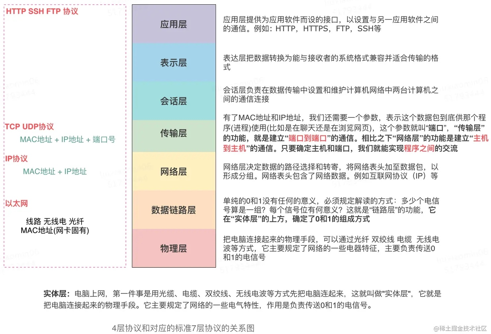
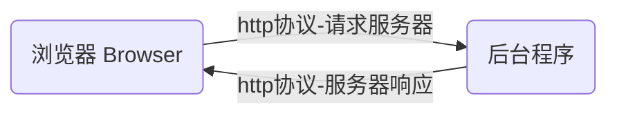
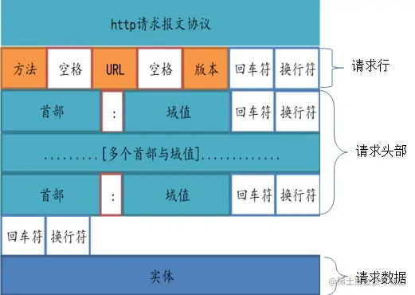
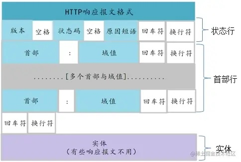
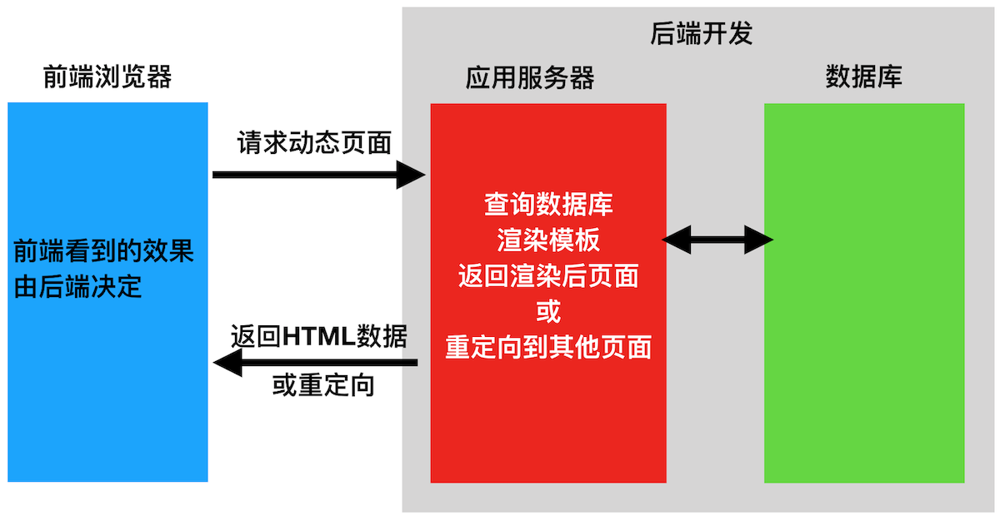
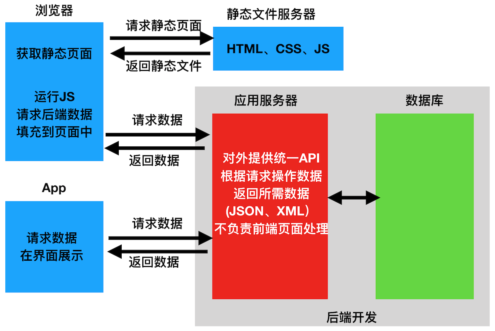

# HTTP协议

通信就是信息的传递与交换，通讯的三要素：信源（Source/发送者）、信道（Channel/传输介质）和信宿（Sink/接收者）。

BS架构本质上也是一种通信，在BS架构中：

* 信源：浏览器
* 信道：网络链路与通讯协议
* 信宿：Web服务器

通信协议（Communication Protocol）是指通信的双方完成通信所必须遵守的规则和约定。计算机网络通讯是一个非常复杂的过程



应用层协议

* HTTP协议（HyperText Transfer Protoco，超文本传输协议）是用于在Web客户端（如浏览器、APP）和服务器之间传输任何格式数据的应用程序协议。
* HTTPS协议（HTTP + TLS/SSL，安全加密）HTTP的安全版，现代前端开发的标配，不配置HTTPS很多浏览器API如摄像头、定位会禁用。
* WebSocket（双向持久连接）实时聊天、股票看板、多人协作文档、在线游戏、实时通知等需要**服务器主动推送**的场景。

> [!important]
>
> 对于前端开发者而言，HTTP/HTTPS协议是日常开发中接触频率最高、最核心的网络协议。

HTTP/HTTPS协议规定了客户端与服务器之间进行网页内容传输时，所必须遵守的传输格式。



## 请求与响应

### 请求消息

有客户端发出的消息，叫HTTP请求，由请求行（request line）、请求头部（header）、空行和请求体4个部分组成。



* 请求行和请求头是纯文本文件。
* 请求体可以是纯文本数据，也可以是图片、视频等二进制数据，还可以为空。
* 请求头是对整个HTTP请求的数据说明，包括：
  * 求体数据的说明，如：数据类型、大小等。
  * 客户端的说明，如：浏览器类型、操作系统版本等。
  * 交互与安全的说明，如：用户的身份凭证。
* 请求行、请求头和请求体被打包在一起。
* 底层的传输层使用会使用二进制数据流数据流的形式传输打包后的数据。

测试post请求

```shell
curl \
--trace-ascii - --request POST \
--url https://dummyjson.com/user/login \
--header 'content-type: application/x-www-form-urlencoded' \
--data username=emilys \
--data password=emilyspass
```

请求格式如下

```http
POST /user/login HTTP/2     
Host: dummyjson.com
User-Agent: curl/8.7.1
Accept: */*
content-type: application/x-www-form-urlencoded
Content-Length: 35

username=emilys&password=emilyspass
```

* `content-type: application/x-www-form-urlencoded`请求体数据为POST表单形式。
* 请求头最后一个字段，后面是空行，通知服务器请求头部至此结束，用来分隔请求头部与请求体。

> [!warning]
>
> GET请求，没有请求体。

常见的请求头字段

| **头部字段**    | **说明**                                     |
| --------------- | -------------------------------------------- |
| Host            | 要请求的服务器域名                           |
| Connection      | 客户端与服务器的连接方式(close 或 keepalive) |
| Content-Type    | 客户端告诉服务器实际发送的数据类型           |
| Content-Length  | 用来描述请求体的大小                         |
| Accept          | 客户端可识别的响应内容类型列表               |
| User-Agent      | 产生请求的浏览器类型                         |
| Accept-Encoding | 客户端可接收的内容压缩编码形式               |
| Accept-Language | 用户期望获得的自然语言的优先顺序             |

[请求头的详细描述](https://developer.mozilla.org/zh-CN/docs/Glossary/Request_header)

### 响应消息

响应消息是服务器返回给客户端的消息内容，也叫作响应报文。响应消息由状态行、响应头部、空行和响应体4个部分组成，



* 状态行和首部行是纯文本。
* 响应体可以是纯文本数据，也可以是图片、视频等二进制数据，还可以为空。
* 客户端接收的是二进制流，经过浏览器解码后转为纯文本和响应体数据。
* 状态行表示请求的数据是否成功返回。
* 响应头部中，表示该网址的响应数据，是否允许跨域解析。

```http
HTTP/2 200 OK
date: Thu, 24 Sep 2026 03:36:53 GMT
content-type: application/json; charset=utf-8
content-length: 930
access-control-allow-credentials: true
access-control-allow-origin: https://restfox.dev
etag: W/"3a2-AszhdamHBaWGsRaSqGx8XBUrsfE"
server: cloudflare
content-type: application/json; charset=utf-8
0000: cf-ray: a3febf56ba9cc6c6-SJC

{...}
```

* `content-type`响应数据类型，依据该类型来解析和处理响应体中的二进制数据。
* `access-control-allow-credentials`允许跨域请求携带凭证。
* `access-control-allow-origin`允许跨域请求的指定网址。
* 响应头最后一个字段，后面是空行，通知客户端响应头部至此结束，用来分隔响应头部与响应体。

[响应头的详细描述](https://developer.mozilla.org/zh-CN/docs/Glossary/Response_header)

[所有HTTP标头](https://developer.mozilla.org/zh-CN/docs/Web/HTTP/Reference/Headers)

### 请求方法

HTTP请求方法，属于HTTP协议中的一部分，用来表明要对服务器上的资源执行的操作。

| 方法     | 描述                                             |
| -------- | ------------------------------------------------ |
| `GET`    | 从服务器取出资源（一项或多项）。                 |
| `POST`   | 在服务器新建一个资源。                           |
| `PUT`    | 在服务器更新资源（客户端提供改变后的完整资源）。 |
| `PATCH`  | 在服务器更新资源（客户端提供改变的属性）。       |
| `DELETE` | 从服务器删除资源。                               |

> [!warning]
>
> 1. `POST`/`PUT`/`PATCH`携带请求体的数据格式是一致的。
> 2. `GET`/`DELETE`请求的格式是一致的，不携带请求体，请求参数在URL中。

[HTTP全部请求方法](https://developer.mozilla.org/zh-CN/docs/Web/HTTP/Reference/Methods)

### 响应状态代码

HTTP响应状态码，用来标识响应的状态。 

* 状态码由三个十进制数字组成。
* 第一个数字定义了状态码的类型。
* 后两个数字用来对状态码进行细分。

HTTP状态码共分为5种类型：

* `2**`：成功。操作被成功接收并处理。
* `3**`：重定向。需要客户端进一步的操作以完成资源的请求。
* `4**`：客户端错误。客户端的请求有非法内容，从而导致这次请求失败。
* `5**`：服务器错误。服务器在处理请求的过程中发生了错误。

#### 响应成功

| 状态码 | 状态码英文名称 | 描述                                                    |
| ------ | -------------- | ------------------------------------------------------- |
| 200    | OK             | 请求成功。一般用于GET与POST请求                         |
| 201    | Created        | 已创建。成功请求并创建了新的资源，通常用于POST或PUT请求 |

#### 重定向

| 状态码 | 状态码英文名称    | 中文描述                                                     |
| ------ | ----------------- | ------------------------------------------------------------ |
| 301    | Moved Permanently | 永久移动。请求的资源已被永久的移动到新URI。                  |
| 302    | Found             | 临时移动。资源只是临时被移动。                               |
| 304    | Not Modified      | 未修改。服务器不会返回任何资，客户端通常会缓存访问过的资源。 |

#### 状态码

| 状态码 | 状态码英文名称  | 中文描述                                             |
| ------ | --------------- | ---------------------------------------------------- |
| 400    | Bad Request     | 语义有误或请求参数有误。                             |
| 401    | Unauthorized    | 当前请求需要用户验证。                               |
| 403    | Forbidden       | 服务器已经理解请求，但是拒绝执行它。                 |
| 404    | Not Found       | 服务器无法根据客户端的请求找到资源（网页）。         |
| 408    | Request Timeout | 请求超时。服务器等待客户端发送的请求时间过长，超时。 |

#### 服务端错误

| 状态码 | 状态码英文名称        | 中文描述                                               |
| ------ | --------------------- | ------------------------------------------------------ |
| 500    | Internal Server Error | 服务器内部错误，无法完成请求。                         |
| 501    | Not Implemented       | 服务器不支持该请求方法，无法完成请求。                 |
| 503    | Service Unavailable   | 由于超载或系统维护，服务器暂时的无法处理客户端的请求。 |

[完整的HTTP响应状态码](https://developer.mozilla.org/zh-CN/docs/Web/HTTP/Status)

## 服务端接口

在网页开发中有两种模式：前后端一体和前后端分离。

1. 前后端一体模式：后端程序查询数据，并渲染页面或重定向，前端页面看到的效果都是由后端控制。



* 前后端一体形式的特点：
  * 后端无法兼容多种平台，如：App、客户端等。
  * 前端无法写出更复杂的应用，如：工具软件等。
  * 前后端耦合度严重，开发效率低。

2. 前后端分离：后端仅返回前端所需的数据，不再渲染HTML页面。



* 前后端分离形式的特点：
  * 后端一般返回Json格式数据，后端数据可以适配多种平台。
  * 前后端程序可以独立开发，前端可以写出更复杂的程序。
  * 前端与后端的耦合度相对较低，开发效率高。

在前后端分离架构中，接口由请求方法（GET、POST等）和请求路径（URL）共同组成了服务端接口（Web API）接口。

> [!important]
>
> 每次HTTP交互，都是在调用后端暴露的一个具体的API接口。

### Restful API

Restful API，是Roy Thomas Fielding（HTTP协议1.0版和1.1版的主要设计者）在他2000年的博士论文中提出的。

* 在前后端分离的应用模式里，普遍使用的API接口形式。
* 它是一种接口设计的风格，并不是标准。

Restful API一般遵循如下设计规范

1. 协议：API与用户的通信协议，总是使用HTTP/HTTPs协议。
2. 域名：应该尽量将API部署在专用域名之下。

```url
https://api.example.com
```

3. 版本：应该将API的版本号放入URL中。

```url
https://api.example.com/v1/
```

4. 路径：表示API的具体网址。
   * 每个网址代表一种资源，所以网址中不能有动词，只能有名词。
   * 名词往往与数据库的表格名对应。
   * 获取多条数据，API中的名词也应该使用复数。

```url
https://api.example.com/v1/employees
```

> [!important]
>
> 资源：就是网络上的一个实体，或者说是网络上的一个具体信息。
>
> * 可以是一段文本、一张图片或一条数据，等信息。
> * 可以用一个URL指向它。
> * 每一个资源的地址都是独一无二的。

5. HTTP动词：对于资源的具体操作，常用的五个HTTP动词——`GET`/`POST`/`PUT`/`PATCH`/`DELETE`。

```http
GET https://api.example.com/v1/employees
```

* 列出所有雇员列表
* 返回数据一般为Json数组。

```http
GET https://api.example.com/v1/employees/1
```

* 读取雇员id为1的信息。
* 返回数据一般为Json对象。

```http
POST https://api.example.com/v1/employees
```

* 增加一个新雇员。
* 返回数据一般为Json对象。

```http
PUT https://api.example.com/v1/employees/1
```

* 更新雇员id为1的完整信息。
* 返回数据一般为Json对象，即更新完的数据。

```http
PATCH https://api.example.com/v1/employees/1
```

* 更新雇员id为1的部分信息。
* 返回数据一般为Json对象。

```http
DELETE https://api.example.com/v1/employees/1
```

* 删除id为1的雇员。
* 返回数据一般为Json对象，通知删除成功。

6. 过滤信息：如果记录数量很多，服务器不可能都将它们返回给用户。API应该提供参数，过滤返回结果。

```http
GET https://api.example.com/v1/employees?page=2&page_size=20
```

* `?page=2&page_size=20`查询参数。

7. 状态码：响应返回遵循HTTP响应状态码规范。
8. 错误处理：如果状态码是4xx，就应该向用户返回出错信息。

```json
{
    error: "Invalid API key"
}
```

## 练习

1. 参考[微博API格式](https://open.weibo.com/wiki/%E5%BE%AE%E5%8D%9AAPI)理解Restful API的URL设计
2. 使用[DummyJSON](https://dummyjson.com/)理解Restful API的响应设计。
