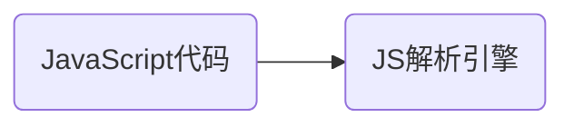
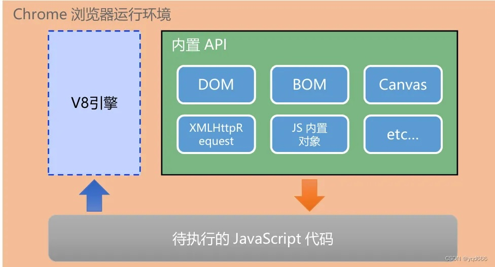
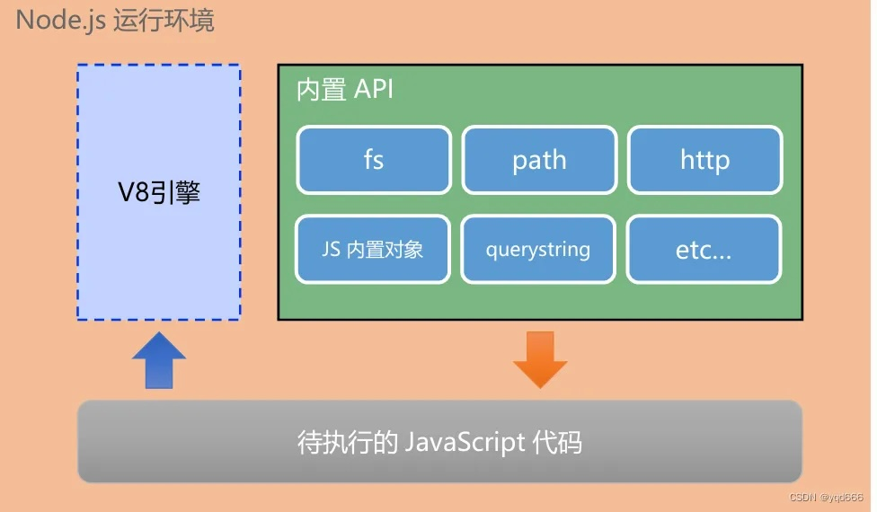
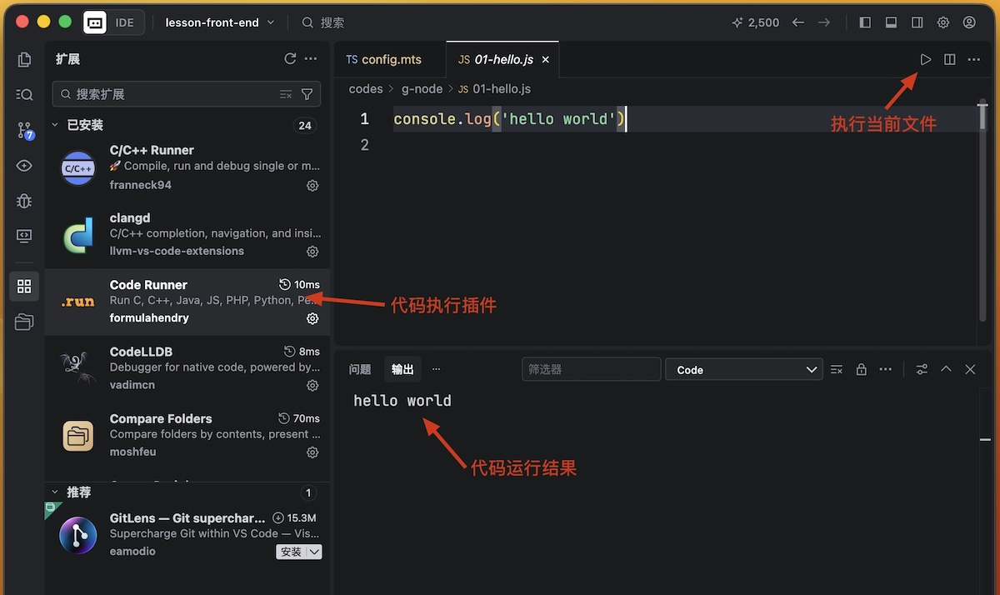

# Node

JavaScript的执行过程



不同的浏览器使用不同的JavaScript解析引擎：

* Chrome浏览器，V8解析引擎。
* Firefox浏览器，OdinMonkey（奥丁猴）。 
* IE浏览器， Chakra（查克拉）。

**在浏览器中运行**

浏览器中的JavaScript运行时环境，由浏览器提供的内置API（WEB API）及JavaScript解析引擎组成。



1. Chorme提供的JavaScript解析引擎V8负责解析和执行JavaScript代码。
2. 内置API，是由运行环境（Chrome浏览器）提供的编程接口。
   * DOM操作文档，比如对页面元素进行移动、大小、添加删除等操作。
   * BOM操作浏览器，比如页面弹窗，检测窗口宽度、存储数据到浏览器等等。

> [!tip]
>
> JavaScript是否可以操作电脑上的文件？

**在服务端运行**

Node.js是一个基于V8引擎的JavaScript运行环境，可以在PC上运行。



1. Node可以操作PC上的文件。
2. 结合不同框架可以开发不同应用。
   * 读写和操作数据库
   * 结合Koa或Express框架可以快速构建Web应用。
   * 结合Electron框架可以构建跨平台的桌面应用。
3. 创建实用的命令行工具辅助前端开发。

## Node的安装

[Node.js](https://nodejs.org/zh-cn)的版本：

* Current当前开发版本，可能存在隐藏安全性漏洞，不推荐在开发项目中使用。
* LTS为长期稳定版，推荐在项目开发中使用。
* node有多种个版本。

nvm（node version manager）用于管理不同的node版本，Mac电脑上使用如下安装nvm

```shell
curl -o- https://raw.githubusercontent.com/nvm-sh/nvm/v0.36.0/install.sh | bash
```

在`.zshenv`中添加nvm的环境变量（新版本nvm默认自动添加）

```shell
export NVM_DIR="$HOME/.nvm"
# This loads nvm
[ -s "$NVM_DIR/nvm.sh" ] && \. "$NVM_DIR/nvm.sh" 
# This loads nvm bash_completion
[ -s "$NVM_DIR/bash_completion" ] && \. "$NVM_DIR/bash_completion"  
```

查看nvm中的node版本

```shell
nvm ls-remote 
```

查看本机上的安装版本

```shell
nvm ls 
```

安装指定的node版本

```shell
nvm install vXXXX
nvm install stable # 安装最新稳定版node
```

查看node的安装位置

```shell
which node
```

* nvm安装的node路径为`~/.nvm/versions/node/v10.18.0/bin/node`


查看当前运行的node版本

```shell
nvm current
```

切换不同的node版本

```shell
nvm alias default vXXXX  # 修改默认版本
nvm use vXXX             # 修改当前命令窗口的版本
```

卸载已安装的node

```shell
nvm uninstall vXXXX
```

node安装成功后查看当前的node版本

```shell
node --version
```

## 使用Node

在node中执行JavaScript代码

```js
console.log('hello world')
```

使用命令行执行node代码

```shell
node 01-hello.js
```

使用插件执行js代码



## 文件

使用文件，需要引入fs是核心模块，可以直接引入。fs中所有操作都分为同步操作和异步操作，同步会阻塞程序执行，异步操作不会阻塞程序，会在操作完成后通过回调函数将结果返回。

#### 文件写入

操作步骤：1. 打开文件；2. 向文件中写入内容；3. 保存并关闭文件。

```javascript
// 同步文件写入
var fs = require('fs')
fd = fs.openSync('demo.txt', 'w') // 返回一个文件的描述符
fs.writeSync(fd, 'hello, world') // 向文件描述符中写入内容
fs.closeSync(fd) // 关闭文件传入文件描述符

// 异步文件写入
// 回调函数两个参数: err 错误对象，如果没有错误则为null，fd文件的描述符
fs.open('demo.txt', 'w', function (err, f) {
    if (!err) {
        fs.write(f, '异步写入的内容', function (err, f) {
            if (!err) {
                fs.close(f, function (err) {
                    console.log(err)
                })
            }
        })
    } else {
        console.log('打开文件错误')
    }
})

// 简单文件写入，flag 1.r 只读 2.w 可写 3.a 追加
var txt = '简单写入内'
fs.writeFile("demo.txt", txt,{flag:"w"} , function (err) {
    if(!err){
        console.log("写入成功~~~");
    }else{
        console.log(err);
    }
});

// 流文件写入
// 创建一个可写流
var ws = fs.createWriteStream("demo.txt");

/*
  on: 可以为对象绑定一个事件
  once: 可以为对象绑定一个一次性的事件，该事件将会在触发一次以后自动失效
*/

// 绑定open回调函数
ws.once("open",function () {
    console.log("流打开了~~~");
});

// 绑定close回调函数
ws.once("close",function () {
    console.log("流关闭了~~~");
});

ws.write("通过可写流写入文件的内容\n");
ws.write("今天天气真不错\n");

// 关闭流
ws.end();
```

#### 文件读取

```javascript
var fs = require('fs')

// 文件读取
fs.readFile('demo.txt', function (err, data) {
    if (!err) {
        console.log(data.toString())
    }
})

// 流文件读取
var rs = fs.createReadStream('demo.txt');
rs.once("open",function () {
    console.log("可读流打开了~~");
});
rs.once("close",function () {
    console.log("可读流关闭了~~");
});

// 读取数据，需要绑定一个data事件，通过回调函数读取数据
rs.on("data", function (data) {
    console.log(data.length); // 默认读取65536字节
});

var rs = fs.createReadStream('demo.txt'); // 创建一个可读流
var ws = fs.createWriteStream("out.txt"); // 创建一个可写流
rs.pipe(ws); // pipe()可以将可读流中的内容，直接输出到可写流中
```


