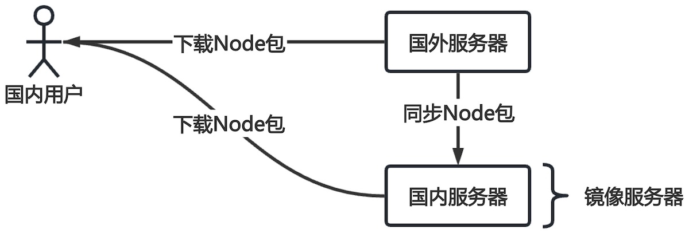

# 包管理

Node.js中模块又叫做包，模块分为内置模块和第三方模块。

* 内置模块，安装node后自带的模块，包括：文件模块、路径模块等。
* 第三方模块，有开发者免费分享的模块，这些模块提供高级的功能。

## npm

[npmjs](https://www.npmjs.com/)是全球最大的Node包共享平台，在该平台上共享了数百万个包。`npm`（Node Package Manager）是用于管理第三方模块的命令。安装Node后，`npm`工具也默认安装。

查看`npm`是否安装成功

```shell
npm             # 查看帮助
npm -v          # npm版本
```

### 初始化项目

在当前文件夹下使用

```shell
npm init -y   # 快速初始化
npm init      # 交互式初始化
```

初始化node项目文件夹下有一个配置文件`package.json`，现在了项目的当前配置

```json
{
  "name": "a-node",           // 项目名称
  "version": "1.0.0",         // 版本号
  "description": "",
  "keywords": [],
  "author": "",
  "license": "ISC",
  "type": "commonjs"         // 模块化规范
}

```

* `type`表示模块化规范，修改值为`module`。
  * `commonjs`传统的模块化规范。
  * `module`为ES6后新模块化规范。

> [!warning]
>
> 当前版本Node已经对ES6模块化规范支持非常完善，现在的项目一般统一使用新规范。

## 内置模块

Node.js官方提供了内置的fs模块用来操作文件，该模块可以直接使用。

* 它包含一系列的方法和属性，用来满足用户对文件的操作需求。
* fs中所有操作都分为同步和异步，同步会阻塞程序执行，异步操作不会阻塞程序。

下面文件读写均已同步操作为例：

1. 文件写入。操作步骤：
   1. 打开文件；
   2. 向文件中写入内容；
   3. 保存并关闭文件。

```javascript
import fs from 'fs'

let str =  `
关山月
明月出天山，苍茫云海间。
长风几万里，吹度玉门关。
汉下白登道，胡窥青海湾。
由来征战地，不见有人还。
戍客望边邑，思归多苦颜。
高楼当此夜，叹息未应闲。
`

let fd = fs.openSync('./关山月.txt', 'w')
fs.writeSync(fd, str)
fs.closeSync(fd)
```

2. 读取文件。

```javascript
import fs from 'fs'

let fd = fs.openSync('./关山月.txt', 'r')
let str = fs.readFileSync(fd, 'utf-8')
fs.closeSync(fd)
console.log(str)
```

## 第三方模块

使用如下命令可以安装第三方模块

```shell
npm install [包名]  
npm install [包名]@[版本号]
npm i [包名]
```

### Day.js

[Day.js](https://day.js.org/zh-CN/)是一个轻量的处理时间和日期的JavaScript库。

> [!tip]
>
> 如何使用JavaScript内置对象，格式化年月日？

```js
Date.prototype.dateFormat = function () {
  function padZero(n) {
    return n > 9 ? n : '0' + n;
  }

  const y = this.getFullYear();
  const m = padZero(this.getMonth() + 1);
  const d = padZero(this.getDate());
  const hh = padZero(this.getHours());
  const mm = padZero(this.getMinutes());
  const ss = padZero(this.getSeconds());

  return `${y}-${m}-${d} ${hh}:${mm}:${ss}`;
};

let dt = new Date();
console.log(dt.dateFormat());
```

* 在`Date`对象的原型链上增加了一个时间格式化方法。

是`npm`工具安装Day.js工具库

```shell
npm install dayjs
```

成功安装Day.js工具库后，在配置文件`package.json`会添加一个依赖项

```json
{
  "dependencies": {
    "dayjs": "^1.11.23"
  }
}

```

* `dependencies`表示项目中依赖的工具库，包括：工具库的名称和版本。

安装第三方包后目标文件夹为

```shell
.
├── ...
├── node_modules
├── package-lock.json
└── package.json
```

* 通过`npm`下载的包都放到`node_modules`文件夹中。
* `package-lock.json`文件是npm在安装或更新依赖包时自动生成的锁定文件。

> [!important]
>
> 项目管理
>
> 1. 在Node项目中`node_modules`文件夹不会上传的git服务器中。
> 2. `package.json`和`package-lock.json`需要上传到git服务器中，可以在项目成员中共享安装包。
> 3. 从git上拉取新项目后，执行`npm install`会按照`package.json`依赖库自动安装包。

使用Day.js完成上面的年月日格式化

```js
import dayjs from 'dayjs';

let dtStr = dayjs().format('YYYY-MM-DD HH:mm:ss');
console.log(dtStr);

dtStr = dayjs().format('YYYY-MM-DD HH-mm-ss');
console.log(dtStr);
```

* `.format('YYYY-MM-DD HH:mm:ss')`表示时间显示的格式化模版。[格式化工具的详细应用](https://day.js.org/docs/zh-CN/display/format)

### 全局模块

Node项目的组织结构：

* 以文件夹为基础，一个项目就是一个独立的文件夹。
* 每个独立项目下包含`node_modules`、`package-lock.json`和`package.json`文件。
* 不同项目的需要依赖不同的第三方库，由`package.json`管理。
* 不同的项目不共用`node_modules`中的第三方库。
* 在文件中引入第三方模块的搜索顺序：
  1. 先在当前目录的`node_modules`中寻找。
  2. 不存在则上一级目录的`node_modules`中寻找。
  3. 以此类推，直到磁盘的根目录中。
  4. 如果一律没有，则会报错。

全局包会安装到用户根目录下，不会安装到某个项中，可以跨项目使用。

```shell
npm install [包名] -g  # -g参数表示安装为全局包
```

轻量级静态服务器，全局安装服务器

```shell
npm install -g serve
```

启动服务器

```shell
serve .
```

* 在浏览器中打开网址http://localhost:3000可以访问服务器。

> [!warning]
>
> 只有工具性质的包，才有全局安装的必要性，它们提供了常用终端命令。

### 镜像服务器

使用npm下包的时，默认从国外的服务器进行下载，下载的速度会比较慢。



设置中国科学技术大学镜像源

```shell
npm config set registry https://npmreg.proxy.ustclug.org/
```

查看镜像源是否成功

```shell
npm config get registry
```

## 模块化

模块化就是按照代码规范，将一个大文件拆成，独立并互相依赖的多个小文件。

程序模块化的优点：

* 提高了代码的复用性。
* 提高了代码的可维护性。
* 可以实现按需加载。、

`import ... from ...`就是从不同的模块导入对象、函数等。

模块化规范是ES6中提出的，在此之前社区已经尝试并提出了AMD、CMD、CommonJS等模块化规范，但这些规范还是存在一定的差异性与局限性、并不是浏览器与服务器通用的模块化标准。

ES6模块化标准的推出，统一了浏览器端与服务器端的开发规范，是现在主流的模块化方式。

* 开启Node项目的ES6模块化规范，在配置文件`package.json`中设置`"type": "module"`。

ES6模块化规范：

* 每个JavaScript文件都是一个独立的模块。
* 导入其它模块成员使用`import`关键字。
* 向外共享模块成员使用`export`关键字。

### 模块化使用

#### 默认导出与导入

默认导出模块

```js
const PI = 3.1415926;

function getArea(radius) {
  return PI * radius * radius;
}

class Point {
  constructor(x, y) {
    this.x = x;
    this.y = y;
  }

  distanceTo(other) {
    return Math.sqrt((this.x - other.x) ** 2 + (this.y - other.y) ** 2);
  }
}

export default {
  PI,
  getArea,
  Point,
};
```

* `export default`表示导出当前模块的默认值
  * 可以是对象、函数和和变量。
  * 只能使用一次，并且只能导出一个实体。
  * 这里表示导出了唯一的对象。

默认导入模块

```js
import math from './d-1-默认导出.js';

console.log(math.PI);
console.log(math.getArea(5));

let p1 = new math.Point(1, 2);
let p2 = new math.Point(3, 4);
console.log(p1.distanceTo(p2));
```

* `import math from './d-1-默认导出.js';`表示导入实体，使用`math`变量接收导入的实体。
* `math`的值和默认导出绑定在一起，无法改变。
* 这里表示`math`接受了一个对象。

#### 按需导出与导入

按需导出模块

```js
export const PI = 3.1415926;

export function getArea(radius) {
  return PI * radius * radius;
}

export class Point {
  constructor(x, y) {
    this.x = x;
    this.y = y;
  }

  distanceTo(other) {
    return Math.sqrt((this.x - other.x) ** 2 + (this.y - other.y) ** 2);
  }
}
```

* 按需导出，在需要导出的实体前添加`export`关键字，没有导出的实体无法被其他文件使用。

按需导入模块

```js
import { PI as circlePI, getArea, Point } from './e-1-按需导出.js';

console.log(circlePI);
console.log(getArea(5));

let p1 = new Point(1, 2);
let p2 = new Point(3, 4);
console.log(p1.distanceTo(p2));
```

* `import { PI, getArea, Point } from './e-1-按需导出.js';`按需导入相应的实体。
  * 按需导入的写法上类似解构赋值，实际上是将变量与导入信息绑定。
  * 变量的值一旦绑定无法更改。
  * 一般情况下按需导入实体的名称应该与导出一致。
* 使用`as`可以对按需导入的实体重命名。

按需导入的另一种写法

```js
const PI = 3.1415926;

function getArea(radius) {
  return PI * radius * radius;
}

export { PI, getArea }
```

* 这里的按需导入与上面一致，注意没有`default`关键字。

#### 混合导出与导入

混合导出：默认导出和按需导出一起使用。

```js
export const PI = 3.1415926;

export function getArea(radius) {
  return PI * radius * radius;
}

class Point {
  constructor(x, y) {
    this.x = x;
    this.y = y;
  }

  distanceTo(other) {
    return Math.sqrt((this.x - other.x) ** 2 + (this.y - other.y) ** 2);
  }
}

export default Point;
```

混合导入

```js
import Point, { PI, getArea } from './f-1-混合导出.js';

console.log(PI);
console.log(getArea(5));

let p1 = new Point(1, 2);
let p2 = new Point(3, 4);
console.log(p1.distanceTo(p2));
```

* `Point`接收默认导出实体。
* `{ PI, getArea }`接收按需导出的实体。

### 导入过程

当使用`import`语句导入一个模块时，JavaScript 引擎确实会加载并执行该模块文件的代码。

1. 导出模块

```js
const PI = 3.1415926;

function getArea(radius) {
  return PI * radius * radius;
}

for (let i = 1; i < 4; i++) {
  console.log(getArea(i));
}

export default getArea;
```

* 模块中有`for`循环函数。

2. 导入模块

```js
import getArea from './g-1-导出过程.js';

console.log(getArea(5));
```

* 导入`getArea`过程中会将导出模块的`for`循环执行一遍。

## 其他命令

1. 删除以安装的包

```shell
npm remove [包名]
```

2. 更新以安装的包

```shell
npm update         # 更新所有包
npm update [包名]   # 更新指定包
```

3. 查看全局包的根目录

```shell
npm root -g 
```

## 练习

1. 使用Node读取和显示一张图片，注意：不要借助浏览器。

