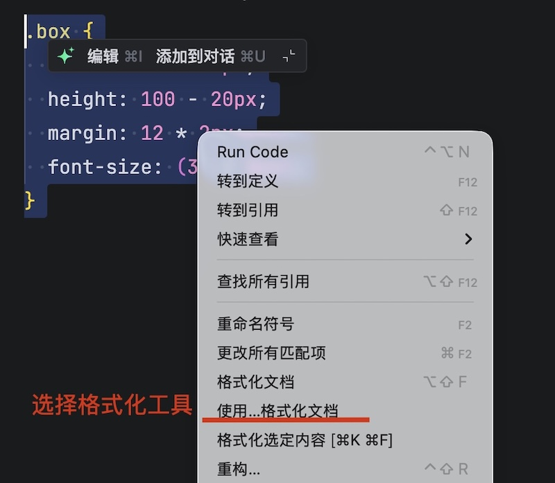
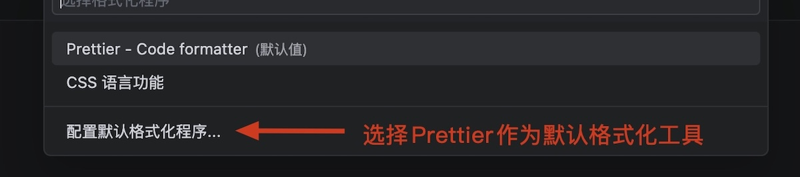

# Less

[Less](https://less.bootcss.com/)是一个CSS预处理器，Less文件后缀是`.less`。扩充了 CSS 语言，使 CSS 具备一定的逻辑性和计算能力。使用Less使得样式表更易维护和扩展。

> [!caution]
>
> 浏览器不识别Less代码，网页只能引入对应的CSS文件。

## 搭建Less自动编译环境

自动化处理的两大核心：

* 编译器：负责把 Less 语法翻译成CSS语法。
* 监听器：负责监听，一旦发现指定的`.less`文件有保存动作，就立刻触发编译器执行。

1. 初始化项目

```shell
npm init -y
```

2.  安装less编译器和onchange监听工具。

```shell
npm install less onchange --save-dev
```

* `--save-dev`表示将包作为开发依赖，命令可以简写为`-D`

> [!important]
>
> * 开发依赖：仅在开发和构建阶段使用的工具。
> * 生产依赖：项目上线后运行业务逻辑必须的库。

安装开发依赖项后，在`package.json`文件中显示

```json
{
  "devDependencies": {
    "less": "^4.9.1",
    "onchange": "^7.1.0"
  }
}
```

* `devDependencies`表示开发依赖项中的包模块。

3. 规范的项目结构

```shell
.
├── node_modules
├── package-lock.json
├── package.json
├── dist
│   └── css
└── src
    └── styles
```

* `.less`文件添加在`src/styles/`文件夹下。
* `.css`文件自动生成在`dist/css/`文件夹下。

4. 配置自动化指令。在`package.json`中添加如下配置

```json
{
  "scripts": {
    "build:css": "find src/styles -type f -name '*.less' | while read -r f; do rel=\"${f#src/styles/}\"; out=\"dist/css/${rel%.less}.css\"; mkdir -p \"$(dirname \"$out\")\"; lessc \"$f\" \"$out\"; done",
    "watch:css": "onchange \"src/styles/**/*.less\" -- npm run build:css"
  }
}

```

* `"scripts"`配置项是项目的快捷指令集。
* 运行`npm run <键>`时，npm会打开了一个终端，把值的命令放进终端里执行。

5. 启动监听：在终端中执行，自动编译`.less`文件。

```shell
npm run watch:css
```

### 配置Less格式化工具

1. 选择`.less`文件的格式化工具。



2. 配置默认格式工具



> [!warning]
>
> 默认配置下Prettier工具没有出来`.less`文件，如果希望Prettier来格式化代码，属于专门配置。其它的预处理文件需要类似的处理。

## Less语法

### 注释

Less中比CSS多了一种单行语法注释，包括：单行注释`//`和块注释`/* */`。

```less
// 单行注释

/* 
  块注释
  第二行
  第三行
*/
```

### 运算

Less的值可以使用四则运算，直接书写计算表达式。

```less
.box {
  width: 100 + 10px;
  height: 100 - 20px;
  margin: 12 * 2px;
  font-size: (32 / 2px);
}
```

* 除法需要添加小括号。
* 表达式存在多个单位以第一个单位为准。

### 后代选择器

Less语法可以使用嵌套来实现后代选择器。

```less
.father {
  width: 100px;
  .son {
    color: pink;
  }
}
```

只选中子代，不选择其他后端

```less
.father {
  width: 100px;
  > .son {
    color: pink;
  }
}
```

> [!warning]
>
> `&`不生成后代选择器，表示当前选择器，通常配合伪类或伪元素使用。

```less
.father {
  width: 100px;
  .son {
    color: pink;
    &:hover {
      color: green;
    }
  }

  &:hover {
    color: orange;
  }
}
```

### 变量

可以统一定义属性值，在样式中使用。变量加载时，将全部预处理文件读取完成后替换。

1. 定义变量 `@name: value`
2. 使用变量 `property: @name`

```less
// 1. 定义变量
@primary: skyblue;

// 2. 使用变量
.box {
  color: @primary;
}

.father {
  background-color: @primary;
}
```

### 导入其它样式

Less中可以引用其它Less文件，使用 `@import path`

```less
@import './base.less';

.son {
    background-color: @primary;
}
```

### 免编译

免编译设置，`~`当原生字符串输出不用编译，后面接字符串。

```less
* {
  margin: 100 * 10px;
  padding: ~'cacl(100px + 100)'; // 当原生字符串输出不用编译
}
```

### 混合

混合（Mixin）是一种将一组属性从一个规则集包含到另一个规则集的方法。

```less
.base {
  font-size: 32px;
  color: rgba(0, 0, 0, 0.9);
}

.main(@w:10px, @h:10px, @c:pink) {
  width: @w;
  height: @h;
  background-color: @c;
}

#box {
  width: 100px;
  height: 100px;
  .base;

  .inner {
    .main(20px, 20px, red);
  }
}
```

* `.main(@w:10px, @h:10px, @c:pink)`带参数混合，混合可以声明默认参数。

### 匹配模式

```less
.triangle(L, @w, @c) {
  border-width: @w;
  border-style: dashed solid dashed dashed;
  border-color: transparent @c transparent transparent;
}

.triangle(R, @w, @c) {
  border-width: @w;
  border-style: dashed dashed dashed solid;
  border-color: transparent transparent transparent @c;
}

#wrap {
  .triangle(R, 40px, yellow);
}
```

* `.triangle`里的`R`和`L`是专门用来告诉Less 编译器到应该调用哪一个具体的混合函数。

### `arguments`变量

`@arguments`表示传递给该混合的所有实参的组合。

```less
.border(@w, @style, @c) {
  border: @arguments;
}

#wrap {
  .border(1px, solid, black);
}
```

### 继承

使用`extend`关键字，可以继承不同的样式，Less继承不能带参数。

```less
.base {
  font-size: 32px;
  color: #000;
}

.base:hover {
  color: red;
}

#wrap:extend(.base) {
  font-weight: bold;
}

.content:extend(.base all) {
  font-weight: bold;
  font-style: italic;
}
```

* `#wrap:extend(.base)`继承`.base`样式。
* `.content:extend(.base all)`继承`.base`全部样式包括`hover`。
