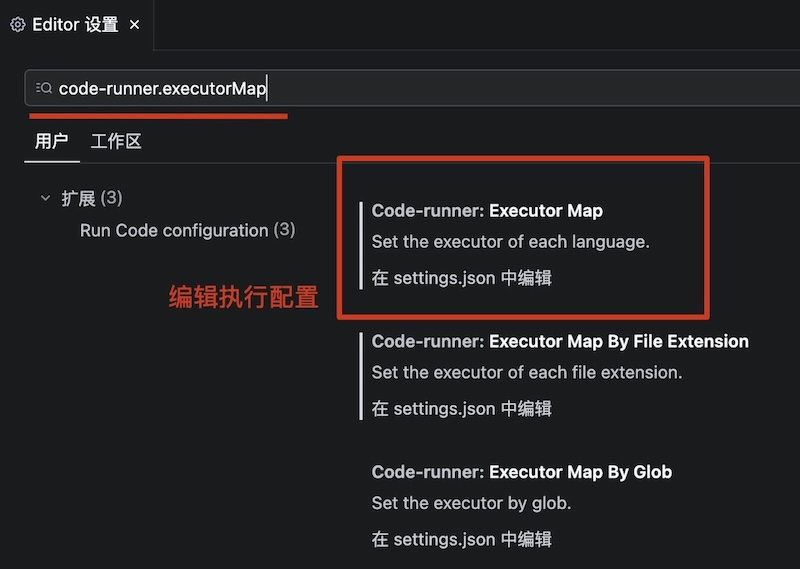
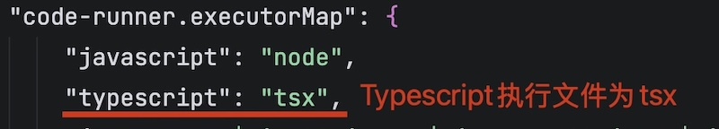
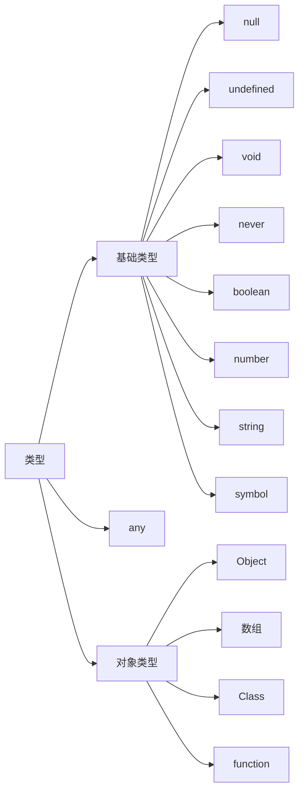

# Typescript基础

[TypeScript](https://www.typescriptlang.org/zh/)是一种强类型编程语言，它基于JavaScript构建，适合于构建复杂项目或应用。

> [!important]
>
> TypeScript无法在浏览器或Node直接运行，需要编译成JavaScript运行。

Typescript的优点：

* 静态类型系统能在编写阶段发现潜在问题，如参数缺失或类型不匹配。
* 类型注解提升代码自解释性，代码可读性更强。

## 搭建开发环境

安装TypeScript编译器

```shell
npm install typescript -g
```

查看编译器是否安装成功

```shell
tsc -v
```

> [!warning]
>
> TypeScript从7.0版本后，编译器架构使用go语言重构，编译效率大幅提升。

创建一个TypeScript文件，以`.ts`后缀结尾。

```ts
let message: string = 'hello typescript';
console.log(message);
```

Typescript代码不能执行，需要编译成JavaScript文件，执行如下编译命令

```shell
tsc a-hello.ts 
```

* 编译后会生成`a-hello.js`文件，执行`.js`文件即可。

为了方便验证Typescript的执行代码，可以使用`tsx`工具直接执行`.ts`文件，不需要中间代码。

```shell
npm install -g tsx
```

直接运行代码

```shell
tsx a-hello.ts
```

设置Code Runner执行工具

1. 搜索`code-runner.executorMap`配置项。



2. 设置TypeScript执行项。



* 可以使用Code Runner执行Typescript代码。

## 基本语法

TypeScript是静态类型语言，也就是说变量的类型一旦确定，就不能改变。

```ts
let pi: number = 3.1415926;
console.log(pi);
console.log(pi.toFixed(2));

pi = 'hello, world';
```

* 变量后面的`:`用于表示变量的类型，变量定义时就确定了类型。
* 静态类型限制了变量的属性和方法。
* 当给变量赋值为不同类型时，编译器会提示错误。

TypeScript的基本类型



> [!warning]
>
> TypeScript的数字类型没有整型（`int`）和浮点型（`float`）之分。

### 基础类型

字符和数字是常见的基础类型

```ts
let value: number = 123;
console.log(value);
value = 456;
console.log(value);

const PI: number = 3.14;
console.log(PI);

let message = 'hello, world!';
console.log(message);
```

* 变量中数据同类型直接可以直接改变。
* 变量和常量都有数据类型。

TypeScript中可以定义变量为多种类型，这种情况称为联合类型。

```ts
let code: number | string = 123;
console.log(code);

code = '456';
console.log(code);
```

* 使用`|`表示类型联合。
* 联合类型可以兼容多种数据类型。

几个特殊类型

| 类型      | 含义      | 区别                                                         |
| --------- | --------- | ------------------------------------------------------------ |
| `never`   | 无值/不存 | 表示函数从不返回，或类型不可能存在。                         |
| `void`    | 无返回值  | 表示函数正常执行完毕，但不返回任何有用数据（即返回`undefined`）。 |
| `any`     | 任意类型  | 关闭类型检查，允许任何操作。                                 |
| `unknown` | 未知类型  | 类型安全的`any`，必须先进行类型断言或缩小范围才能操作。      |

> [!warning]
>
> `any`表示任意类型，使用`any`类型就失去了Typescript类型声明的意义，要慎重使用。

### 对象类型

#### `Object`对象

```ts
let sudent: {
  name: string;
  id: number;
} = {
  name: '张三',
  id: 1001,
};
console.log(sudent);
```

* 可以先定义变量，然后在对变量赋值。
* 定义对象类型是，需要说明对象的包含的属性。

#### 数组类型

数值也是对象类型的一种。

```ts
const strArr: string[] = ['a', 'b', 'c'];
console.log(strArr);

strArr[0] = 1;
```

* `[]`定义数组，`string`表示数组中的数据类型。
* 定义了一个数组，数组中的每一项都必须是`string`。
* 如果修改数量类型，编译器会报错。

数组中的数据可以是多种类型

```ts
const mixArr: (string | number)[] = ['1', 2, 3];
console.log(mixArr);

let students: {
  name: string;
  id: number;
}[] = [
  { name: '张三', id: 1001 },
  { name: '李四', id: 1002 },
];
console.log(students);
```

#### 元组类型

元组 (Tuple): 一种特殊的数组，其长度固定，且每一项的类型也固定。

```ts
const player: [number, string, number] = [1001, '张三', 18];
console.log(player);
```

* 元组比普通数组更精确地约束数据，防止类型或数量错误。

元组经常用于读取表格数据，如：CSV文件等。

```ts
const players: [number, string, number][] = [
  [1001, '张三', 18],
  [1002, '李四', 19],
];
console.log(players);
```

### 类型别名

使用`type`关键字为复杂类型起名，提高代码可读性。

```ts
type Row = number | string;

const nsArr: Row[] = [1, '2', 3];
console.log(nsArr);
```

* 这里定义了`NumOrStr`为一种新类型，并使用该类型定义了数组。
* 定义类型别名是一般以大驼峰形式名，类似于定义类。

定义其它的类型别名

```ts
type Student = {
  name: string;
  id: number;
};
type Player = [number, string, number];
type Code = string;
```

定义类型别名可以为具体的值

```ts
type Gender = 'male' | 'female';

let gender: Gender = 'male';
console.log(gender);

gender = 'person';
```

* 这里`gender`的取值只能是`male`或`female`，赋值为其他字面量，编译器会报错。

### 函数类型

Typescript中定义函数时，通过变量类型来约定函数的输入和输出。

```ts
function circleArea(radius: number): number {
  return Math.PI * radius * radius;
}

console.log(circleArea(5));
console.log(circleArea('5'));

function squareArea(side: number): string {
  return side * side;
}
```

* 当传参参数和返回值不符时，编译器报错。

函数也可以作为类型使用，使用箭头函数语法来定义函数类型。

```ts
type MathFunc = (radius: number) => number;

let circle: MathFunc = (radius) => {
  return 2 * Math.PI * radius;
};

let square: MathFunc = (side) => {
  return side * side;
};

console.log(circle(5));
console.log(square(5));
```

* `(radius: number) => number`为函数类型，约定了输入变量和返回值。

定义函数时可以指定对象类型。

```ts
let logUser: ({ code, name }: { code: number; name: string }) => void = ({
  code,
  name,
}) => {
  console.log(`用户${code}的姓名是${name}`);
};

logUser({ code: 1001, name: '张三' });
let user: { code: number; name: string } = {
  code: 1002,
  name: '李四',
};
logUser(user);
```

* `({ code, name }: { code: number; name: string }) => void`为函数类型。
* 定义函数参数时可以使用结构赋值。
* 如果函数的返回值为空可以设置为`void`类型。
* 传入参数`user`时，只要对象的属性与参数一致，也可以使用。

## 类型注解与类型推断

### 类型注解

通过显式声明告诉TypeScript变量的具体类型。

```ts
let firstName: string;
firstName = 'Tom';
console.log(firstName);
```

* 首先约定了变量的类型，然后对变量赋值，赋值的字面量类型应该与声明一致。

### 类型推断

TypeScript通过赋值内容自动推导变量类型。

```ts
let teacher = {
  name: '张三',
  age: 30,
};
console.log(teacher);

let g = 9.8;
console.log(g);
```

* 这里没有声明类型，直接通过通过字面量来推断变量的类型。
* 类型推断时，变量必须赋值。

函数的返回值可以通过类型推断来处理，不需要显示声明

```ts
function triangle(base: number, height: number) {
  return (base * height) / 2;
}
console.log(triangle(5, 10));
```

* 定义函数时，参数类型需要明确注解。
* 返回值可以使用类型推断。

> [!important]
>
> 定义变量时优先依赖推断，无法推断时时补充注解。

## 接口

接口（Interface）是TypeScript中用来对复杂数据结构（如：对象、类、函数）进行类型约束的核心工具。

定义接口替代类

```ts
interface Employee {
  readonly code: number;
  name: string;
  age: number;
}

let emp: Employee = {
  code: 1001,
  name: '张三',
  age: 30,
};
console.log(emp);

function logEmployee(emp: Employee) {
  console.log(`员工${emp.code}的姓名是${emp.name}，年龄是${emp.age}`);
}
logEmployee(emp);

emp = {
  code: 1002,
  name: '李四',
  age: 32,
};

emp.age = 31;
emp.code = 1002;
```

* `readonly`表示属性为只读，不能单独修改，否则编译器会报错。
* `code`表示属性`: string`表示类型。
* `let emp: Employee`使用接口来约束变量的类型。

接口中可以添加方法

```ts
interface Note {
  user: string;
  bill: number;
  send(): string;
}
```

* `send(): string;`表示接口中的函数，返回值为`string`。

接口可以被继承

```ts
interface EmailNote extends Note {
  email: string;
}
```

* 子接口可以继承父接口的属性和方法。

使用接口来规范对象

```ts
let eNote: EmailNote = {
  user: '张三',
  bill: 100,
  email: 'zhangsan@example.com',
  send() {
    return `用户${this.user}您好，您的账单金额为${this.bill}元。目标邮件${this.email}`;
  },
};

console.log(eNote.send());
```

接口中的可选属性可以用`?`表示

```ts
interface Person {
  name: string;
  gender: 'male' | 'female';
  age?: number;
}

let person: Person = {
  name: '张三',
  gender: 'male',
};

console.log(person);
```

* 使用接口创建对象时，可选属性可以省略。

当接口中包含不确定的属性时，可以使用扩展属性

```ts
interface Json {
  [key: string]: string | number | boolean | null | Json;
}

interface User extends Json {
  id: number;
  username: string;
}

let owner: User = {
  id: 10011,
  username: 'tom',
  password: '123456',
  email: 'tom@example.com',
  isAdmin: true,
  phone: '13800000000',
  address: null,
  area: {
    country: 'China',
    city: 'Beijing',
    district: 'Dongcheng',
  },
  favoriteSports: ['basketball', 'football'],
};

console.log(owner);
```

* `[key: string]`语法允许接口包含任意属性，属性类型包括`: string | number | boolean | null | Json;`。
* 定义对象时除了必要项外，可以增加任意的键值对。
* `favoriteSports`这个类型不存在，所以会警告。

如果希望定义更开放的接口，可以使用`any`类型

```ts
interface IResponse {
  code: number;
  msg: string;
  [prop: string]: any;
}

let response: IResponse = {
  code: 200,
  msg: 'success',
  data: [
    { id: 10011, username: 'tom' },
    { id: 10012, username: 'jerry' },
  ],
};

console.log(response);
```

接口也可以用于定义函数类型

```ts
interface Greeting {
  (name: string): string;
}

let greeting: Greeting = (name) => {
  return `hello ${name}`;
};
console.log(greeting('tom'));
```

* 接口中只定义一个函数。

接口和类型别名的区别

* 类型别名可以表示基础类型。
* 接口只能表示对象、函数和类。
* 类型别名可以表示更广泛的类型集合。

> [!important]
>
> 优先使用接口表示对象等类型，类型别名用于表示基础类型的组合。


