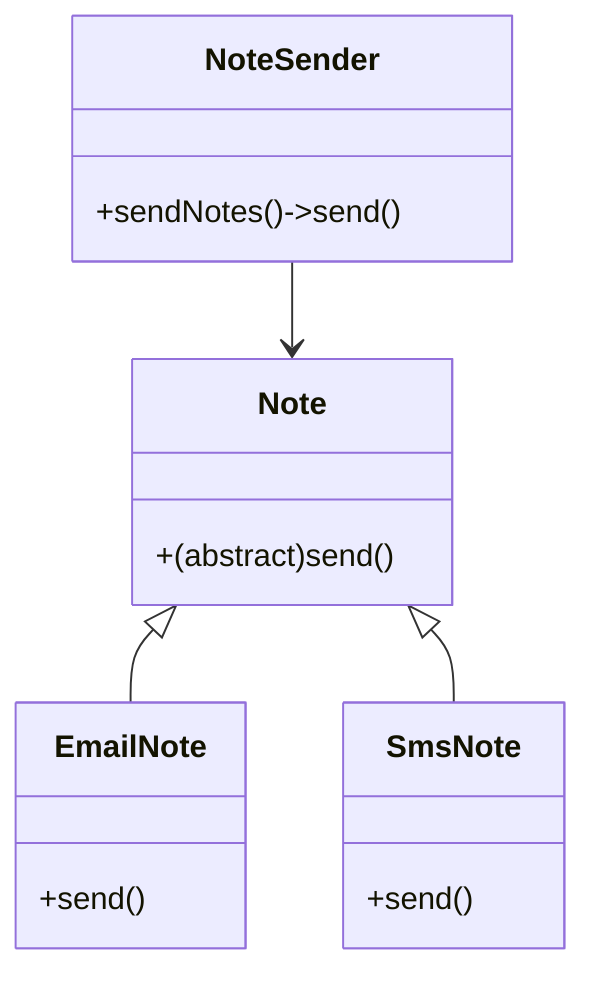

# Typescript进阶

Typescript文件需要编译成JavaScript才能运行，尽管`tsx`工具可以测试代码的执行结果，但是`.ts`文件终于还是要编译成`.js`文件，对于完整的Typescript项目需要系统的管理。

Typescript项目管理

1. 使用`npm init -y`初始化整个项目。
2. 使用`tsc --init`初始化项目，并生成`tsconfig.json`文件，该文件是Typescript的配置文件。
3. 项目目录结构

```shell
├── build                   # 编译输出JavaScript文件
├── src                     # 项目源文件，Typescript文件
├── package-lock.json
├── package.json            # 项目配置文件
└── tsconfig.json           # Typescript的配置文件
```

4. 设置`tsconfig.json`的配置

```json
{
  // 指定编译文件
  "include": ["src/**/*"],                         // 包含的编译文件
  "exclude": ["node_modules/**/*"],                // 排除的编译文件
  "files": ["src/a-hello.ts", "src/b-class.ts"],   // 指定编译文件，不支持通配符
  // 编译选项
  "compilerOptions": {
    "rootDir": "./src",                            // 源文件夹           
    "outDir": "./dist",                            // 输出文件夹
    "module": "es6",                               // 模块化版本
    "target": "es6",                               // 编译的目标文件

    // Stricter Typechecking Options
    "noUncheckedIndexedAccess": true,
    "exactOptionalPropertyTypes": true,

    // Style Options
    "noUnusedLocals": true,                        // 检测未使用的局部变量
    "noUnusedParameters": true,                    // 检测未使用的函数参数

    // Recommended Options
    "strict": true,
    "removeComments": true,                        // 编译时自动去除注释
    "verbatimModuleSyntax": true,
    "isolatedModules": true,
    "noUncheckedSideEffectImports": true,
    "moduleDetection": "force",
    "skipLibCheck": true,
  }
}

```

[TSConfig参考](https://www.typescriptlang.org/tsconfig/)

5. 在根目录下执行`tsc`命令，自动读取`tsconfig.json`对`src`中的文件进行编译。

> [!warning]
>
> 编写并测试代码时，可以使用Code Runner工具，但是最终部署文件时，必须编译成`.js`文件。

## 类的使用

TypeScript中的类与ES6原生类相似，但在此基础上提供了更多特性。

```ts
class Investment {
  principal: number;
  years: number;

  constructor(principal: number, years: number) {
    this.principal = principal;
    this.years = years;
  }

  show() {
    return `本金: ${this.principal}, 年限: ${this.years}`;
  }
}

let i: Investment = new Investment(1000, 5);
console.log(i.show());
```

* 类的属性有统一声明，否则编译器会提示错误。
* 在构造函数中对属性初始化，如果属性没有初始化，编译器也会提示错误。

类可以被继承

```ts
class FixedDeposit extends Investment {
  rate: number;

  constructor(principal: number, years: number, rate: number) {
    super(principal, years);
    this.rate = rate;
  }

  show() {
    return super.show() + `, 利率: ${this.rate}`;
  }

  calculateReturn() {
    return this.principal * (1 + this.rate) ** this.years;
  }
}

let fd: FixedDeposit = new FixedDeposit(1000, 5, 0.05);
console.log(fd.show());
console.log(`到期金额: ${fd.calculateReturn()}`);
```

* 子类拥有父类的属性和方法。
* 子类中可以重新父类的方法。
* 通过`super`关键字可以调用父类的属性和方法。
* 父类有构造器时，子类必须手动调用`super()`函数，该函数就是父类的构造函数。
* 在子类中可以添加新的属性和方法。

### 访问控制

类的访问控制包括：公有、保护和私有。

| 修饰符               | 类内部 | 子类（继承） | 类外部（实例对象） | 说明                                       |
| -------------------- | ------ | ------------ | ------------------ | ------------------------------------------ |
| **`public`**（默认） | ✅      | ✅            | ✅                  | 无限制，任何地方都可以自由访问。           |
| **`protected`**      | ✅      | ✅            | ❌                  | 仅在类自身及其子类内部访问，外部不可访问。 |
| **`private`**        | ✅      | ❌            | ❌                  | 仅在当前类内部访问，子类和外部均不可访问。 |

* 类内部：类定义体 { } 内的代码区域。
* 类外部：类定义体之外的代码区域（实例对象）。

```ts
class Employee {
  protected id: number;
  public name: string;

  constructor(id: number, name: string) {
    this.id = id;
    this.name = name;
  }

  private info() {
    return `ID: ${this.id}, 姓名: ${this.name}`;
  }

  show() {
    console.log(this.info());
  }
}

class Manager extends Employee {
  constructor(id: number, name: string) {
    super(id, name);
  }

  title() {
    return this.info() + ' 是经理';
  }
}

let emp: Employee = new Employee(1001, '张三');
console.log(emp.name);
emp.show();
console.log(emp.id);
console.log(emp.info());

let mg: Manager = new Manager(1002, '李四');
console.log(mg.name);
console.log(mg.title());
mg.show();
console.log(mg.id);
console.log(mg.info());
```

### 静态属性和方法

静态属性和方法绑定在整个类上。

```ts
class Circle {
  static PI: number = 3.14159;

  radius: number;
  constructor(radius: number) {
    this.radius = radius;
  }

  area(): number {
    return Circle.PI * this.radius * this.radius;
  }
}

let circle = new Circle(5);
console.log(circle.area());
console.log(Circle.PI);
```

借助静态方法和私有属性可以实现单例模型

```ts
class Singleton {
  private static _instance: Singleton;

  private constructor() {}

  static getInstance(): Singleton {
    if (!this._instance) {
      this._instance = new Singleton();
    }
    return this._instance;
  }
}

let first = Singleton.getInstance();
let second = Singleton.getInstance();
console.log(first === second);
```

### 存取器

对外部暴露时表现得像一个普通的属性，但内部实际上是作为函数在执行。通过`get`和`set`关键字定义的方法。

```ts
class Ratio {
  private _value: number;

  constructor(ratio: number) {
    this._value = ratio;
  }

  get percent(): string {
    return `${this._value * 100}%`;
  }

  set percent(value: number) {
    if (value < 0) {
      this._value = 0;
    } else if (value > 100) {
      this._value = 1;
    } else {
      this._value = value / 100;
    }
  }
}

let ratio = new Ratio(0.5);
console.log(ratio.percent);
ratio.percent = 100;
console.log(ratio.percent);
```

* `percent`是一个函数，但是调用时可以类似于属性。赋值调用`set`方法，获取值使用`get`方法。

使用`readonly`关键字可以使属性变为只读。

```ts
class Employee {
  readonly id: number;
  name: string;

  constructor(id: number, name: string) {
    this.id = id;
    this.name = name;
  }
}

let emp = new Employee(1001, '张三');
console.log(emp.id);
emp.id = 10012;
```

* 修改只读属性的值编译器会报错。

### 多态

抽象类：使用`abstract`关键值定义的类，抽象类只能继承，不能被实例化。

* 可以抽象类可以包含抽象方法。
* 可以包含具体实现的属性和方法。

抽象方法：抽象方法是没有具体代码实现的方法，自定义了方法的类型。

```ts
abstract class Note {
  user: string;
  bill: number;

  constructor(user: string, bill: number) {
    this.user = user;
    this.bill = bill;
  }

  abstract send(): void;

  info(): string {
    return `亲爱的用户${this.user}，您的账单为${this.bill}`;
  }
}
```

子类可以继承抽象类

> [!important]
>
> 抽象方法必须在子类中实现。

```ts
class EmailNote extends Note {
  email: string;

  constructor(user: string, bill: number, email: string) {
    super(user, bill);
    this.email = email;
  }

  send(): void {
    console.log(`调用【邮箱】api接口向 ${this.email}发送 📧`);
    console.log('-----------------');
    let msg = '用户，您好：\n';
    msg += this.info() + '\n';
    msg += '[中国联通]';
    console.log(msg);
    console.log('-----------------');
  }
}

class SmsNote extends Note {
  phone: string;

  constructor(user: string, bill: number, phone: string) {
    super(user, bill);
    this.phone = phone;
  }

  send(): void {
    console.log(`调用【短信】api接口向 ${this.phone}发送 📭`);
    console.log('-----------------');
    let msg = '[中国联通]' + this.info();
    msg += '';
    console.log(msg);
    console.log('-----------------');
  }
}
```

定义`NoteSender`用于信息发送服务。

```ts
class NoteSender {
  notes: Note[] = [];

  addNote(note: Note): void {
    this.notes.push(note);
  }

  sendNotes(): void {
    this.notes.forEach((note) => {
      note.send();
    });
  }
}

let smsNote: SmsNote = new SmsNote('张三', 100, '13800000000');
let emailNote: EmailNote = new EmailNote('张三', 100, 'zhangsan@example.com');
let sender: NoteSender = new NoteSender();
sender.addNote(smsNote);
sender.addNote(emailNote);
sender.sendNotes();
```

* 由于短信和邮件通知服务一定实现了`send`方法，所以一定可以调用`send`方法。
* 将通知子类放入数组中，不用修改`NoteSender`就可以添加新的子类用于发送短信。
* `notes: Note[]`数组的类型是抽象类，子类对象可以添加到父类数组中。

```ts
console.log(smsNote instanceof Note);
console.log(emailNote instanceof Note);
```

上面的实例就是多态的应用：

- 多态是一种使用对象的方式。
- 在父类中定义统一的方法，称作接口。
- 子类重写父类的接口，调用不同子类对象的接口，可以产生不同的执行结果。

实现步骤：

1. 定义父类，并提供公共方法。
2. 定义子类，并重写父类方法。
3. 传递子类对象给调用者，可以看到不同子类，执行效果不同。

上述多态的关系图如下：



## 类与接口

TypeScript的继承特点：

* 类只支持单继承（Single Inheritance），一个类只能通过`extends`继承一个父类。
* 类可以实现多接口（Multiple Interfaces），一个类可以通过`implements`关键字同时实现多个接口，并用逗号`,`分隔。

> [!important]
>
> 类实现接口，接口中的方法必须在类中实现。

```ts
interface Loggable {
  log(message: string): void;
}

interface Serializable {
  serialize(): string;
}

class BaseEntity {
  id: number = 0;
}

class User extends BaseEntity implements Loggable, Serializable {
  name: string;

  constructor(name: string) {
    super();
    this.name = name;
  }

  log(message: string): void {
    console.log(`[USER LOG]: ${message}`);
  }

  serialize(): string {
    return JSON.stringify({ id: this.id, name: this.name });
  }
}

let loggergable: Loggable = new User('张三');
loggergable.log('这是一条日志');

let serializable: Serializable = new User('李四');
console.log(serializable.serialize());
```

* 实现接口的类，可以当做接口类型来使用。

> [!important]
>
> 类型的本质，变量是某一种类型，则拥有这种类型的属性和方法，且变量可以是多种类型。

## 练习

1. 定义`WXNote`类模拟向微信发送账单，继承`Note`实现抽象方法。

