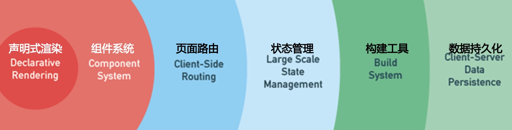
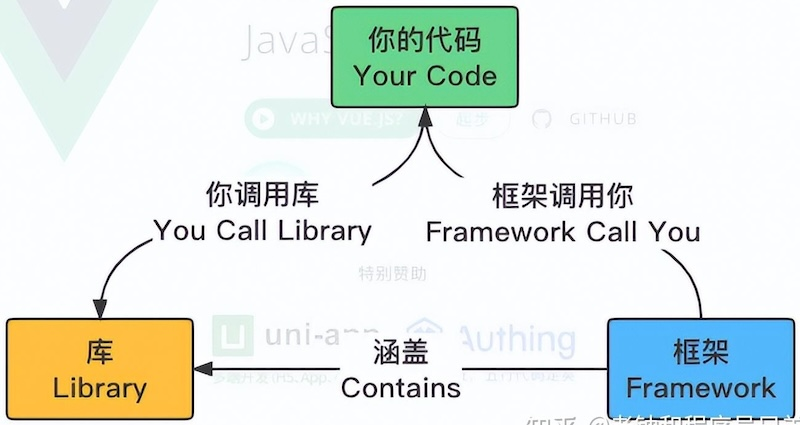
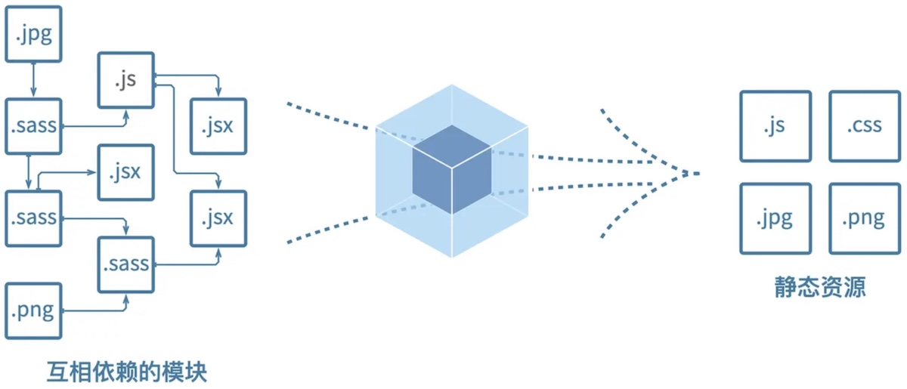
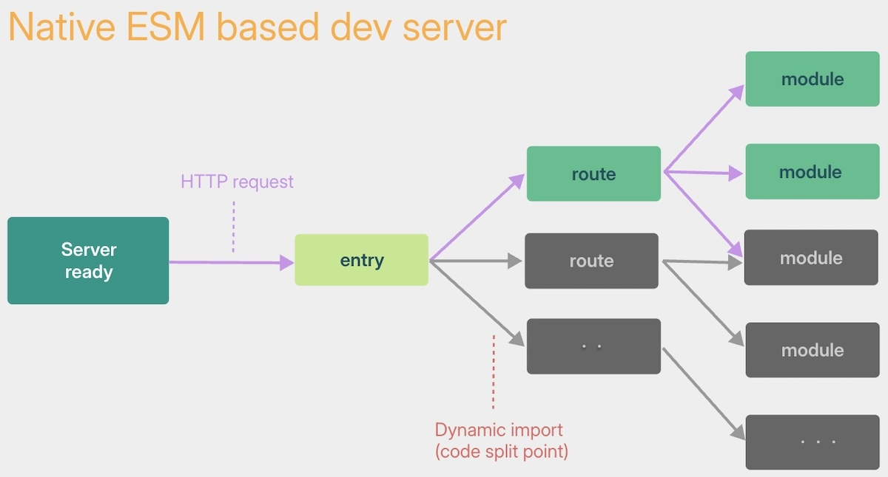
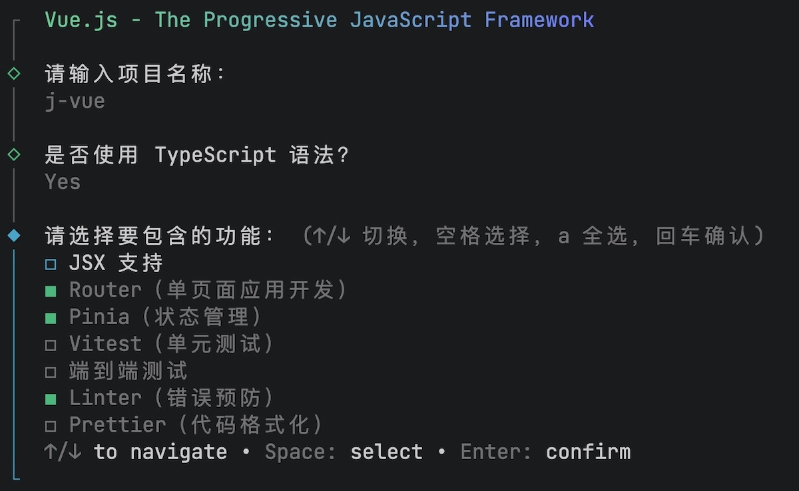
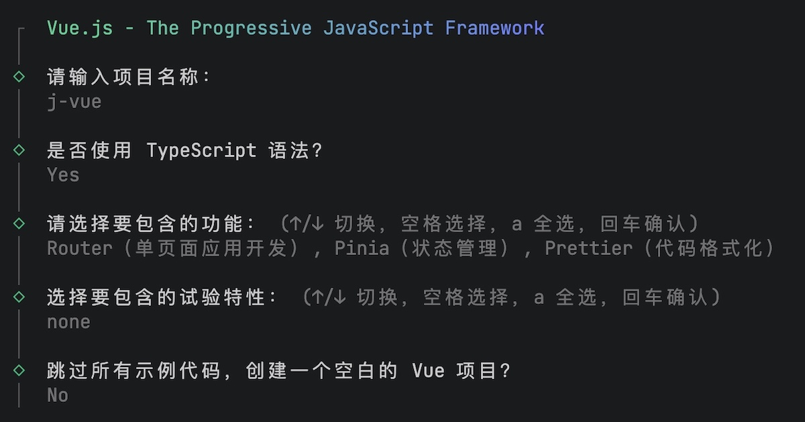
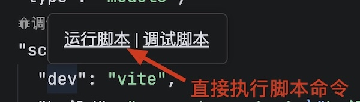
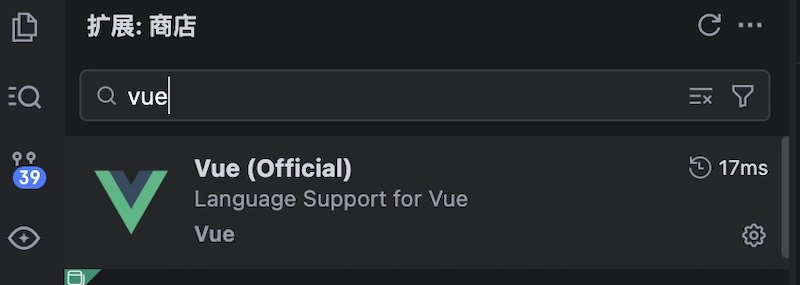

# Vue概述

[Vue](https://cn.vuejs.org/)是渐进式的JavaScript框架，有一套自己的语法规程，可以开发出丰富的Web应用。



Vue最核心的部分是：声明式渲染和组件系统，其他的功能可以根据项目的需求选择性添加。

框架和库的区别



* 库是集合了某些对象、方法和函数的工具箱。
* 框架是一套开发规范，继承了一套完整的解决方案。

Vue框架包括

* 声明式渲染（模板引擎），可以在HTML中嵌入代码。
* 组件系统，可以将页面拆分为模块，模块可以复用。
* 全局的状态管理。
* 支持Typescript语法。
* 支持Less预处理器。
* 支持npm安装的各种第三方包。

Vue的开发方式

* 基于html文件的传统开发模式。
* 工程化开发方式，在node环境下开发，使用Vite打包为网页。

Vue现在的主流版本是`3.x`，该版本从2020年9月发布至今。Vue 2已于2023年12月31日，停止Bug修复和特性更新。

> [!tip]
>
> 浏览器只能解析HTML/CSS/JavaScript，Vue项目中如何将Typescript和Less等代码转化成浏览器能解析的文件？

## Vite

[Vite](https://vitejs.cn/)是新一代前端构建工具

* 开发阶段：搭建开发服务器，边写代码、边实时预览开发页面。
* 生产阶段：优化的代码打包，将零散的代码文件按照依赖关系整合、优化并输出为静态资源。



> [!warning]
>
> 开发阶段和生成阶段访问的文件和运行机制是完全不同的。

### 开发阶段

* 轻量快速的热重载（HMR），能实现极速的服务启动。
* 对TypeScript、CSS等支持开箱即用。
* 真正的按需编译，不再等待整个应用编译完成。



> [!warning]
>
> 上述特点优化开发服务器的响应速度，提升开发效率，本质上不影响打包结果。

### 单页面应用

开发完成后，使用Vite工具可以打包出单页面应用，部署到互联网上。

单页面应用（Single Page Application，SPA）是一种网络应用程序或网站的开发模式。

* 首次加载时会下载单个HTML页面以及所需的JavaScript和CSS。
* 当用户在应用内部点击链接或切换页面时，程序不会重新刷整页，而是动态更新当前页面的局部内容。

单页应用的特点

* 仅1个HTML主页面。
* 页面跳转通过切换组件局部重绘，浏览器地址栏改变但无全页刷新。
* 首次加载页面框架，后续仅通过AJAX/Fetch传输JSON 数据。
* 首屏加载速度较慢。
* 后续交互体验极度流畅，接近原生App体验。
* 服务端压力低。
* 状态共享简单。
* SEO（搜索引擎优化）较差。

## 初始化项目

创建Vue工程的命令如下

```shell
npm create vue@latest
```

* `npm create`是npm 的标准官方内置命令，用于快速初始化各类前端工程化项目。

上述命令实际运行的内容如下

```shell
> npx
> "create-vue"
```

* `npx`是npm官方自带的一个命令行工具。
* `create-vue`Vue官方的脚手架工具，它可以帮助开发者快速初始化并搭建Vue 3项目。
  1. `npm`会将`create-vue`的最新版本下载到电脑的全局临时缓存。
  2. 临时运行`create-vue`脚手架，引导开发者配置项目文件。
  3. 命令执行完毕后，自动清理`create-vue`工具。

根据向导对项目进行配置



项目的完整配置如下



项目创建成功后执行命令

```shell
npm install
```

* 安装所有第三方包。
* 该项目为Vue3项目，使用Vite构建。

执行命令

```shell
npm run dev
```

* 启动开发服务器，可以预览开发页面。

在Trae使用图形工具启动脚本



在Trae下安装Vue开发插件



### Vue项目结构

vue 3项目的结构目录为

```shell
.
├── node_modules                      # 依赖包文件
├── public                            # 页签图标
├── dist                              # 输出文件夹
├── src                               # 代码文件夹
│   ├── assets                        # 静态资源目录，包括：静态样式、图标等           
│   ├── stores                        # 全局状态管理（共享数据状态）
│   ├── router                        # 路由配置目录
│   ├── components                    # 通用组件
│   ├── views                         # 页面组件
│   ├── main.ts                       # 应用入口文件，整个Vue应用的总入口脚本
│   └── App.vue                       # 根组件，所有其他Vue组件的最顶层父组件
├── .gitignore                        # git忽略文件
├── .prettierrc.json                  # 代码格式配置
├── env.d.ts                          # 类型声明文件            
├── index.html                        # 入口文件
├── README.md                         # 项目说明
├── package-lock.json
├── package.json                      # 项目配置文件
├── tsconfig.app.json
├── tsconfig.json
├── tsconfig.node.json                # Typescript配置文件
└── vite.config.ts                    # Vite打包配置文件
```

由于前面选择安装了Pinia和Router两个功能，所以`package.json`包含如下

```json
{
  "dependencies": {
    "pinia": "^4.0.3",
    "vue": "^3.5.42",
    "vue-router": "^5.3.1"
  }
}
```

## 项目启动过程

`index.html`做为项目的入口文件，项启动后开发服务器会直接访问该文件

```html
<!DOCTYPE html>
<html lang="">

<head>
  <meta charset="UTF-8">
  <link rel="icon" href="/favicon.ico">
  <meta name="viewport" content="width=device-width, initial-scale=1.0">
  <title>Vite App</title>
</head>

<body>
  <div id="app"></div>
  <script type="module" src="/src/main.ts"></script>
</body>

</html>
```

* Vite会解析`<script type="module" src="/src/main.ts"></script>`指向的文件，启动项目。
* `<div id="app"></div>`是加载页面的根节点。

`main.ts`为应用入库文件，清除文件中的多余内容，保留如下代码

```ts
import { createApp } from 'vue'
import { createRouter, createWebHistory } from 'vue-router'
import { createPinia } from 'pinia'
import App from './App.vue'

const app = createApp(App)

app.use(createPinia())
app.use(createRouter({ history: createWebHistory(), routes: [] }))

app.mount('#app')
```

* `App`为根组件，是所有Vue组件的顶级节点。其它页面和组件，都会作为子组件挂载到`App`下面，形成一棵组件树。
* `createApp`初始化并创建一个全新的Vue应用实例`app`
  * `app`实例会加载根组件`App`。
  * `app`实例可以加载第三方插件。
* `app.use`可以添加第三方插件
  * `createPinia`全局状态管理。
  * `createRouter`路由管理插件。
* `app.mount('#app')`将创建好的Vue应用渲染并挂载到HTML中`id="app"`的DOM节点上。

### 单文件组件

`App.vue`文件是根组件，文件类型`.vue`，该文件为Vue推荐的项目开发文件，即为单文件组件

```vue
<script setup lang="ts"></script>

<template>
  <h1>Hello Vue 3!</h1>
</template>

<style scoped></style>
```

* `script`标签是程序标签，在这里写代码，`lang="ts"`表示使用Typescript语言。
* `template`标签写模版语法，HTML标签的超集，兼容基本的标签。最终被转换为纯JavaScript代码。
* `style`标签写页面的样式，`scoped`保证样式只针对当前模版内标签生效。

`*.vue`文件最终只会被编译并提炼为标准的JavaScript和CSS文件，不会生成`.html`文件。

> [!important]
>
> Vue中的所有页面结构都是由JavaScript动态渲染得到，只有`index.html`中的根标签是元素HTML。

