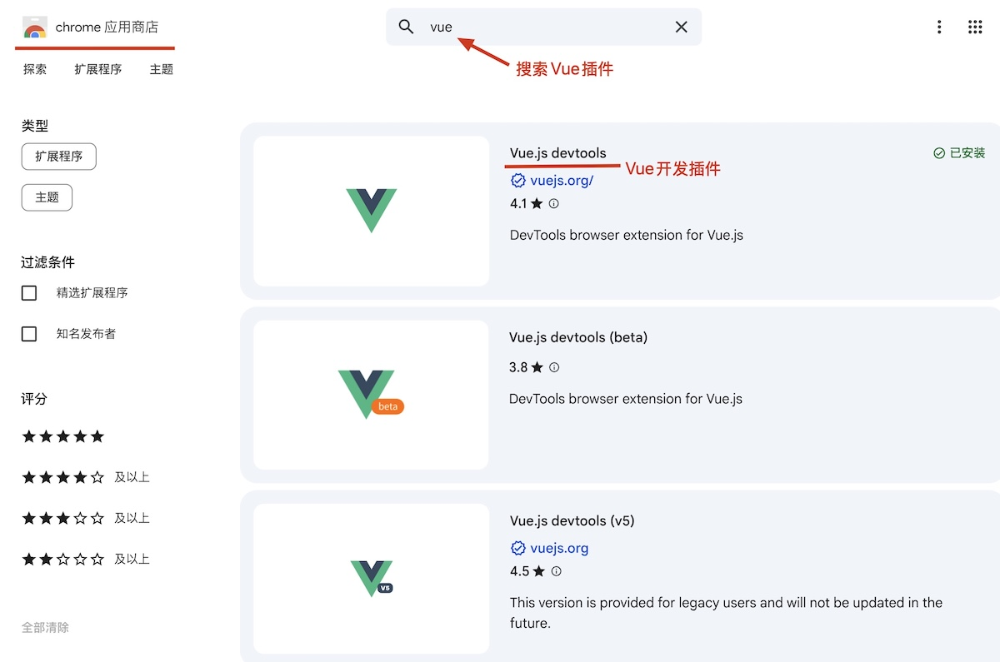
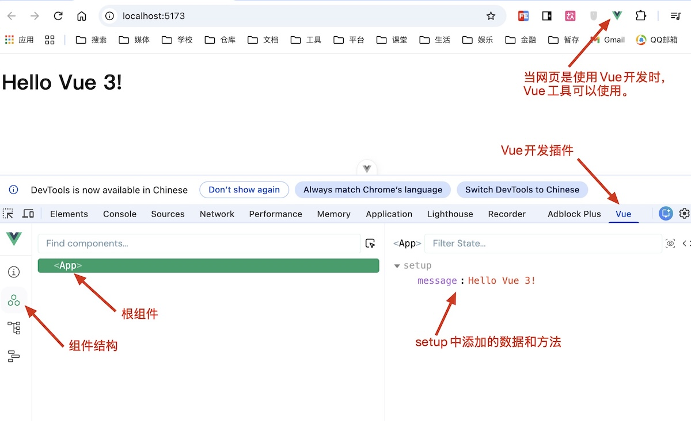
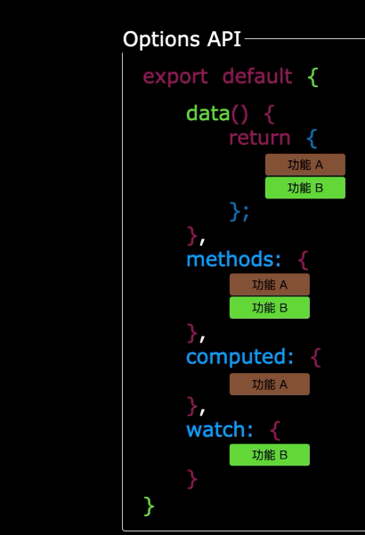
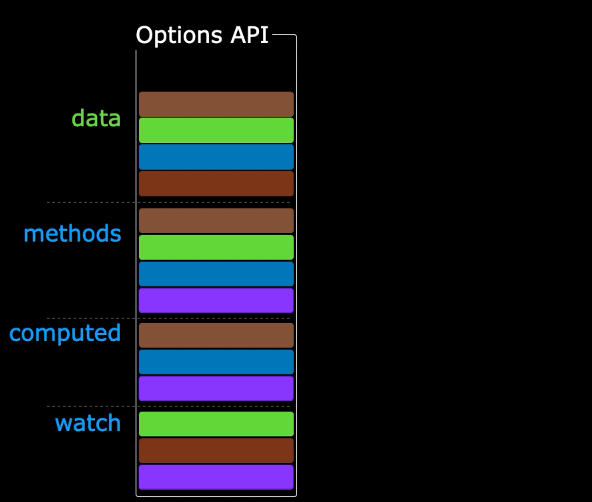
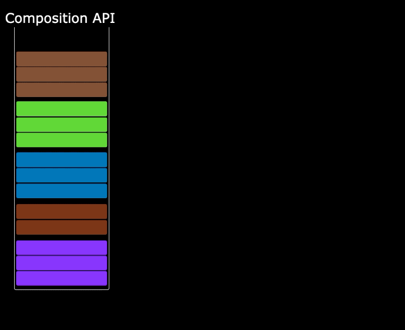
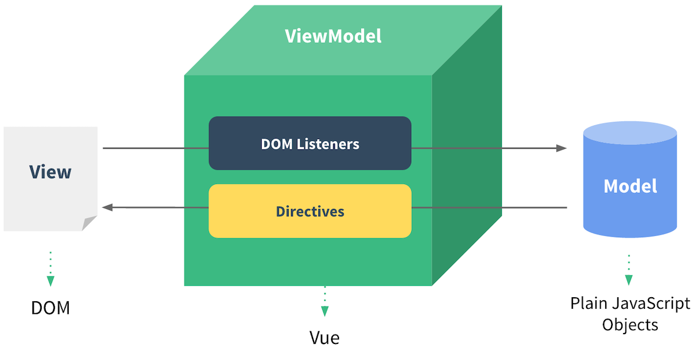
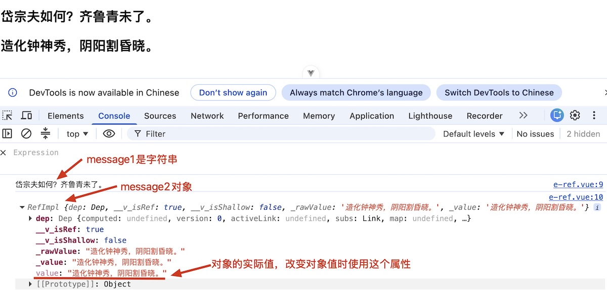
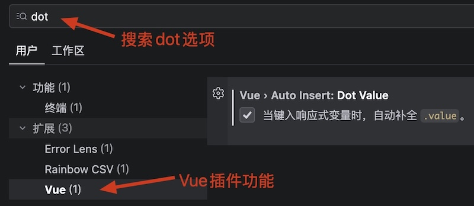
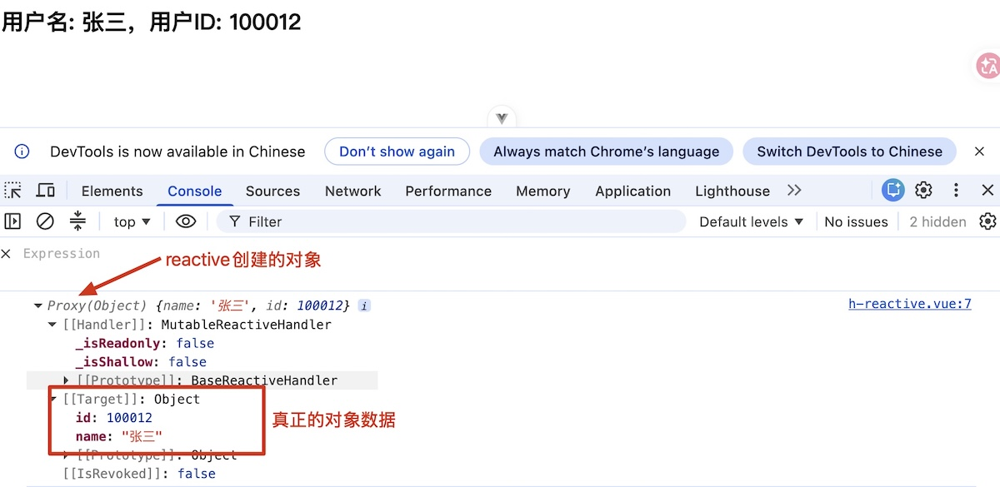
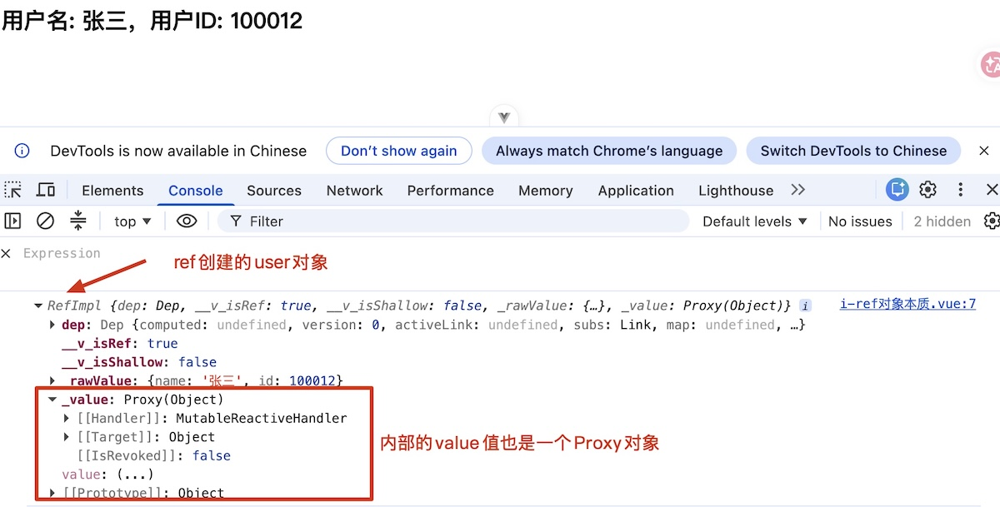

# Vue模版

Vue使用一种基于HTML的模板语法

* 数据能够声明式地绑定DOM上。
* 所有合法的HTML语法和标签，都可以写在模版上。

```vue
<script lang="ts">
export default {
  name: 'App',
  setup() {
    let message = 'Hello Vue 3!'

    return {
      message,
    }
  },
}
</script>

<template>
  <h2>{{ message }}</h2>
</template>
```

1. `script`标签是写代码的标签，在该标签中定义了数据`message`。
1. `template`标签是模版标签，用于渲染页面中的元素，可以在标签中引用变量`message`。
1. <code v-pre>{{ }}</code>文本插值，可以写Typescript表达式。

安装Chrome浏览器Vue插件



使用Vue插件监控项目



可以在[极简插件](https://chrome.zzzmh.cn/index)中搜索相关的安装包。

## 默认导出

`.vue`文件本质上是一个JavaScript/Typescript模块。

* `export default`是ES6的的标准模块导出语法。
* `import App from './App.vue'`引入该组件时，引用的就是`export default`后面的这个配置对象。
  * `name: 'App'`导出当前组件的名字。
  * `setup()`组件的入口函数。

## `setup`函数

`setup`函数是Vue 3组合式API（Composition API）的入口函数，主要作用包括：

* 初始化数据。
* 处理业务逻辑。
* 暴漏数据给模版使用。

> [!warning]
>
> 组合式API就是，可以在代码中自由组合数据和逻辑的写法。

在Vue 2中接口的规范是选择式的（Options API），数据和业务逻辑要分开写

<div style="display: flex; gap: 2px; justify-content: left;"> 
  
  
</div>

在Vue 3中引入了组合式API（Composition API ），数据和业务逻辑可以自由组合

<div style="display: flex; gap: 2px; justify-content: left;"> 
  
  
</div>

> [!caution]
>
> `setup`函数中定义的变量只有在，`return`中返回后才能在模版中使用，否则模版不会识别。

### `<script setup>`语法糖

在`script`添加`setup`可以简化`setup`函数的写法

```vue
<script setup lang="ts">
defineOptions({ name: 'App' })

let message = '清川带长薄，车马去闲闲。'
</script>

<template>
  <h2>{{ message }}</h2>
</template>
```

* `defineOptions`中可以指定组件的名称。
* `<script setup lang="ts">`标签中定义的所有顶层变量，都会自动暴露给`<template>`模板使用。

> [!warning]
>
> 每个`.vue`文件可以写多个`<script lang="ts">`标签，但`<script setup lang="ts">`标签只能写一个。

## 文本插值

文本插值是在DOM标签中，直接插入数据变量。在`<template>`标签中，使用<span v-pre>`{{ }}`</span>表达式。

文本插值中只能写入单条表达式：

* 算术或逻辑运算：<code v-pre>{{ count + 1 }}</code>、<code v-pre>{{ isReady && hasPermission }}</code>。
* 三元运算符：<code v-pre>{{ isOk ? '成功' : '失败' }}</code>。
* 方法调用与链式操作：<code v-pre>{{ message.substring(0, message.length / 2).toUpperCase() }}</code>。
* 模板字符串：<code v-pre>{{ {{ ${user.name} 的得分是 ${score} }} }}</code>。
* 类型断言与非空断言：<code v-pre>{{ (user as User).name }}</code>、<code v-pre>{{ user!.details?.age }}</code>。
* 可选链运算符：<code v-pre>{{ user?.profile?.avatar }}</code>

```vue
<script setup lang="ts">
defineOptions({ name: 'App' })

let message = '流水如有意，暮禽相与还。'
let isMale = true
let greeting = 'Hello world!'
let name = '张三'
let score = 90.5
</script>

<template>
  <h2>{{ message }}</h2>
  <h2>{{ isMale ? '男' : '女' }}</h2>
  <h2>{{ greeting.toUpperCase() }}</h2>
  <h2>{{ `${name}的分数是${score}` }}</h2>
</template>
```

> [!important]
>
> 只要是能返回一个值的JavaScript/TypeScript表达式，都可以写入。

不能写入的表达式

* 控制流`if ... else`、`for`、`while`等。
* 变量声明`let`、`const`等。
* 多条语句，不能使用分号`;`分隔多条语句。

## 双向绑定

Vue 3高度借鉴MVVM（Model-View-ViewModel）模式，并实现了双向绑定机制。



* 数据变了，视图跟着改变：变量根据网络请求等操作发生变化，视图中数据自动更新。
* 视图变了，数据跟着改变：当用户在页面上进行交互，比如输入账号和密码等操作，绑定的变量会同时变化。

## 响应式数据

[响应式数据](https://cn.vuejs.org/guide/extras/reactivity-in-depth.html)，就是数据变了视图跟着改变。

```vue
<script setup lang="ts">
defineOptions({ name: 'App' })

let message = '荒城临古渡，落日满秋山。'

setTimeout(() => {
  message = '流水如有意，暮禽相与还。'
  console.log(message)
}, 1500)
</script>

<template>
  <h2>{{ message }}</h2>
</template>
```

* `message`变量发生了变化，但是页面信息并没有更新。

### `ref()`函数

`ref`可以用来声明响应式数据，包括：基本类型和对象类型。

使用`ref`来创建变量

```vue
<script setup lang="ts">
defineOptions({ name: 'App' })

import { ref } from 'vue'

let message1 = '岱宗夫如何？齐鲁青未了。'
let message2 = ref('造化钟神秀，阴阳割昏晓。')

console.log(message1)
console.log(message2)
</script>

<template>
  <h2>{{ message1 }}</h2>
  <h2>{{ message2 }}</h2>
</template>
```

上面的代码创建的结果如下



> [!important]
>
> `ref()`返回的对象会被Vue框架监控，当数据发生变化时页面同时更新。

使用`ref`对象来修改数据

```vue
<script setup lang="ts">
defineOptions({ name: 'App' })

import { ref } from 'vue'

let message = ref('荡胸生曾云，决眦入归鸟。')
setTimeout(() => {
  message.value = '会当凌绝顶，一览众山小。'
}, 1500)
</script>

<template>
  <h2>{{ message }}</h2>
</template>
```

使用`ref`来创建对向数据并修改

```vue
<script setup lang="ts">
defineOptions({ name: 'App' })

import { ref } from 'vue'

let user = ref({ name: '张三', id: 100012 })
setTimeout(() => {
  user.value.name = '李四'
  user.value.id = 100020
}, 1500)

setTimeout(() => {
  user.value = { name: '王五', id: 100035 }
}, 3000)
</script>

<template>
  <h2>用户名: {{ user.name }}，用户ID: {{ user.id }}</h2>
</template>
```

* 可以使用`message.value`的属性来修改对象的属性值。
* 可以使用`message.value`整体修改属性值。

可以在Trae的Vue插件中配置快捷输入



### `reactive()`函数

`reactive`只能用来声明响应式对象。

```vue
<script setup lang="ts">
defineOptions({ name: 'App' })

import { reactive } from 'vue'

let user = reactive({ name: '张三', id: 100012 })
setTimeout(() => {
  user.name = '李四'
  user.id = 100020
}, 1500)
</script>

<template>
  <h2>用户名: {{ user.name }}，用户ID: {{ user.id }}</h2>
</template>
```

`reactive()` 返回的是一个原始对象的[Proxy](https://developer.mozilla.org/zh-CN/docs/Web/JavaScript/Reference/Global_Objects/Proxy)，这个对象是JavaScript的内置对象。



### `ref()`与`reactive()`对比

1. `ref()`创建对象类型数据，内部其实也是调用了`reactive`函数。

```vue
<script setup lang="ts">
defineOptions({ name: 'App' })

import { ref } from 'vue'

let user = ref({ name: '张三', id: 100012 })
console.log(user)
</script>
```



2. `reactive`重新分配一个新对象，会失去响应式，可以使用`Object.assign`去整体替换。

```vue
<script setup lang="ts">
defineOptions({ name: 'App' })

import { reactive } from 'vue'

let user = reactive({ name: '张三', id: 100012 })

setTimeout(() => {
  user = { name: '李四', id: 100020 }
  console.log(user)
}, 1500)
</script>

<template>
  <h2>用户名: {{ user.name }}，用户ID: {{ user.id }}</h2>
</template>
```

* `user =`赋值相当于用新对象来替换代理对象，所以失去了响应式链接。
* `Object.assign`函数可以将一个对象的属性拷贝到另一个对象上。

`ref()`与`reactive()`使用原则：

1. 若需要一个基本类型的响应式数据，必须使用`ref`。
2. 若需要一个响应式对象，层级不深，`ref`、`reactive`都可以。
3. 若需要一个响应式对象，且层级较深，推荐使用`reactive`。

[声明响应式状态](https://cn.vuejs.org/guide/essentials/reactivity-fundamentals.html#reactivity-fundamentals)详解

### `toRefs()`与`toRef()`

`toRefs()`将响应式对象中的每一个属性，转换为`ref`对象。

```vue
<script setup lang="ts">
defineOptions({ name: 'App' })

import { reactive, toRefs } from 'vue'

let user = reactive({ name: '张三', id: 100012 })
let { name, id } = toRefs(user)

setTimeout(() => {
  name.value = '李四'
  id.value = 100020
}, 1500)
</script>

<template>
  <h2>用户名: {{ name }}，用户ID: {{ id }}</h2>
</template>
```

`toRef()`可以拆解出响应式对象中的一个属性，并转换为`ref`对象。

```vue
<script setup lang="ts">
defineOptions({ name: 'App' })

import { reactive, toRef } from 'vue'

let user = reactive({ name: '张三', id: 100012 })
let name = toRef(user, 'name')

setTimeout(() => {
  name.value = '李四'
}, 1500)
</script>

<template>
  <h2>用户名: {{ name }}</h2>
</template>
```

> [!warning]
>
> `toRefs()`和`toRef()`可以用来拆解`reactive`对象与`props`对象，但不能用来拆解`ref`对象。
