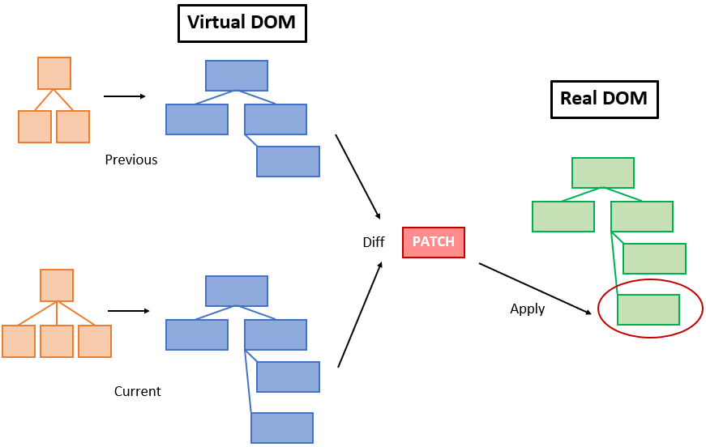
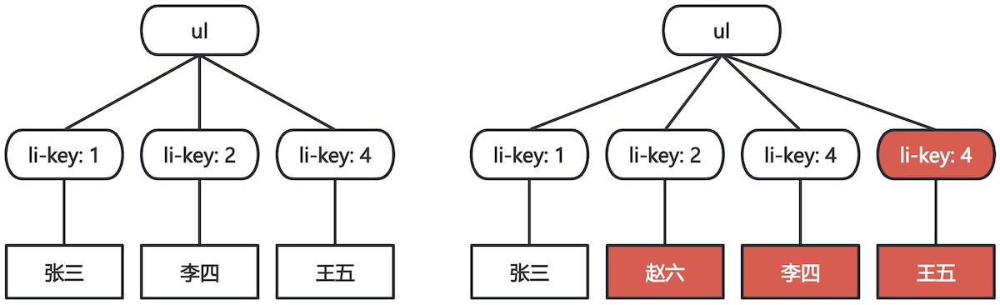
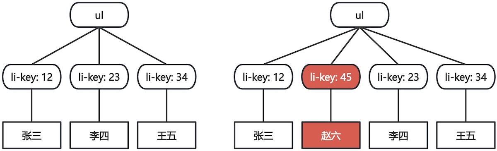

# Vue指令

指令是由Vue框架定义，添加在模版标签上的特殊属性，它们由`v-`作为前缀，为DOM节点提供特殊的响应式行为。

> [!tip]
>
> 如何使用原生的JavaScript给`<a>`标签设置`href`属性？

## 基本指令

### `v-bind`

动态的绑定一个或多个属性，该属性可以是HTML标签的真实属性，也可以是组件的属性。

```vue
<script setup lang="ts">
let link = 'https://vuejs.org/'
let src =
  'https://raw.githubusercontent.com/hughxusu/lesson-front-end/refs/heads/main/static/silder/naz1.jpg'
</script>

<template>
  <a v-bind:href="link" target="_blank" rel="noopener">百度首页</a>
  <hr />
  
</template>
```

* `v-bind:href`是动态绑定`href`的属性
  * `v-bind:`为Vue指令，后面可以接任意属性。
  * `="link"`为TypeScript表达式，与文本插值一样，只能是返回一个值的表达式。
* `v-bind:`指令中`v-bind`可以省略，简写为`:`。

### `v-on`

给元素绑定事件监听器。

```vue
<script setup lang="ts">
import { ref } from 'vue'

let counter = ref(0)
function decrement() {
  counter.value--
}
function add(value: number = 1) {
  counter.value += value
}
</script>

<template>
  <h2>当前计数: {{ counter }}</h2>
  <div class="btns">
    <button v-on:click="counter++">+1</button>
    <button v-on:click="decrement">-1</button>
    <button @click="add(5)">+5</button>
  </div>
</template>

<style scoped lang="less">
.btns {
  display: flex;
  align-items: center;
  button {
    margin: 0 5px;
    font-size: 24px;
  }
}
</style>
```

* `v-on:click`可以动态绑定`click`事件
  * `v-on:`为Vue指令，后面可以接任意事件，包括点击事件、键盘事件等。
  * `@事件名`里的事件名，不是元素的属性，是JavaScript[原生DOM事件](https://developer.mozilla.org/zh-CN/docs/Web/API/Document_Object_Model/Events)类型。
  * `="counter++"`为TypeScript表达式
    * 可以是多行代码，使用`;`分割。
    * 可以是函数名，如：`"decrement"`。
    * 可以是函数调用，如：`"add(5)"`。
    * 函数在`<script>`中定义。
* `v-on:click`指令可以简写为`@click`。

上面的代码中`<style>`标签中使用了Less语法控制`<template>`的样式。

> [!warning]
>
> `v-on`指令是Vue唯一可以使用`;`写多行代码的指令，其他指令只能写一行代码。但开发的最佳实际是，`v-on`指令中也只写一行代码，多行代码需要封装为函数。

`v-on`绑定事件后可以获得事件对象

```vue
<script setup lang="ts">
function aClick(e: MouseEvent) {
  e.preventDefault()
  alert('点击了链接')
}

function btnClick(msg: string, e: MouseEvent) {
  e.preventDefault()
  alert(msg)
}
</script>

<template>
  <a href="https://www.baidu.com" @click="aClick">百度跳转</a>
  <hr />
  <button @click="btnClick('点击了按钮', $event)">点击我</button>
</template>
```

* 绑定函数名，回调函数中直接收事件对象。
* 绑定函数调用，需要手动传入`$event`事件。

事件修饰符：可以为触发事件添加特定的行为，用`.`表示的指令后缀。常用修饰符

* `.stop`阻止事件冒泡。
* `.prevent`阻止默认行为。

```vue
<script setup lang="ts">
function aClick() {
  alert('点击了链接')
}

function btn1Click() {
  alert('点击了按钮1')
}

function btn2Click() {
  alert('点击了按钮2')
}

function upToDiv() {
  alert('事件冒泡了！')
}
</script>

<template>
  <a href="https://www.baidu.com" @click.prevent="aClick">百度跳转</a>
  <hr />
  <div class="btns">
    <div @click="upToDiv">
      <button @click="btn1Click">点击我</button>
    </div>
    <div @click="upToDiv">
      <button @click.stop="btn2Click">点击我</button>
    </div>
  </div>
</template>
```

[更多事件修饰符](https://cn.vuejs.org/guide/essentials/event-handling.html#event-modifiers)

按键修饰符：给键盘事件添加特定的行为。常用的按键修饰符

* `.enter`监测回车按键。
* `.esc`监测返回按键。

```vue
<script setup lang="ts">
function handleEnter() {
  alert('按下了Enter键')
}

function handleEsc() {
  alert('按下了Esc键')
}
</script>

<template>
  <input type="text" @keyup.enter="handleEnter" />
  <hr />
  <input type="text" @keyup.esc="handleEsc" />
</template>
```

[更多按键修饰符](https://cn.vuejs.org/guide/essentials/event-handling.html#key-modifiers)

### `v-model`

专门用于表达元素数据进行双向绑定，可使用的元素包括：`<input>`、`<select>`、`<textarea>`和组件。

```vue
<script setup lang="ts">
import { reactive, ref } from 'vue'

const user = reactive({
  username: '',
  password: '',
})

const intro = ref('')
</script>

<template>
  <label>用户名：<br /><input type="text" v-model="user.username" /></label>
  <hr />
  <label>密码：<br /><input type="password" v-model="user.password" /></label>
  <hr />
  <label>简洁： <br /><textarea rows="4" v-model="intro"></textarea></label>
</template>
```

* `v-model`将输入框与变量（响应式数据）链接。

`v-model`更多用法

```vue
<script setup lang="ts">
import { reactive } from 'vue'

const info = reactive({
  area: '',
  gender: '男',
  hobby: [],
  intro: '',
  agree: false,
})
</script>

<template>
  <div>
    <span>区域: </span> <br />
    <select v-model="info.area" style="width: 100px">
      <option value="0">北京</option>
      <option value="1">天津</option>
      <option value="2">铁岭</option>
    </select>
  </div>
  <hr />
  <div>
    <span>性别: </span> <br />
    <input type="radio" v-model="info.gender" value="男" />男
    <input type="radio" v-model="info.gender" value="女" />女
  </div>
  <hr />
  <div>
    <span>爱好</span> <br />
    <input type="checkbox" v-model="info.hobby" value="足球" /> 足球
    <input type="checkbox" v-model="info.hobby" value="篮球" /> 篮球
    <input type="checkbox" v-model="info.hobby" value="写代码" /> 写代码
  </div>
  <hr />
  <div>
    <span>自我介绍</span> <br />
    <textarea v-model="info.intro" rows="4"></textarea>
  </div>
  <hr />
  <div>
    <input type="checkbox" v-model="info.agree" />
    <span>同意协议</span>
  </div>
</template>
```

* 下拉框的`v-model`绑定到`<select>`。`value`值只能绑定在`<option>`，且值为字符串。
* 同一组单选框绑定在同一个`v-model`时，就不需要手动设置`name`属性了。
* 多选框的`v-model`需要绑定到数组上。
* 单选复选框，绑定到一个变量上，Vue会自动转换为布尔值。

想让单选复选框绑定的值为字符串，按照如下写法

```vue
<input type="checkbox" v-model="info.agree" true-value="yes" false-value="no" />
```

`v-model`可以使用的修饰符包括

- `.lazy`表单失去焦点，才把值赋传递给变量。
- `.number`将输入的合法字符串转为数字。
- `.trim`移除输入内容两端空格。

```vue
<script setup lang="ts">
import { reactive } from 'vue'

const info = reactive({
  area: '',
  intro: '',
})
</script>

<template>
  <div>
    <span>区域: </span> <br />
    <select v-model.number="info.area" style="width: 100px">
      <option value="0">北京</option>
      <option value="1">天津</option>
      <option value="2">铁岭</option>
    </select>
  </div>
  <hr />
  <div>
    <span>自我介绍</span> <br />
    <textarea v-model.lazy="info.intro" rows="4"></textarea>
  </div>
</template>
```

* `v-model.number`使单选框的值转换为数字。

使用`v-bind`绑定`<input>`输入框

```vue
<script setup lang="ts">
import { ref } from 'vue'

const txt = ref('争将世上无期别，换得年年一度来。')
</script>

<template>
  <input :value="txt" type="text" style="width: 300px"></input>
</template>
```

* 使用`v-bind`绑定`<input>`的`value`可以将响应数据绑定到输入框，但这是单项绑定。

> [!important]
>
> Vue框架中的双向绑定，只有`v-model`这个指令，其它指令没有双向绑定。而`v-model`常用于绑定表单项，其它没有输入功能的标签，仅做数据展示，不需要双向绑定。

### 设置标签内容

* `v-text`更新元素的文本内容。
* `v-html`更新元素的innerHTML，会渲染一段HTML代码。

```vue
<script setup lang="ts">
let msg = '<strong>莫听穿林打叶声，</strong>何妨吟啸且徐行。'
</script>

<template>
  <p v-html="msg"></p>
  <p v-text="msg"></p>
</template>
```

### 条件渲染

能够实现条件渲染的指令包括

* `v-show`基于表达式值的真假性，来改变元素的可见性。
* `v-if`与`v-else`基于条件语句，来改变元素的可见性。
* `v-else-if`基于多分支语句，来改变元素的可见性。

基本使用

```vue
<script setup lang="ts">
import { ref } from 'vue'

let isShow = ref(true)
</script>

<template>
  <input type="checkbox" v-model="isShow" />
  <hr />
  <p v-show="isShow">竹杖芒鞋轻胜马，谁怕？一蓑烟雨任平生。</p>
  <p v-if="isShow">料峭春风吹酒醒，微冷，山头斜照却相迎。</p>
  <p v-else>回首向来萧瑟处，归去，也无风雨也无晴。</p>
</template>
```

* `v-if`可以单独使用；`v-else`必须配合`v-if`，不能单独使用。

多分支渲染

```vue
<script setup lang="ts">
import { ref } from 'vue'

let value = ref(0)
</script>

<template>
  <div>
    <select v-model.number="value" style="width: 100px">
      <option value="0">A</option>
      <option value="1">B</option>
      <option value="2">C</option>
    </select>
  </div>
  <div>
    <h2 v-if="value === 0">A</h2>
    <h2 v-else-if="value === 1">B</h2>
    <h2 v-else>C</h2>
  </div>
</template>
```

`v-if`与`v-show`的区别

* `v-show`用的`display:none`隐藏元素。
* `v-if`直接从DOM树上移除节点。

### `v-for`

基于数据的循环渲染。

1. `v-for = "(item, index) in array"`可以读取数据`item`和索引`index`。

```vue
<script setup lang="ts">
let users = [
  { id: 10012, name: '张三' },
  { id: 10023, name: '李四' },
  { id: 10034, name: '王五' },
]
</script>

<template>
  <ul>
    <li v-for="(user, index) in users" :key="user.id">
      序号:{{ index + 1 }}，用户名:{{ user.name }}
    </li>
  </ul>
</template>
```

* `:key`相当于`v-bind:key`的缩写，而`key`不是原生 HTML 的属性，是Vue框架保留的特殊属性。

> [!important]
>
> 绑定`key`属性可以提升提升DOM移动效率，`key`的值只能是字符串或数字。

2. `v-for = "item in array"`只读取数据`item`。

```vue
<script setup lang="ts">
import { ref } from 'vue'

let value = ref(0)
</script>

<template>
  <div>
    <select v-model.number="value" style="width: 100px">
      <option value="0">A</option>
      <option value="1">B</option>
      <option value="2">C</option>
    </select>
  </div>
  <div>
    <h2 v-if="value === 0">A</h2>
    <h2 v-else-if="value === 1">B</h2>
    <h2 v-else>C</h2>
  </div>
</template>

```

> [!warning]
>
> `v-for`的临时变量名不能用到`v-for`范围外

3. 可遍历的对象包括数组、对象、字符串等可遍历结构。

```vue
<script setup lang="ts">
let user = {
  id: 10012,
  name: '张三',
  phone: '13800000000',
  email: 'zhangsan@example.com',
}
</script>

<template>
  <ul>
    <li v-for="(value, key) in user" :key="key">{{ key }}: {{ value }}</li>
  </ul>
</template>
```

> [!important]
>
> 需要循环哪个页面元素，就将指令`v-for`写在该元素上。

4. 只有直接修改响应式数据的方法，才会影响列表的渲染。

```ts
script setup lang="ts">
import { reactive } from 'vue'

let users = reactive([
  { id: 10012, name: '张三' },
  { id: 10023, name: '李四' },
  { id: 10034, name: '王五' },
])

function reverseArray() {
  users.reverse()
}

function modifyArray() {
  if (users && users.length > 0) {
    users[0]!.name += '~'
  }
}

function sliceArray() {
  if (users && users.length > 0) {
    users.slice(0, 2)
  }
}
</script>

<template>
  <ul>
    <li v-for="user in users" :key="user.id">用户ID:{{ user.id }}，用户名:{{ user.name }}</li>
  </ul>
  <div class="btn-group">
    <button @click="reverseArray">翻转</button>
    <button @click="modifyArray">修改</button>
    <button @click="sliceArray">截取</button>
  </div>
</template>
```

## 虚拟DOM

页面中操作真实DOM会造成浏览器重新计算布局，造成浏览器渲染极大的负担。Vue采用虚拟DOM机制，减少操作实际DOM的次数，提示页面渲染性能。

虚拟DOM本质上只是一个轻量级的JavaScript对象，只包含真实对象的部分属性和方法，操作的开销远小于真实DOM。

当数据改变时：

1. 框架会在内存中构建一棵新的虚拟 DOM 树。
2. 通过高效的[Diff算法](https://juejin.cn/post/7602488966609829926)比对新旧两棵虚拟DOM树。
3. 找出真正发生变化的节点。
4. 只针对有差异的部分去更新真实DOM，做到局部更新，避免整块区域或整页重绘。



> [!important]
>
> 虚拟DOM的本质是用计算的开销，去换取DOM操作开销。

使用序号作为`:key`

```vue
<script setup lang="ts">
import { reactive } from 'vue'

let users = reactive([
  { id: 10012, name: '张三' },
  { id: 10023, name: '李四' },
  { id: 10034, name: '王五' },
])

function modifyArray() {
  users.splice(1, 0, { id: 10045, name: '赵六' })
}
</script>

<template>
  <ul>
    <li v-for="(user, index) in users" :key="index">
      <input type="text" style="width: 100px" />
      用户名:{{ user.name }}
    </li>
  </ul>
  <button @click="modifyArray">添加元素</button>
</template>
```

虚拟DOM树的比较与更新



> [!important]
>
> Diff算法会基于`:key`属性来比较新、旧虚拟DOM，移除`:key`不存在元素或添加新元素。

使用用户ID做为`:key`

```vue
<li v-for="user in users" :key="user.id">
```

虚拟DOM树的比较与更新



> [!important]
>
> `:key`值的选择，优先选择数据的唯一ID，没有ID可以选择索引序号。

## 练习

1. 使用Vue框架生成是一个表单。
