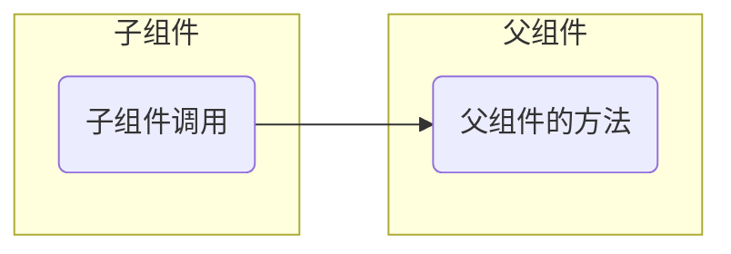

# 组件

> [!tip]
>
> 当网页中有重复结构时应该如何处理？

组件与组件化

* 组件（components）是可复用的Vue 实例，封装标签、样式和代码。
* 组件化就是把页面上可重用的部分封装为组件，从而方便项目的开发和维护。


在实际应用中，组件常常被组织成一个层层嵌套的树状结构：


## 组件的基本使用

### 引入组件

1. 创建组件，封装为单个的`.vue`文件。

```vue
<script setup lang="ts">
let item = { id: 1, name: '锅包肉', price: 32.5, num: 1 }
</script>

<template>
  <div class="box">
    <h3>{{ item.name }}</h3>
    <div class="bottom">
      价格：{{ item.price }}元
      <div class="num">
        <span>数量：{{ item.num }}</span>
        <button>+1</button>
        <button>-1</button>
      </div>
    </div>
  </div>
</template>

<style scoped>
...
</style>
```

Vue框架会以组件为单位，给定义了`<style scoped>`组件中的DOM节点添加唯一标识符，通过该标识符可以确定元素的样式。


2. 在父组件中引入子组件。

```vue
<script setup lang="ts">
import Item from '@/components/item_1.vue'
</script>
```

3. 在父组件中属于只组件。

```vue
<template>
  <Item />
</template>
```

### 模版化组件

单个组件可以当做HTML标签来使用，Vue指令可以作用于组件。

```vue
<script setup lang="ts">
import Item from '@/components/item_1.vue'

let items = [1, 2, 3]
</script>

<template>
  <Item v-for="item in items" :key="item" />
</template>
```

## 传递数据

> [!tip]
>
> 如何实现在子组件中展示不同的数据？

这需要实现组件间的数据传递。

### 数据接口

使用Typescript的一大特点，就是可以提前定义好组件间数据传递的格式，中小型项目数据接口规范如下

```shell
src/
├── types/                      # 全局类型定义目录
│   ├── index.ts                # 统一出口
│   ├── api.ts                  # 后端统一响应结构等
│   ├── global.d.ts             # 全局声明（Window 扩展等）
│   ├── env.d.ts                # 环境变量类型
│   ├── user.ts                 # 用户相关接口
│   ├── ...
├── stores/
├── router/
├── components/
├── views/
...
```

> [!warning]
>
> `.d.ts`一般用于描述库的API接口规范和全局声明，项目内部接口规范不用`.d.ts`定义。

可以在`types/index.ts`文件中定义统一的数据接口

```ts
export interface Item {
  id: number
  name: string
  price: number
  num: number
}
```

### 从父组件到子组件

在子组件中使用`defineProps`宏声明，来接收父组件传来的`props`数据，`props`称为单项数据流。

1. 使用字符串数组来接受`props`

```vue
<script setup lang="ts">
defineOptions({ name: 'Item2' })

const props = defineProps(['food'])
console.log(props)
</script>

<template>
  <div class="box">
    <h3>{{ food.name }}</h3>
    <div class="bottom">
      价格：{{ food.price }}元
      <div class="num">
        <span>数量：{{ food.num }}</span>
        <button>+1</button>
        <button>-1</button>
      </div>
    </div>
  </div>
</template>
```

* `food`为接受数据的变量名称，`props`可以用于在代码中操作数据。

父组件中发送数据

```vue
<script setup lang="ts">
import Item from '@/components/item_2.vue'
import { type Food } from '@/types/index'
import { reactive } from 'vue'

let items = reactive<Food[]>([
  { id: 10011, name: '锅包肉', price: 32.5, num: 1 },
  { id: 10022, name: '地三鲜', price: 24.5, num: 1 },
  { id: 10033, name: '米饭', price: 2, num: 2 },
])
</script>

<template>
  <Item v-for="item in items" :key="item.id" :food="item" />
</template>
```

* `reactive<Food[]>`中定义了数据接口类型。
* `:food`为`v-bind`指令，绑定`food`属性。
* `food`属性是子组件约定用来接收数据的变量名称，已经在子组件中定义过了。
* `import { type Food } from`引入接口是要说明，导入元素为类型。

2. 属于接口在子组件中约束数据类型

```ts
defineOptions({ name: 'Item3' })
import { type Food } from '@/types/index'

const { food } = defineProps<{ food: Food }>()
```

可以指定`props`的默认值

```ts
const { food = { id: 0, name: '', price: 0, num: 0 } } = defineProps<{ food: Food }>()
```

* 该方法是Vue 3.5版本后的API，之前的版本需要使用`withDefaults`宏声明。

### 从子组件到父组件

#### 使用`props`

1. 在父组件中定义方法，使用`props`传递给子组件。

```vue
<script setup lang="ts">
import Item from '@/components/item_4.vue'
import { type Food } from '@/types/index'
import { reactive } from 'vue'

let items = reactive<Food[]>([
  { id: 10011, name: '锅包肉', price: 32.5, num: 1 },
  { id: 10022, name: '地三鲜', price: 24.5, num: 1 },
  { id: 10033, name: '米饭', price: 2, num: 2 },
])

function addNum(item: Food) {
  item.num++
}

function subNum(item: Food) {
  item.num--
  if (item.num < 0) {
    item.num = 0
  }
}
</script>

<template>
  <Item v-for="item in items" :key="item.id" :food="item" :addNum="addNum" :subNum="subNum" />
</template>
```

* `addNum`和`subNum`作为属性传递给子组件。

2. 在子组件中调用方法

```vue
<script setup lang="ts">
defineOptions({ name: 'Item3' })

defineProps(['food', 'addNum', 'subNum'])
</script>

<template>
  <div class="box">
    <h3>{{ food.name }}</h3>
    <div class="bottom">
      价格：{{ food.price }}元
      <div class="num">
        <span>数量：{{ food.num }}</span>
        <button @click="addNum(food)">+1</button>
        <button @click="subNum(food)">-1</button>
      </div>
    </div>
  </div>
</template>
```

* 使用`props`接受父组件传来的属性和方法。
* 在点击按钮中调用父组件的方法，并传入参数。

#### 自定义事件

绑定DOM事件

```vue
<script setup lang="ts">
function clickMe(msg: string, e: MouseEvent) {
  console.log(msg, e)
}
</script>

<template>
  <button @click="clickMe('hello', $event)">点击我</button>
</template>
```

> [!important]
>
> `$event`是Vue模板语法中的一个特殊保留关键字：
>
> 1. 绑定原生HTML事件时，`$event`代表原生的JavaScript事件对象。
> 2. 绑定自定义组件事件时，`$event`代表子组件在触发事件时传递给父组件的具体数据。

可以在组件上绑定自定义事件，相当于`v-on`命令绑定事件监听，但是这个事件的触发是子组件中定义的。

```vue
<script setup lang="ts">
...

function addNum(item: Food) {
  item.num++
}

function subNum(msg: string, item: Food) {
  console.log(msg)
  item.num--
  if (item.num < 0) {
    item.num = 0
  }
}
</script>

<template>
  <Item
    v-for="item in items"
    :key="item.id"
    :food="item"
    @add-num="addNum"
    @sub-num="subNum('hello', $event)"
  />
</template>

```

* 这里`@add-num`和`@sub-num`相当于`v-on`绑定了事件监听，这些事件是有子组件在特殊情况下触发的。
* `$event`代表子组件传递给父组件的数据。
* Vue中建议自定义事件使用[kebab-case](https://cn.vuejs.org/guide/components/events.html#emitting-and-listening-to-events)风格。

在子组件中定义事件触发的条件，使用`$emit`触发自定义事件，

```vue
<script setup lang="ts">
defineOptions({ name: 'Item5' })

defineProps(['food'])
</script>

<template>
  <div class="box">
    <h3>{{ food.name }}</h3>
    <div class="bottom">
      价格：{{ food.price }}元
      <div class="num">
        <span>数量：{{ food.num }}</span>
        <button @click="$emit('add-num', food)">+1</button>
        <button @click="$emit('sub-num', food)">-1</button>
      </div>
    </div>
  </div>
</template>
```

* `$emit`触发自定义事件，第一个参数是触发事件的名称，第二个参数是传递给触发事件的数据。

触发自定义事件的第二种写法

```vue
<script setup lang="ts">
defineOptions({ name: 'Item5' })

import { type Food } from '@/types/index'

const { food } = defineProps<{ food: Food }>()
const emit = defineEmits(['add-num', 'sub-num'])

function addNum() {
  emit('add-num', food)
}

function subNum() {
  emit('sub-num', food)
}
</script>

<template>
  <div class="box">
    <h3>{{ food.name }}</h3>
    <div class="bottom">
      价格：{{ food.price }}元
      <div class="num">
        <span>数量：{{ food.num }}</span>
        <button @click="addNum">+1</button>
        <button @click="subNum">-1</button>
      </div>
    </div>
  </div>
</template>
```

* 使用`defineProps`宏声明来定义`emit`变量来触发事件。

> [!warning]
>
> `props`和`emit`方法，只能用于子组件向父组件传递数据，不能用于跨层级的组件传递数据。

子组件向父组件传递数据，本质上确实都是通过调用父组件的方法来实现的。



Vue更推荐使用`emit`来向父组件传递数据：

* `props`的设计初衷是向下传递数据。如果用`props`传函数来修改父组件状态，会让`props`的职责变得混杂。
* `emit`的设计初衷是向上传递通知，边界非常清晰。
* 更好的解耦，使用`emit`时，子组件不需要关心父组件有没有处理这个事件。

## `ref`属性

> [!tip]
>
> 如果需要获得原生的DOM标签，应该如何操作？

```vue
<script setup lang="ts">
function handleClick() {
  let ele = document.querySelector('#title')
  alert(ele?.textContent)
}
</script>

<template>
  <h2 id="title">明月出天山，苍茫云海间。</h2>
  <button @click="handleClick">点击我</button>
</template>
```

* `document.querySelector`是WebAPI定义的元素选择器。

> [!caution]
>
> 在组件化编程中，不同组件间可能存在`id`重复的情况，所以使用`id`来选择页面元素，有可能`id`冲突。

`ref`属性时Vue中保留的特殊属性，用于访问指定的DOM元素或组件。

### 访问DOM元素

```vue
<script setup lang="ts">
import { useTemplateRef } from 'vue'

let title = useTemplateRef<HTMLHeadingElement>('title')
function handleClick() {
  alert(title.value?.textContent)
}
</script>

<template>
  <h2 ref="title">长风几万里，吹度玉门关。</h2>
  <button @click="handleClick">点击我</button>
</template>
```

* `ref="title"`给`ref`属性赋值。
* `useTemplateRef`根据`ref`属性值获取DOM元素。

> [!warning]
>
> `ref`属性和定义响应式的`ref()`函数不是一个东西。

### 访问组件元素

定义子组件

```vue
<script setup lang="ts">
import { ref } from 'vue'

const msg = ref('汉下白登道，胡窥青海湾。')
</script>

<template>
  <h2>{{ msg }}</h2>
</template>
```

在父组件中，获取子组件

```vue
<script setup lang="ts">
import TitleLine from '@/components/title_line_1.vue'
import { useTemplateRef } from 'vue'

let title = useTemplateRef('title')
function handleClick() {
  console.log(title)
}
</script>

<template>
  <TitleLine ref="title" />
  <button @click="handleClick">点击我</button>
</template>
```

* `title`为子组件的一个实例。

使用`defineExpose`宏定义，可以暴露子组件中的数据

```vue
<script setup lang="ts">
import { ref } from 'vue'

const msg = ref('由来征战地，不见有人还。')

defineExpose({
  msg,
})
</script>

<template>
  <h2>{{ msg }}</h2>
</template>
```

在父组件中，可以通过子组件实例，来操作子组件的数据

```vue
<script setup lang="ts">
import TitleLine from '@/components/title_line_2.vue'
import { useTemplateRef } from 'vue'

let title = useTemplateRef('title')
function handleClick() {
  if (title.value) {
    title.value.msg = '戍客望边邑，思归多苦颜。'
  }
}
</script>

<template>
  <TitleLine ref="title" />
  <button @click="handleClick">点击我</button>
</template>
```

* `title.value`可以获取子组件暴露的数据。
* 使用`useTemplateRef`会自动对响应式数据解包，`title.value.msg`可以直接修改数据。

> [!warning]
>
> 通过模板`ref`属性直接改子组件的内部状态，等于绕过了`props`的单向数据流，父子会强耦合，调试也容易乱。在实际项目里父改用`props`，子通知父用`emit`。

## 练习

1. 使用组件设计一个古诗显示的页面。


