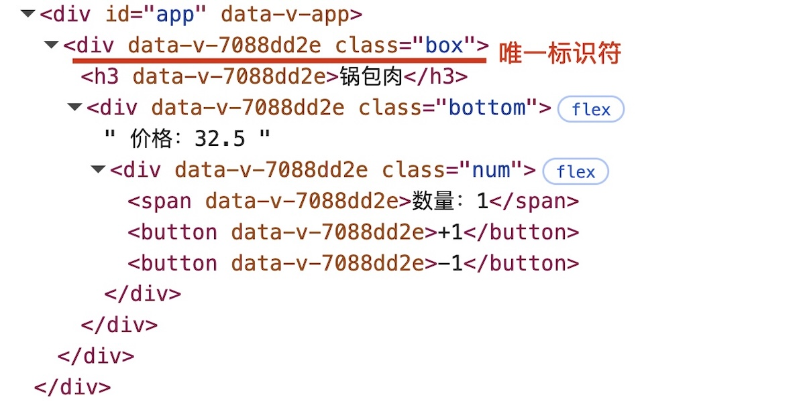

# 组件

> [!tip]
>
> 当[网页](https://www.figma.com/design/eQsqszguMZOHolmr7XVFoC/%25E6%2596%25B0%25E9%2597%25BB%25E8%25B5%2584%25E8%25AE%25AF%25E7%25B1%25BB%25E7%25BD%2591%25E7%25AB%2599?t=6IXD8QYBCxvwOv0p-0)中有重复结构时应该如何处理？

组件与组件化

* 组件（components）是可复用的Vue 实例，封装标签、样式和代码。
* 组件化就是把页面上可重用的部分封装为组件，从而方便项目的开发和维护。


在实际应用中，组件常常被组织成一个层层嵌套的树状结构：


## 组件的基本使用

### 引入组件

1. 创建组件，封装为单个的`.vue`文件。

```vue
<script setup lang="ts">
let item = { id: 1, name: '锅包肉', price: 32.5, num: 1 }
</script>

<template>
  <div class="box">
    <h3>{{ item.name }}</h3>
    <div class="bottom">
      价格：{{ item.price }}元
      <div class="num">
        <span>数量：{{ item.num }}</span>
        <button>+1</button>
        <button>-1</button>
      </div>
    </div>
  </div>
</template>

<style scoped>
...
</style>
```

Vue框架会以组件为单位，给定义了`<style scoped>`组件中的DOM节点添加唯一标识符，通过该标识符可以确定元素的样式。



2. 在父组件中引入子组件。

```vue
<script setup lang="ts">
import Item from '@/components/item_1.vue'
</script>
```

3. 在父组件中属于只组件。

```vue
<template>
  <Item />
</template>
```

### 模版化组件

单个组件可以当做HTML标签来使用，Vue指令可以作用于组件。

```vue
<script setup lang="ts">
import Item from '@/components/item_1.vue'

let items = [1, 2, 3]
</script>

<template>
  <Item v-for="item in items" :key="item" />
</template>
```

## 组件间通讯

> [!tip]
>
> 如何实现在子组件中展示不同的数据？

这需要实现组件间的数据传递。

### 数据接口

使用Typescript的一大特点，就是可以提前定义好组件间数据传递的格式，中小型项目数据接口规范如下

```shell
src/
├── types/                      # 全局类型定义目录
│   ├── index.ts                # 统一出口
│   ├── api.ts                  # 后端统一响应结构等
│   ├── global.d.ts             # 全局声明（Window 扩展等）
│   ├── env.d.ts                # 环境变量类型
│   ├── user.ts                 # 用户相关接口
│   ├── ...
├── stores/
├── router/
├── components/
├── views/
...
```

> [!warning]
>
> `.d.ts`一般用于描述库的API接口规范和全局声明，项目内部接口规范不用`.d.ts`定义。

可以在`types/index.ts`文件中定义统一的数据接口

```ts
export interface Item {
  id: number
  name: string
  price: number
  num: number
}
```

### 从父组件到子组件

在子组件中使用`defineProps`宏声明，来接收父组件传来的`props`数据。

1. 使用字符串数组来接受`props`

```vue
<script setup lang="ts">
defineOptions({ name: 'Item2' })

const props = defineProps(['food'])
console.log(props)
</script>

<template>
  <div class="box">
    <h3>{{ food.name }}</h3>
    <div class="bottom">
      价格：{{ food.price }}元
      <div class="num">
        <span>数量：{{ food.num }}</span>
        <button>+1</button>
        <button>-1</button>
      </div>
    </div>
  </div>
</template>
```

* `food`为接受数据的变量名称，`props`可以用于在代码中操作数据。

父组件中发送数据

```vue
<script setup lang="ts">
import Item from '@/components/item_2.vue'
import { type Food } from '@/types/index'
import { reactive } from 'vue'

let items = reactive<Food[]>([
  { id: 10011, name: '锅包肉', price: 32.5, num: 1 },
  { id: 10022, name: '地三鲜', price: 24.5, num: 1 },
  { id: 10033, name: '米饭', price: 2, num: 2 },
])
</script>

<template>
  <Item v-for="item in items" :key="item.id" :food="item" />
</template>
```

* `reactive<Food[]>`中定义了数据接口类型。
* `:food`为`v-bind`指令，绑定`food`属性。
* `food`属性是子组件约定用来接收数据的变量名称，已经在子组件中定义过了。
* `import { type Food } from`引入接口是要说明，导入元素为类型。

2. 属于接口在子组件中约束数据类型

```ts
defineOptions({ name: 'Item3' })
import { type Food } from '@/types/index'

const { food } = defineProps<{ food: Food }>()
```

可以指定`props`的默认值

```ts
const { food = { id: 0, name: '', price: 0, num: 0 } } = defineProps<{ food: Food }>()
```

* 该方法是Vue 3.5版本后的API，之前的版本需要使用`withDefaults`宏声明。


