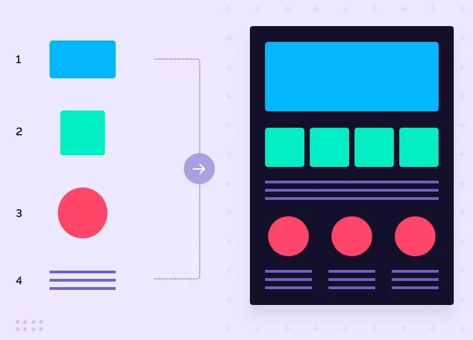
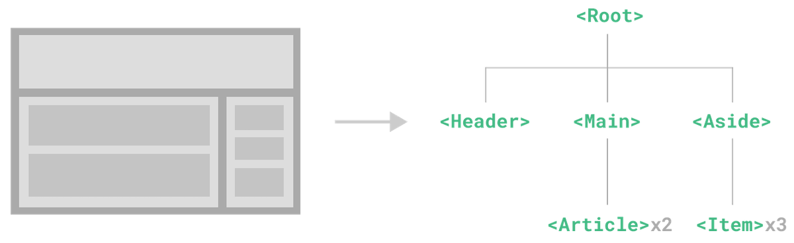

# 组件

> [!tip]
>
> 当[网页](https://www.figma.com/design/eQsqszguMZOHolmr7XVFoC/%25E6%2596%25B0%25E9%2597%25BB%25E8%25B5%2584%25E8%25AE%25AF%25E7%25B1%25BB%25E7%25BD%2591%25E7%25AB%2599?t=6IXD8QYBCxvwOv0p-0)中有重复结构时应该如何处理？

组件与组件化

* 组件（components）是可复用的Vue 实例，封装标签、样式和代码。
* 组件化就是把页面上可重用的部分封装为组件，从而方便项目的开发和维护。

在实际应用中，组件常常被组织成一个层层嵌套的树状结构：

## 组件的基本使用

