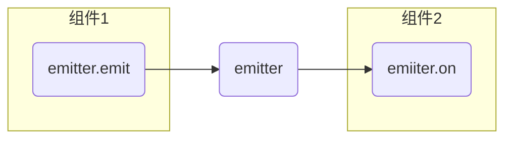

# 组件通讯

## Mitt

[Mitt](https://github.com/developit/mitt)是一个消息订阅与发布的库，可以实现任意组件的通信。使用Mitt前要先安装

```shell
npm install --save mitt
```

使用Mitt传递消息的过程



* `emitter`相当一个公告栏，所有组件的信息都发布到公告栏上。
* `emitter.emit`向公告栏发布消息。
* `emiiter.on`在公告栏上订阅消息。

`emitter`一般定义在工具包中，`src\utils\emitter.ts`文件中

```ts
import mitt from 'mitt'

type Events = {
  'send-msg': string
}

export const emitter = mitt<Events>()

export default emitter
```

* `Events`用于约定消息发送时的数据格式。

发送消息的组件

```vue
<script setup lang="ts">
import emitter from '@/utils/emitter'

function sendMsg(e: KeyboardEvent) {
  e.preventDefault()
  if (e.target instanceof HTMLInputElement) {
    const msg = e.target.value.trim()
    if (!msg) {
      return
    }

    emitter.emit('send-msg', msg)
    e.target.value = ''
  }
}
</script>

<template>
  <input type="text" @keyup.enter="sendMsg" placeholder="请输入消息" />
</template>
```

* 当输入完成时发送消息`emitter.emit('send-msg', msg)`，其中`'send-msg'`事件名称（相当于发送消息的代号）

订阅消息的组件

```vue
<script setup lang="ts">
import { reactive, onUnmounted } from 'vue'
import emitter from '@/utils/emitter'

let msgs = reactive<string[]>([])

emitter.on('send-msg', (msg: string) => {
  msgs.push(msg)
})

onUnmounted(() => {
  emitter.off('send-msg')
})
</script>

<template>
  <h3>消息板</h3>
  <div class="no-msg" v-show="msgs.length === 0">当前没有消息！</div>
  <ul class="msg">
    <li v-for="(msg, index) in msgs" :key="index">{{ msg }}</li>
  </ul>
</template>
```

* `emitter.on`订阅消息，如果接受到`'send-msg'`事件，就执行回调函数。
* 当组件卸载时，需要清理绑定事件`emitter.off('send-msg')`，防止内存泄露。

集成两个组件

```vue
<script setup lang="ts">
import MsgInputer from '@/components/msg_inputer.vue'
import MsgBoard from '@/components/msg_board.vue'
</script>

<template>
  <MsgBoard />
  <hr />
  <MsgInputer />
</template>
```

